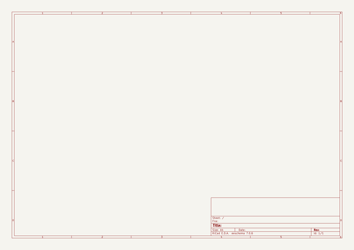
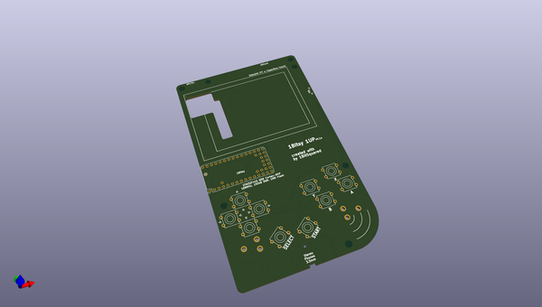
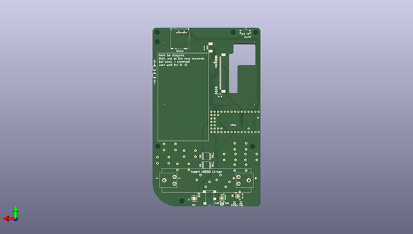

# 1bitsy_1up
 
## summary 
* id: 1bitsy_1bitsy_1up_1bitsy_1up
* user: 1bitsy
* name: 1bitsy_1up
* board: 1bitsy_1up
* repo: https://github.com/1Bitsy/1bitsy-1up
* src_file_repo_kicad_pcb: hardware/v0.2/1bitsy-1up.kicad_pcb
* src_file_repo_kicad_pcb_link: https://github.com/1Bitsy/1bitsy-1up/tree/master/hardware/v0.2/1bitsy-1up.kicad_pcb

* src_file_repo_sch: hardware/v0.2/1bitsy-1up.sch
* src_file_repo_sch_link: https://github.com/1Bitsy/1bitsy-1up/tree/master/hardware/v0.2/1bitsy-1up.sch

## schematic  
  
[schematic (pdf)](working_schematic.pdf)  

## pcb  
 
  
  
  
[board (pdf)](working.pdf)  

## working_bom
| Id | Designator | Footprint | Quantity | Designation | Supplier and ref |  | None | 
| --- | --- | --- | --- | --- | --- | --- | --- | 
| 1 | P1 | PAD_MILL-MAX_0906 | 1 | PogoPin |  |  | [''] | 
| 2 | SW1 | Tact_Switch_Top_TH_7.8MM_Snap | 1 | UP |  |  | [''] | 
| 3 | SW2 | Tact_Switch_Top_TH_7.8MM_Snap | 1 | Y |  |  | [''] | 
| 4 | SW3 | Tact_Switch_Top_TH_7.8MM_Snap | 1 | LEFT |  |  | [''] | 
| 5 | SW4 | Tact_Switch_Top_TH_7.8MM_Snap | 1 | RIGHT |  |  | [''] | 
| 6 | SW5 | Tact_Switch_Top_TH_7.8MM_Snap | 1 | X |  |  | [''] | 
| 7 | SW6 | Tact_Switch_Top_TH_7.8MM_Snap | 1 | A |  |  | [''] | 
| 8 | SW7 | Tact_Switch_Top_TH_7.8MM_Snap | 1 | SELECT |  |  | [''] | 
| 9 | SW8 | Tact_Switch_Top_TH_7.8MM_Snap | 1 | DOWN |  |  | [''] | 
| 10 | SW9 | Tact_Switch_Top_TH_7.8MM_Snap | 1 | B |  |  | [''] | 
| 11 | SW10 | Tact_Switch_Top_TH_7.8MM_Snap | 1 | START |  |  | [''] | 
| 12 | U1 | 1bitsy-sl-1xx-xx-19 | 1 | 1bitsy-complete-concise |  |  | [''] | 
| 13 | REF**,REF**,REF**,REF**,REF**,REF**,REF** | MountingHole_3-5mm | 7 | MountingHole_3-5mm |  |  | [''] | 
| 14 | REF** | ER-TFT028-4-mechanical | 1 | ER-TFT028-4-mechanical |  |  | [''] | 
| 15 | C1 | C_0805 | 1 | 10u |  |  | [''] | 
| 16 | C2,C3,C10,C11,C12 | C_0402 | 5 | 100n |  |  | [''] | 
| 17 | C4,C5,C6,C7,C9 | C_0402 | 5 | 1u |  |  | [''] | 
| 18 | C8 | C_0402 | 1 | 2u2 |  |  | [''] | 
| 19 | CON1 | SCHA4B0419 | 1 | pkl_Micro_SD |  |  | [''] | 
| 20 | D1 | D_0603 | 1 | YEL |  |  | [''] | 
| 21 | D2 | D_0603 | 1 | GRN |  |  | [''] | 
| 22 | J1,J2,J3,J4 | J_0402 | 4 | pkl_jumper |  |  | [''] | 
| 23 | J6 | J_0602 | 1 | Jumper_Dual |  |  | [''] | 
| 24 | J7 | SJ2-35853B-SMT | 1 | pkl_JACK_3C1S |  |  | [''] | 
| 25 | Q1 | SOT-23 | 1 | NMOS |  |  | [''] | 
| 26 | R1,R2,R3,R4 | R_0603 | 4 | 10E |  |  | [''] | 
| 27 | R5,R8,R9,R12,R13,R16,R17,R21,R22,R23,R25 | R_0402 | 11 | 10k |  |  | [''] | 
| 28 | R6,R7,R10,R11 | R_Array_Convex_4x0402 | 4 | 10k |  |  | [''] | 
| 29 | R14,R15 | R_0402 | 2 | 50E |  |  | [''] | 
| 30 | R18 | R_0402 | 1 | 0E |  |  | [''] | 
| 31 | R19 | R_0402 | 1 | 590E |  |  | [''] | 
| 32 | R20 | R_0402 | 1 | 1k1 |  |  | [''] | 
| 33 | SW11 | SW_SPDT_PCM12 | 1 | pkl_SWITCH-SPDT |  |  | [''] | 
| 34 | SW12,SW13 | Tact_Switch_Side_B3U-3000P | 2 | ~ |  |  | [''] | 
| 35 | U2 | ER-CON50HT | 1 | lcd_50pin_logic |  |  | [''] | 
| 36 | U3 | ER-CON06HB | 1 | lcd_cap_touch_buydisplay |  |  | [''] | 
| 37 | U4,U5 | TSSOP-16_4.4x5mm_Pitch0.65mm | 2 | 74HC165 |  |  | [''] | 
| 38 | U6 | QFN-16-1EP_3x3mm_Pitch0.5mm | 1 | BQ24075 |  |  | [''] | 
| 39 | U7 | QFN-16-1EP_3x3mm_Pitch0.5mm | 1 | TPA6135A2 |  |  | [''] | 
| 40 | U8 | QFN-16-1EP_4x4mm_Pitch0.65mm | 1 | MCP4661-103E/ML |  |  | [''] | 
| 41 | BT1 | BATTERY_CLIP_18650 | 1 | Battery_Cell |  |  | [''] | 
| 42 | R24 | R_0402 | 1 | 4k7 |  |  | [''] | 

## mounting_holes
| x | y | package | value | ref | size | 
| --- | --- | --- | --- | --- | --- | 
| 74.0 | 126.5 | MountingHole_3-5mm | MountingHole_3-5mm | REF** | m3 | 
| 0.0 | 126.5 | MountingHole_3-5mm | MountingHole_3-5mm | REF** | m3 | 
| 74.0 | 119.5 | MountingHole_3-5mm | MountingHole_3-5mm | REF** | m3 | 
| 17.0 | 126.5 | MountingHole_3-5mm | MountingHole_3-5mm | REF** | m3 | 
| 55.5 | 0.0 | MountingHole_3-5mm | MountingHole_3-5mm | REF** | m3 | 
| 73.5 | 41.0 | MountingHole_3-5mm | MountingHole_3-5mm | REF** | m3 | 
| 2.5 | 41.0 | MountingHole_3-5mm | MountingHole_3-5mm | REF** | m3 | 

