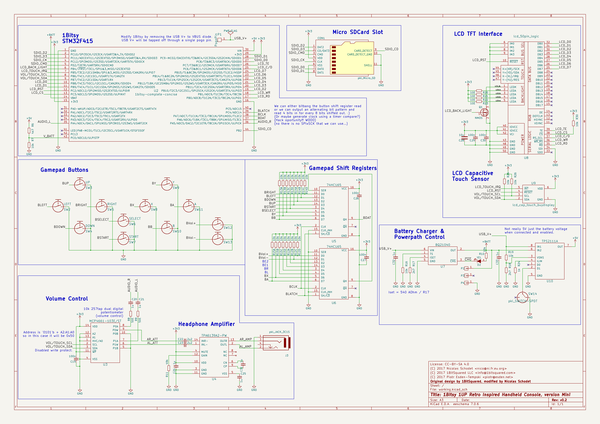

# 1bitsy_1up
 
## summary 
* id: 1bitsy_1bitsy_1up_1up_mini
* user: 1bitsy
* name: 1bitsy_1up
* board: 1up_mini
* repo: https://github.com/1Bitsy/1bitsy-1up
* src_file_repo_kicad_pcb: hardware/contrib/1up-mini/1up-mini.kicad_pcb
* src_file_repo_kicad_pcb_link: https://github.com/1Bitsy/1bitsy-1up/tree/master/hardware/contrib/1up-mini/1up-mini.kicad_pcb

* src_file_repo_sch: hardware/contrib/1up-mini/1up-mini.sch
* src_file_repo_sch_link: https://github.com/1Bitsy/1bitsy-1up/tree/master/hardware/contrib/1up-mini/1up-mini.sch

## schematic  
  
[schematic (pdf)](working_schematic.pdf)  

## pcb  
 
  
  
  
[board (pdf)](working.pdf)  

## bom_schematic
| Ref | Qnty | Value | Cmp name | Footprint | Description | Vendor | DNP | 
| --- | --- | --- | --- | --- | --- | --- | --- | 
| C19, C26, C27, C29, C30 | 5 | 100n | pkl_C_Small | pkl_dipol:C_0603 |  |  |  | 
| C20, C21, C24, C25, C31, C32, C33 | 7 | 1u | pkl_C_Small | pkl_dipol:C_0603 |  |  |  | 
| C22, C23 | 2 | 2u2 | pkl_C_Small | pkl_dipol:C_0603 |  |  |  | 
| C28 | 1 | 10u | pkl_C | pkl_dipol:C_0805 |  |  |  | 
| CON1 | 1 | pkl_Micro_SD | pkl_Micro_SD | pkl_misc:SCHA4B0419 |  |  |  | 
| D2 | 1 | YEL | pkl_LED | pkl_dipol:D_0603 |  |  |  | 
| J3 | 1 | pkl_JACK_3C1S | pkl_JACK_3C1S | pkl_connectors:SJ2-35853B-SMT |  |  |  | 
| P1 | 1 | PogoPin | PAD_SMD | pkl_pads:PAD_MILL-MAX_0906 |  |  |  | 
| P2, P3, P4 | 3 | CONN_01X01 | CONN_01X01 | pkl_pin_headers:Pin_Header_Straight_Round_1x01 |  |  |  | 
| Q1 | 1 | NMOS | pkl_Q_NMOS_BD_GSD | TO_SOT_Packages_SMD:SOT-23 |  |  |  | 
| R6 | 1 | 4k7 | pkl_R_Small | pkl_dipol:R_0603 |  |  |  | 
| R7, R10, R16, R19, R25, R26, R30 | 7 | 10k | pkl_R_Small | pkl_dipol:R_0603 |  |  |  | 
| R8, R9 | 2 | 50E | pkl_R_Small | pkl_dipol:R_0603 |  |  |  | 
| R11 | 1 | 49k | pkl_R_Small | pkl_dipol:R_0603 |  |  |  | 
| R12, R13, R14, R15 | 4 | 10k | pkl_R4_Small | pkl_dipol:R_Array_Concave_4x0603 |  |  |  | 
| R17, R18 | 2 | 2k7 | pkl_R_Small | pkl_dipol:R_0603 |  |  |  | 
| R20, R21, R22, R23 | 4 | 10E | pkl_R_Small | pkl_dipol:R_0603 |  |  |  | 
| R24 | 1 | 1k | pkl_R_Small | pkl_dipol:R_0603 |  |  |  | 
| SW2 | 1 | LEFT | TACT | pkl_buttons_switches:Tact_Switch_Top_TH_7.8MM_Snap |  |  |  | 
| SW3 | 1 | UP | TACT | pkl_buttons_switches:Tact_Switch_Top_TH_7.8MM_Snap |  |  |  | 
| SW4 | 1 | DOWN | TACT | pkl_buttons_switches:Tact_Switch_Top_TH_7.8MM_Snap |  |  |  | 
| SW5 | 1 | RIGHT | TACT | pkl_buttons_switches:Tact_Switch_Top_TH_7.8MM_Snap |  |  |  | 
| SW6 | 1 | SELECT | TACT | pkl_buttons_switches:Tact_Switch_Top_TH_7.8MM_Snap |  |  |  | 
| SW7 | 1 | START | TACT | pkl_buttons_switches:Tact_Switch_Top_TH_7.8MM_Snap |  |  |  | 
| SW8 | 1 | X | TACT | pkl_buttons_switches:Tact_Switch_Top_TH_7.8MM_Snap |  |  |  | 
| SW9 | 1 | Y | TACT | pkl_buttons_switches:Tact_Switch_Top_TH_7.8MM_Snap |  |  |  | 
| SW10 | 1 | B | TACT | pkl_buttons_switches:Tact_Switch_Top_TH_7.8MM_Snap |  |  |  | 
| SW11 | 1 | A | TACT | pkl_buttons_switches:Tact_Switch_Top_TH_7.8MM_Snap |  |  |  | 
| SW12, SW13 | 2 | ~ | TACT | pkl_buttons_switches:Tact_Switch_Side_B3U-3000P |  |  |  | 
| SW14 | 1 | pkl_SWITCH-SPDT | pkl_SWITCH-SPDT | pkl_buttons_switches:SW_SPDT_PCM12 |  |  |  | 
| U2 | 1 | 1bitsy-complete-concise | 1bitsy-complete-concise | 1bitsy:1bitsy-sl-1xx-xx-19 |  |  |  | 
| U3 | 1 | MCP4661-103E/ST | MCP4661-ST | Housings_SSOP:TSSOP-14_4.4x5mm_Pitch0.65mm |  |  |  | 
| U4 | 1 | TPA6139A2-PW | TPA6139A2-PW | Housings_SSOP:TSSOP-14_4.4x5mm_Pitch0.65mm |  |  |  | 
| U5, U6 | 2 | 74HC165 | 74HC165 | pkl_housings_sop:TSSOP-16_4.4x5mm_Pitch0.65mm |  |  |  | 
| U7 | 1 | BQ21040 | BQ21040 | pkl_housings_sot:SOT-23-6 |  |  |  | 
| U8 | 1 | lcd_50pin_logic | lcd_50pin_logic | pkl_connectors:ER-CON50HT |  |  |  | 
| U9 | 1 | lcd_cap_touch_buydisplay | LCD_CAP_TOUCH | pkl_connectors:ER-CON06HB |  |  |  | 
| U10 | 1 | TPS2111A | TPS2111A | Housings_SSOP:TSSOP-8_4.4x3mm_Pitch0.65mm |  |  |  | 

