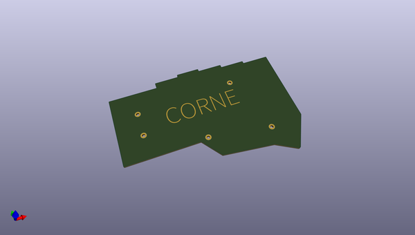
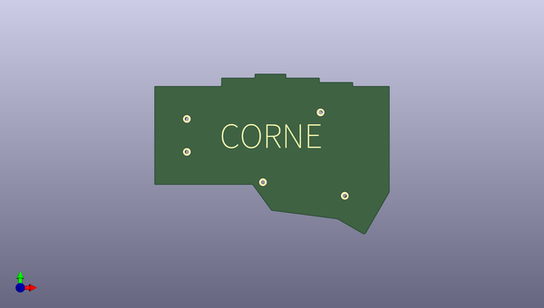
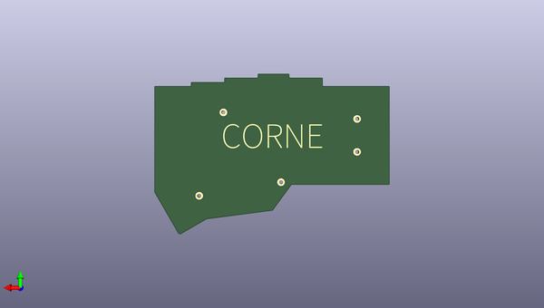

# crkbd
 
## summary 
* id: 50an6xy06r6n_crkbd_corne_bottom_plate
* user: 50an6xy06r6n
* name: crkbd
* board: corne_bottom_plate
* repo: https://github.com/50an6xy06r6n/crkbd
* src_file_repo_kicad_pcb: plates/pcb/bottom/corne-bottom-plate.kicad_pcb
* src_file_repo_kicad_pcb_link: https://github.com/50an6xy06r6n/crkbd/tree/master/plates/pcb/bottom/corne-bottom-plate.kicad_pcb

* src_file_repo_sch: plates/pcb/bottom/corne-bottom-plate.sch
* src_file_repo_sch_link: https://github.com/50an6xy06r6n/crkbd/tree/master/plates/pcb/bottom/corne-bottom-plate.sch

## schematic  
  
[schematic (pdf)](working_schematic.pdf)  

## pcb  
 
  
  
  
[board (pdf)](working.pdf)  

## working_bom
| Id | Designator | Footprint | Quantity | Designation | Supplier and ref |  | None | 
| --- | --- | --- | --- | --- | --- | --- | --- | 
| 1 | ,,,, | M2_Hole_TH | 5 |  |  |  | [''] | 
| 2 | G***,G*** | corne-horizontal | 2 | LOGO |  |  | [''] | 

## bom_schematic
no data

