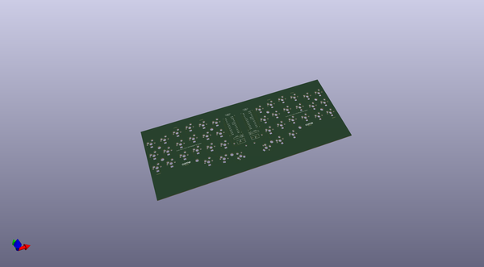
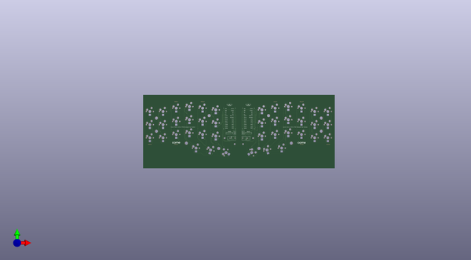
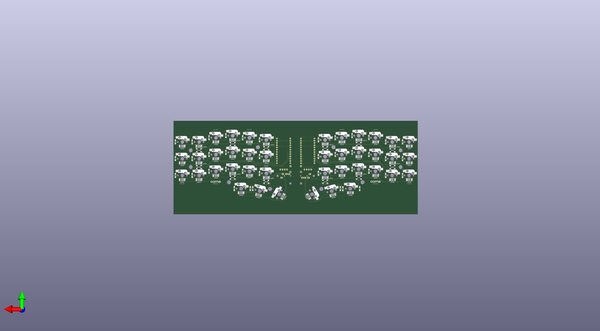

# crkbd
 
## summary 
* id: 50an6xy06r6n_crkbd_corne_cherry
* user: 50an6xy06r6n
* name: crkbd
* board: corne_cherry
* repo: https://github.com/50an6xy06r6n/crkbd
* src_file_repo_kicad_pcb: corne-cherry/pcb/corne-cherry.kicad_pcb
* src_file_repo_kicad_pcb_link: https://github.com/50an6xy06r6n/crkbd/tree/master/corne-cherry/pcb/corne-cherry.kicad_pcb

* src_file_repo_sch: corne-cherry/pcb/corne-cherry.sch
* src_file_repo_sch_link: https://github.com/50an6xy06r6n/crkbd/tree/master/corne-cherry/pcb/corne-cherry.sch

## schematic  
  
[schematic (pdf)](working_schematic.pdf)  

## pcb  
 
  
  
  
[board (pdf)](working.pdf)  

## working_bom
| Id | Designator | Footprint | Quantity | Designation | Supplier and ref |  | None | 
| --- | --- | --- | --- | --- | --- | --- | --- | 
| 1 | J1,J3 | MJ-4PP-9_1side | 2 | MJ-4PP-9 |  |  | [''] | 
| 2 | J2,J4 | OLED_1side | 2 | OLED |  |  | [''] | 
| 3 | RSW1,RSW2 | ResetSW_1side | 2 | SW_PUSH |  |  | [''] | 
| 4 | SW2,SW3,SW4,SW5,SW7,SW8,SW9,SW10,SW11,SW12,SW13,SW14,SW15,SW16,SW17,SW18,SW19,SW20,SW37,SW38,SW39,SW40,SW41,SW25,SW26,SW28,SW24,SW29,SW35,SW36,SW22,SW23,SW30,SW31,SW32,SW33,SW34,SW1,SW6,SW27 | CherryMX_Hotswap | 40 | SW_PUSH |  |  | [''] | 
| 5 | SW21,SW42 | CherryMX_Hotswap_1.5u | 2 | SW_PUSH |  |  | [''] | 
| 6 | U1,U2 | ProMicro_v3 | 2 | ProMicro |  |  | [''] | 
| 7 | REF**,REF**,REF**,REF**,REF**,REF**,REF**,REF** | Breakaway_Tabs | 8 | Breakaway_Tabs |  |  | [''] | 
| 8 | G***,G***,G***,G*** | corne-logo-horizontal | 4 | LOGO |  |  | [''] | 
| 9 | D1,D2,D3,D4,D5,D6,D7,D8,D9,D10,D11,D12,D13,D14,D15,D16,D17,D18,D19,D20,D21,D23,D24,D25,D27,D28,D29,D30,D31,D32,D33,D34,D35,D36,D37,D38,D39,D40,D41,D42,D22,D26 | D3_SMD_v2 | 42 | D |  |  | [''] | 
| 10 | LED7,LED8,LED9,LED10,LED11,LED12,LED13,LED14,LED15,LED16,LED17,LED18,LED19,LED20,LED21,LED22,LED24,LED27,LED43,LED44,LED45,LED46,LED47,LED48,LED49,LED50,LED51,LED52,LED53,LED25,LED26,LED23,LED34,LED35,LED36,LED37,LED38,LED39,LED40,LED41,LED42,LED54 | YS-SK6812MINI-E | 42 | YS-SK6812MINI-E |  |  | [''] | 
| 11 | LED1,LED2,LED3,LED5,LED6,LED28,LED29,LED30,LED31,LED32,LED33,LED4 | LED_WS2812B_PLCC4_5.0x5.0mm_P3.2mm | 12 | WS2812B |  |  | [''] | 

## bom_schematic
no data

