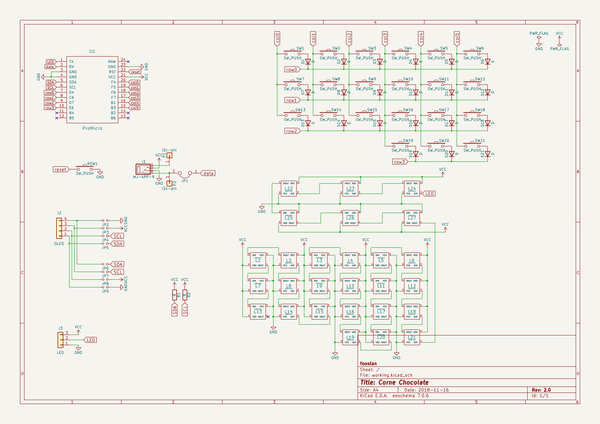
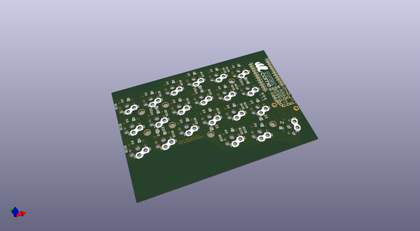
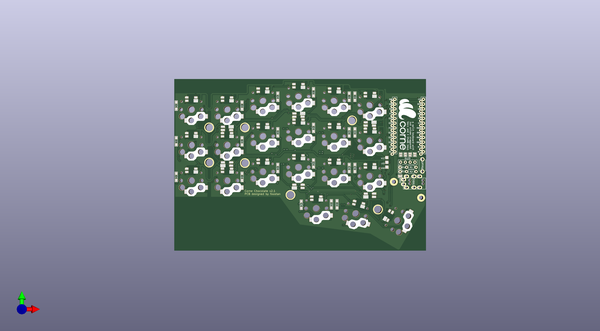
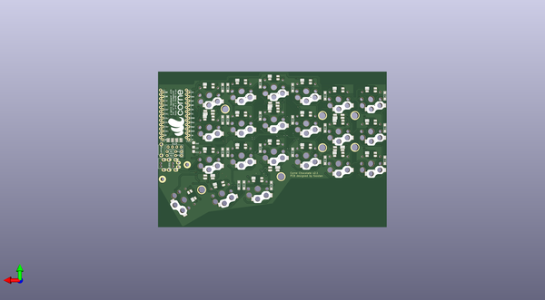

# crkbd
 
## summary 
* id: 50an6xy06r6n_crkbd_corne_chocolate
* user: 50an6xy06r6n
* name: crkbd
* board: corne_chocolate
* repo: https://github.com/50an6xy06r6n/crkbd
* src_file_repo_kicad_pcb: corne-chocolate/pcb/corne-chocolate.kicad_pcb
* src_file_repo_kicad_pcb_link: https://github.com/50an6xy06r6n/crkbd/tree/master/corne-chocolate/pcb/corne-chocolate.kicad_pcb

* src_file_repo_sch: corne-chocolate/pcb/corne-chocolate.sch
* src_file_repo_sch_link: https://github.com/50an6xy06r6n/crkbd/tree/master/corne-chocolate/pcb/corne-chocolate.sch

## schematic  
  
[schematic (pdf)](working_schematic.pdf)  

## pcb  
 
  
  
  
[board (pdf)](working.pdf)  

## working_bom
| Id | Designator | Footprint | Quantity | Designation | Supplier and ref |  | None | 
| --- | --- | --- | --- | --- | --- | --- | --- | 
| 1 | D1,D2,D3,D4,D5,D6,D7,D8,D9,D10,D11,D12,D13,D14,D15,D16,D17,D18,D19,D20,D21 | D3_SMD | 21 | D |  |  | [''] | 
| 2 | L1,L2,L3,L4,L5,L6,L7,L8,L9,L10,L11,L12,L13,L14,L15,L16,L17,L18,L19,L20,L21 | SK6812MINI_rev | 21 | SK6812MINI |  |  | [''] | 
| 3 | SW1,SW2,SW3,SW4,SW5,SW6,SW7,SW8,SW9,SW10,SW11,SW12,SW13,SW14,SW15,SW16,SW17,SW18,SW19,SW20 | Choc_Hotswap | 20 | SW_PUSH |  |  | [''] | 
| 4 | JP2,JP3,JP4,JP5,JP6,JP7,JP8,JP9 | Jumper | 8 |   |  |  | [''] | 
| 5 | U1 | ProMicro_v2 | 1 | ProMicro |  |  | [''] | 
| 6 | J3 | StripLED_rev | 1 | LED |  |  | [''] | 
| 7 | data | JPC2 | 1 |   |  |  | [''] | 
| 8 | OLED | OLED | 1 | OLED |  |  | [''] | 
| 9 | TRRS | MJ-4PP-9 | 1 | MJ-4PP-9 |  |  | [''] | 
| 10 | RSW1 | ResetSW | 1 | Reset |  |  | [''] | 
| 11 | L23,L24,L26,L27,L22,L25 | SK6812MINI_underglow_rev | 6 | SK6812MINI |  |  | [''] | 
| 12 | G***,G*** | corne | 2 | LOGO |  |  | [''] | 
| 13 | SW21 | Choc_Hotswap_1.5u | 1 | SW_PUSH |  |  | [''] | 
| 14 | R2,R1 | R | 2 | R |  |  | [''] | 
| 15 | P1,P2 | 1pin_conn | 2 | i2c-pin |  |  | [''] | 

## bom_schematic
| Ref | Qnty | Value | Cmp name | Footprint | Description | Vendor | DNP | 
| --- | --- | --- | --- | --- | --- | --- | --- | 
| D1, D2, D3, D4, D5, D6, D7, D8, D9, D10, D11, D12, D13, D14, D15, D16, D17, D18, D19, D20, D21 | 21 | D | D | kbd:D3_TH_SMD | Diode |  |  | 
| J1 | 1 | MJ-4PP-9 | MJ-4PP-9-kbd | kbd:MJ-4PP-9 |  |  |  | 
| J2 | 1 | OLED | Conn_01x04 | kbd:OLED | Generic connector, single row, 01x04, script generated (kicad-library-utils/schlib/autogen/connector/) |  |  | 
| J3 | 1 | LED | Conn_01x03 | kbd:StripLED_rev | Generic connector, single row, 01x03, script generated (kicad-library-utils/schlib/autogen/connector/) |  |  | 
| JP1 | 1 |  | Jumper-Device | kbd:JPC2 |  |  |  | 
| JP2, JP3, JP4, JP5, JP6, JP7, JP8, JP9 | 8 |  | Jumper_NO_Small-Device | kbd:Jumper |  |  |  | 
| L1, L2, L3, L4, L5, L6, L7, L8, L9, L10, L11, L12, L13, L14, L15, L16, L17, L18, L19, L20, L21 | 21 | SK6812MINI | SK6812MINI-kbd | kbd:SK6812MINI_rev |  |  |  | 
| L22, L23, L24, L25, L26, L27 | 6 | SK6812MINI | SK6812MINI-kbd | kbd:SK6812MINI_underglow |  |  |  | 
| P1, P2 | 2 | i2c-pin | Conn_01x01 | kbd:1pin_conn | Generic connector, single row, 01x01, script generated (kicad-library-utils/schlib/autogen/connector/) |  |  | 
| R1, R2 | 2 | R | R | kbd:R | Resistor |  |  | 
| RSW1 | 1 | SW_PUSH | SW_PUSH-kbd | kbd:ResetSW |  |  |  | 
| SW1, SW2, SW3, SW4, SW5, SW6, SW7, SW8, SW9, SW10, SW11, SW12, SW13, SW14, SW15, SW16, SW17, SW18, SW19, SW20 | 20 | SW_PUSH | SW_PUSH-kbd | kbd:MX_ALPS_PG1350_noLed |  |  |  | 
| SW21 | 1 | SW_PUSH | SW_PUSH-kbd | kbd:MX_ALPS_PG1350_noLed_1.75u |  |  |  | 
| U1 | 1 | ProMicro | ProMicro-kbd | kbd:ProMicro_v2 |  |  |  | 

