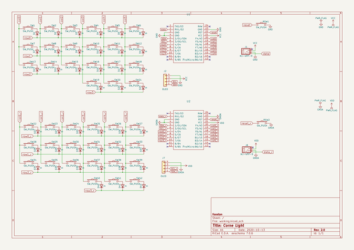
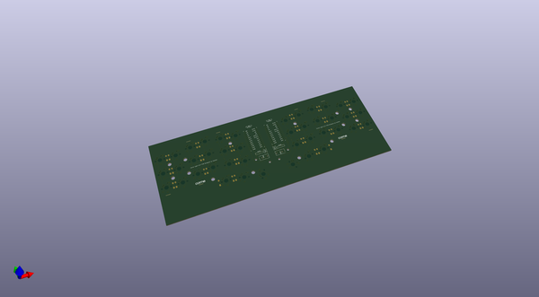
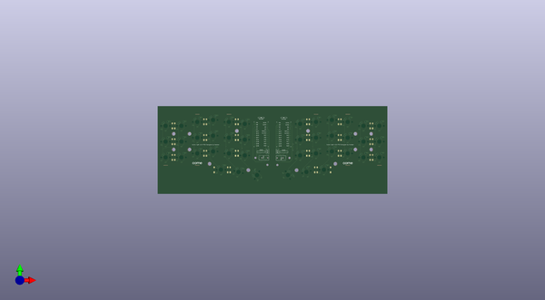
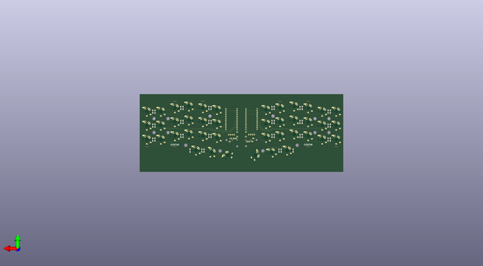

# crkbd
 
## summary 
* id: 50an6xy06r6n_crkbd_corne_light
* user: 50an6xy06r6n
* name: crkbd
* board: corne_light
* repo: https://github.com/50an6xy06r6n/crkbd
* src_file_repo_kicad_pcb: corne-light/pcb/corne-light.kicad_pcb
* src_file_repo_kicad_pcb_link: https://github.com/50an6xy06r6n/crkbd/tree/master/corne-light/pcb/corne-light.kicad_pcb

* src_file_repo_sch: corne-light/pcb/corne-light.sch
* src_file_repo_sch_link: https://github.com/50an6xy06r6n/crkbd/tree/master/corne-light/pcb/corne-light.sch

## schematic  
  
[schematic (pdf)](working_schematic.pdf)  

## pcb  
 
  
  
  
[board (pdf)](working.pdf)  

## working_bom
| Id | Designator | Footprint | Quantity | Designation | Supplier and ref |  | None | 
| --- | --- | --- | --- | --- | --- | --- | --- | 
| 1 | J1,J6 | MJ-4PP-9_1side | 2 | MJ-4PP-9 |  |  | [''] | 
| 2 | RSW2,RSW1 | ResetSW_1side | 2 | SW_PUSH |  |  | [''] | 
| 3 | SW22,SW23,SW24,SW25,SW26,SW27,SW28,SW29,SW30,SW31,SW32,SW33,SW34,SW35,SW36,SW37,SW38,SW40,SW41,SW39,SW6,SW5,SW4,SW3,SW2,SW18,SW13,SW20,SW19,SW17,SW16,SW15,SW14,SW12,SW11,SW10,SW9,SW8,SW7,SW1 | keyswitch_cherrymx_alps_choc12_1u | 40 | SW_PUSH |  |  | [''] | 
| 4 | U1,U2 | ProMicro_v3 | 2 | ProMicro |  |  | [''] | 
| 5 | SW21,SW42 | keyswitch_cherrymx_alps_choc12_1.5u | 2 | SW_PUSH |  |  | [''] | 
| 6 | J2,J7 | OLED_1side | 2 | OLED |  |  | [''] | 
| 7 | J5,J5,J5,J5,J5,J5,J5,J5 | Breakaway_Tabs | 8 | Breakaway_Tabs |  |  | [''] | 
| 8 | G***,G***,G***,G*** | corne-logo-horizontal | 4 | LOGO |  |  | [''] | 
| 9 | D34,D36,D37,D38,D39,D40,D41,D42,D22,D23,D24,D25,D26,D27,D28,D29,D30,D31,D32,D14,D8,D2,D33,D21,D20,D19,D18,D17,D16,D15,D13,D12,D11,D10,D9,D7,D6,D5,D4,D3,D1,D35 | D3_TH_SMD_v2 | 42 | D |  |  | [''] | 

## bom_schematic
| Ref | Qnty | Value | Cmp name | Footprint | Description | Vendor | DNP | 
| --- | --- | --- | --- | --- | --- | --- | --- | 
| D1, D2, D3, D4, D5, D6, D7, D8, D9, D10, D11, D12, D13, D14, D15, D16, D17, D18, D19, D20, D21, D22, D23, D24, D25, D26, D27, D28, D29, D30, D31, D32, D33, D34, D35, D36, D37, D38, D39, D40, D41, D42 | 42 | D | D | kbd:D3_TH | Diode |  |  | 
| J1, J6 | 2 | MJ-4PP-9 | MJ-4PP-9-kbd | kbd:MJ-4PP-9_1side |  |  |  | 
| J2, J7 | 2 | OLED | Conn_01x04 | kbd:OLED_1side | Generic connector, single row, 01x04, script generated (kicad-library-utils/schlib/autogen/connector/) |  |  | 
| RSW1, RSW2 | 2 | SW_PUSH | SW_PUSH-kbd | kbd:ResetSW_1side |  |  |  | 
| SW1, SW2, SW3, SW4, SW5, SW6, SW7, SW8, SW9, SW10, SW11, SW12, SW13, SW14, SW15, SW16, SW17, SW18, SW19, SW20, SW22, SW23, SW24, SW25, SW26, SW27, SW28, SW29, SW30, SW31, SW32, SW33, SW34, SW35, SW36, SW37, SW38, SW39, SW40, SW41 | 40 | SW_PUSH | SW_PUSH-kbd | kbd:CherryMX_ChocV2_1u |  |  |  | 
| SW21, SW42 | 2 | SW_PUSH | SW_PUSH-kbd | kbd:CherryMX_ChocV2_1.5u |  |  |  | 
| U1, U2 | 2 | ProMicro | ProMicro-kbd | kbd:ProMicro_v3 |  |  |  | 

