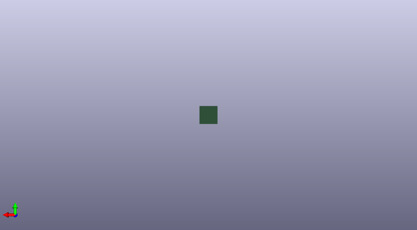

# ergogen
 
## summary 
* id: 50an6xy06r6n_ergogen__export
* user: 50an6xy06r6n
* name: ergogen
* board: _export
* repo: https://github.com/50an6xy06r6n/ergogen
* src_file_repo_kicad_pcb: test/cli/big/reference/pcbs/export.kicad_pcb
* src_file_repo_kicad_pcb_link: https://github.com/50an6xy06r6n/ergogen/tree/master/test/cli/big/reference/pcbs/export.kicad_pcb

* src_file_repo_sch: 
* src_file_repo_sch_link: https://github.com/50an6xy06r6n/ergogen/tree/master/

## pcb  
 
  
  
  
[board (pdf)](working.pdf)  

