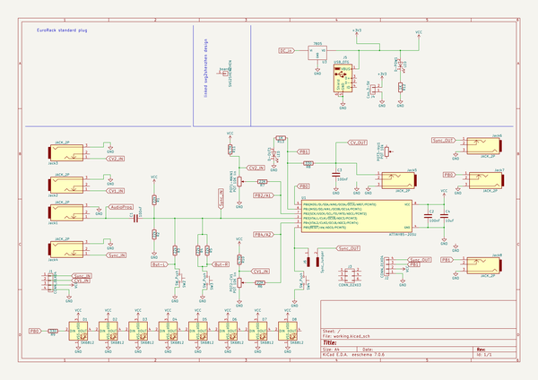
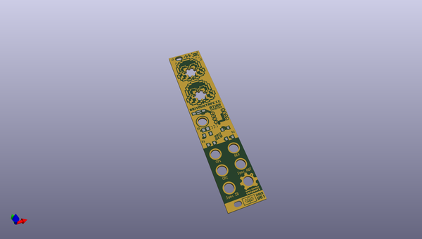
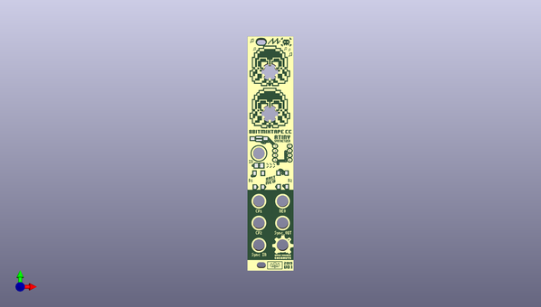
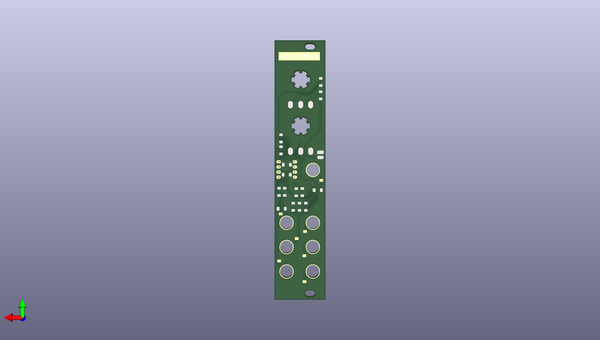

# 8bit_eurorack_5hp
 
## summary 
* id: 8bitmixtape_8bit_eurorack_5hp_8bit_eurorack
* user: 8bitmixtape
* name: 8bit_eurorack_5hp
* board: 8bit_eurorack
* repo: https://github.com/8BitMixtape/8Bit_EuroRack-5hp
* src_file_repo_kicad_pcb: KiCAD/8Bit_EuroRack.kicad_pcb
* src_file_repo_kicad_pcb_link: https://github.com/8BitMixtape/8Bit_EuroRack-5hp/tree/master/KiCAD/8Bit_EuroRack.kicad_pcb

* src_file_repo_sch: KiCAD/8Bit_EuroRack.sch
* src_file_repo_sch_link: https://github.com/8BitMixtape/8Bit_EuroRack-5hp/tree/master/KiCAD/8Bit_EuroRack.sch

## schematic  
  
[schematic (pdf)](working_schematic.pdf)  

## pcb  
 
  
  
  
[board (pdf)](working.pdf)  

## working_bom
| Id | Designator | Footprint | Quantity | Designation | Supplier and ref |  | None | 
| --- | --- | --- | --- | --- | --- | --- | --- | 
| 1 | J6 | Sync_jumper | 1 | Sync_Jumper |  |  | [''] | 
| 2 | POT1-MAIN1,POT2-CV1 | Potentiometer_backPads_noHole | 2 | POT 10K lin |  |  | [''] | 
| 3 | SW4 | SW_SPST_FSMSM | 1 | SW_Push |  |  | [''] | 
| 4 | U1 | Attiny_DIP-8_W7.62mm_mod | 1 | ATTINY85-20SU |  |  | [''] | 
| 5 | Ref** | 8Bit_EuroRack-NEO_mini_frontplate | 1 | Val** |  |  | [''] | 
| 6 | D-OUT1 | LED_2835_minimal | 1 | LED |  |  | [''] | 
| 7 | ,,,,,, | Jack_pads | 7 |  |  |  | [''] | 
| 8 | R1,R2,R3,R4,R5 | R_1206_HandSoldering | 5 | 22k |  |  | [''] | 
| 9 | R6,R7 | R_1206_HandSoldering | 2 | 22K |  |  | [''] | 
| 10 | R8 | R_1206_HandSoldering | 1 | 330 |  |  | [''] | 
| 11 | R10,R11 | R_1206_HandSoldering | 2 | 4.7K |  |  | [''] | 
| 12 | R13 | R_1206_HandSoldering | 1 | 1K |  |  | [''] | 
| 13 | C1,C2,C3 | C_1206_HandSoldering | 3 | 100nF |  |  | [''] | 
| 14 | C4 | C_1206_HandSoldering | 1 | 10uF |  |  | [''] | 
| 15 | J4 | Bat_connector_SMD | 1 | Con_3-5V |  |  | [''] | 

## bom_schematic
| Ref | Qnty | Value | Cmp name | Footprint | Description | Vendor | DNP | 
| --- | --- | --- | --- | --- | --- | --- | --- | 
| board1 | 1 | SVG2SHENZHEN | CONN_01X01 | 8Bit_Eurorack:8Bit_EuroRack-NEO |  |  |  | 
| C1, C2, C3 | 3 | 100nF | C | 8Bit_Eurorack:C_1206_HandSoldering |  |  |  | 
| C4 | 1 | 10uF | C | 8Bit_Eurorack:C_1206_HandSoldering |  |  |  | 
| D1, D2, D3, D4, D5, D6, D7, D8 | 8 | SK6812 | SK6812 | 8Bit_Eurorack:Mixtape_NEO_WS2812B |  |  |  | 
| D-OUT1 | 1 | LED | LED | 8Bit_Eurorack:LED_2835_minimal |  |  |  | 
| D-POW1 | 1 | LED | LED | 8Bit_Eurorack:LED_2835_minimal |  |  |  | 
| J1, J2 | 2 | CONN_01X04 | CONN_01X04 | 8Bit_Eurorack:Angled_1x04_Pitch2.54mm-flip |  |  |  | 
| J3 | 1 | CONN_02X03 | CONN_02X03 | 8Bit_Eurorack:Socket_Strip_Straight_2x03_Pitch2.54mm |  |  |  | 
| J4 | 1 | Con_3-5V | CONN_01X02 | 8Bit_Eurorack:Bat_connector_SMD |  |  |  | 
| J5 | 1 | USB_OTG | USB_OTG | 8Bit_Eurorack:USB_Micro-B |  |  |  | 
| J6 | 1 | Sync_Jumper | CONN_01X02_MALE | 8Bit_Eurorack:Sync_jumper |  |  |  | 
| Jack1, Jack2, Jack3, Jack4, Jack5, Jack6, Jack7, Jack8 | 8 | JACK_2P | JACK_2P | 8Bit_Eurorack:PJ301M-12 |  |  |  | 
| POT1-MAIN1 | 1 | POT 10K lin | POT | 8BitMixtape_Stomp:Mixtape_Pot_Alps_RK09L_Sleve_Single_Horizontal |  |  |  | 
| POT2-CV1 | 1 | POT 10K lin | POT | 8BitMixtape_Stomp:Mixtape_Pot_Alps_RK09L_Sleve_Single_Horizontal |  |  |  | 
| POT3-Vol1 | 1 | POT 10k | POT | 8BitMixtape_Stomp:Mixtape_Pot_Alps_RK09L_Sleve_Single_Horizontal |  |  |  | 
| R1, R2, R3, R4, R5 | 5 | 22k | R | 8Bitmixtape_reworked:R_1206_HandSoldering |  |  |  | 
| R6, R7 | 2 | 22K | R | 8Bitmixtape_reworked:R_1206_HandSoldering |  |  |  | 
| R8, R9 | 2 | 330 | R | 8Bitmixtape_reworked:R_1206_HandSoldering |  |  |  | 
| R10, R11 | 2 | 4.7K | R | 8Bitmixtape_reworked:R_1206_HandSoldering |  |  |  | 
| R12, R13 | 2 | 1K | R | 8Bitmixtape_reworked:R_1206_HandSoldering |  |  |  | 
| SW2, SW3 | 2 | SW_Push | SW_Push | 8Bit_Eurorack:TACTILE-PTH_6mm_SMD |  |  |  | 
| SW4 | 1 | SW_Push | SW_Push | 8Bit_Eurorack:SW_SPST_FSMSM |  |  |  | 
| U1 | 1 | ATTINY85-20SU | ATTINY85-20SU | 8Bit_Eurorack:Attiny_DIP-8_W7.62mm_mod |  |  |  | 
| U3 | 1 | 7805 | 7805 | TO_SOT_Packages_SMD:TO-252-3_TabPin2 |  |  |  | 

