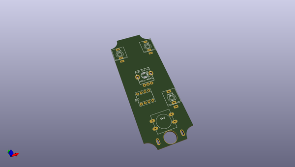
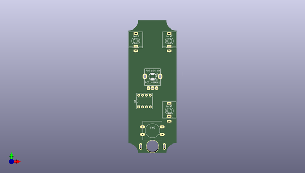
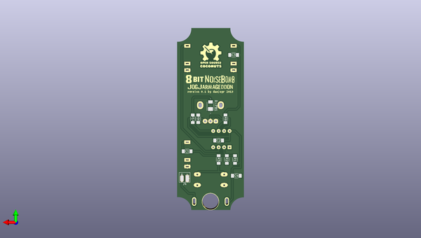

# 8bit_jogjanoise
 
## summary 
* id: 8bitmixtape_8bit_jogjanoise_8bit_eurorack_7hp
* user: 8bitmixtape
* name: 8bit_jogjanoise
* board: 8bit_eurorack_7hp
* repo: https://github.com/8BitMixtape/8Bit_JogjaNoise
* src_file_repo_kicad_pcb: KiCAD/8Bit_EuroRack_7hp.kicad_pcb
* src_file_repo_kicad_pcb_link: https://github.com/8BitMixtape/8Bit_JogjaNoise/tree/master/KiCAD/8Bit_EuroRack_7hp.kicad_pcb

* src_file_repo_sch: 
* src_file_repo_sch_link: https://github.com/8BitMixtape/8Bit_JogjaNoise/tree/master/

## pcb  
 
  
  
  
[board (pdf)](working.pdf)  

## working_bom
| Id | Designator | Footprint | Quantity | Designation | Supplier and ref |  | None | 
| --- | --- | --- | --- | --- | --- | --- | --- | 
| 1 | SW2 | SW_PUSH-12mm_3D_new | 1 | SW_Push |  |  | [''] | 
| 2 | board1 | 8Bit_YogyaNoise | 1 | SVG2SHENZHEN |  |  | [''] | 
| 3 | D-PB0,D-PB1 | LED_PLCC_2835_Handsoldering | 2 | LED |  |  | [''] | 
| 4 | Jack1,Jack2,Jack5 | PJ301M-12_dusjagr_3d | 3 | JACK_2P |  |  | [''] | 
| 5 | POT1-MAIN1 | RD901F-ALPHA-3D | 1 | POT 10K lin |  |  | [''] | 
| 6 | U1 | DIP-8_Attiny_with_Socket_3d | 1 | ATTINY85-20SU |  |  | [''] | 
| 7 | C1,C2,C3 | C_1206_3d | 3 | 100nF |  |  | [''] | 
| 8 | C4 | C_1206_3d | 1 | 10uF |  |  | [''] | 
| 9 | R1,R2,R3 | R_1206_3d | 3 | 22k |  |  | [''] | 
| 10 | R8 | R_1206_3d | 1 | 330 |  |  | [''] | 
| 11 | R14 | R_1206_3d | 1 | 1K |  |  | [''] | 
| 12 | J4 | Bat_connector_SMD | 1 | Con_3-5V |  |  | [''] | 
| 13 | logo1 | Coconut_logo | 1 | COCONUT |  |  | [''] | 
| 14 | R99 | R_1206_3d | 1 | 0 |  |  | [''] | 
| 15 | Ref** | NoiseBomb_logo | 1 | Val** |  |  | [''] | 

