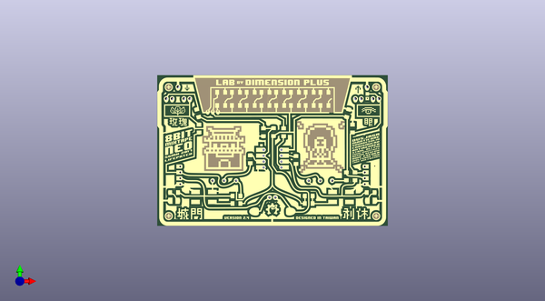

# 8bit_mixtape_neo
 
## summary 
* id: 8bitmixtape_8bit_mixtape_neo_8bitmixtapeneo_hk
* user: 8bitmixtape
* name: 8bit_mixtape_neo
* board: 8bitmixtapeneo_hk
* repo: https://github.com/8BitMixtape/8Bit-Mixtape-NEO
* src_file_repo_kicad_pcb: boards/8Bit-Mixtape-NEO_v1/ShenzhenReady/kicad_8bitMixtapeNEO_HK/8BitMixtapeNEO_HK.kicad_pcb
* src_file_repo_kicad_pcb_link: https://github.com/8BitMixtape/8Bit-Mixtape-NEO/tree/master/boards/8Bit-Mixtape-NEO_v1/ShenzhenReady/kicad_8bitMixtapeNEO_HK/8BitMixtapeNEO_HK.kicad_pcb

* src_file_repo_sch: boards/8Bit-Mixtape-NEO_v1/ShenzhenReady/kicad_8bitMixtapeNEO_HK/8BitMixtapeNEO_HK.sch
* src_file_repo_sch_link: https://github.com/8BitMixtape/8Bit-Mixtape-NEO/tree/master/boards/8Bit-Mixtape-NEO_v1/ShenzhenReady/kicad_8bitMixtapeNEO_HK/8BitMixtapeNEO_HK.sch

## schematic  
  
[schematic (pdf)](working_schematic.pdf)  

## pcb  
 
  
  
  
[board (pdf)](working.pdf)  

## working_bom
| Id | Designator | Footprint | Quantity | Designation | Supplier and ref |  | None | 
| --- | --- | --- | --- | --- | --- | --- | --- | 
| 1 | G*** | kicad_8BitMixtape_HK_fCu_inv | 1 | LOGO |  |  | [''] | 
| 2 | G*** | kicad_8BitMixtape_HK_fMask_inv | 1 | LOGO |  |  | [''] | 
| 3 | ,,,,,,,,,,,,,,, | Loch10 | 16 |  |  |  | [''] | 
| 4 | ,,,,,,,,, | Loch12 | 10 |  |  |  | [''] | 
| 5 | ,,,,,,, | Loch08 | 8 |  |  |  | [''] | 
| 6 | G*** | kicad_8BitMixtape_HK_bCu_inv | 1 | LOGO |  |  | [''] | 
| 7 | G*** | kicad_8BitMixtape_HK_bMask_inv | 1 | LOGO |  |  | [''] | 
| 8 | G*** | kicad_8BitMixtape_HK_bSilk_inv | 1 | LOGO |  |  | [''] | 

## bom_schematic
no data

