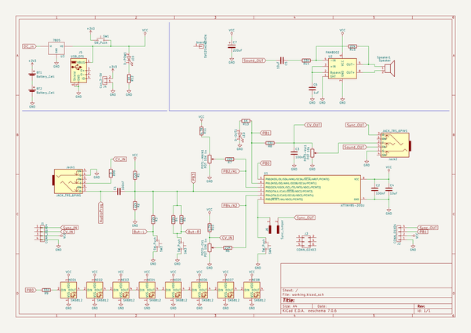
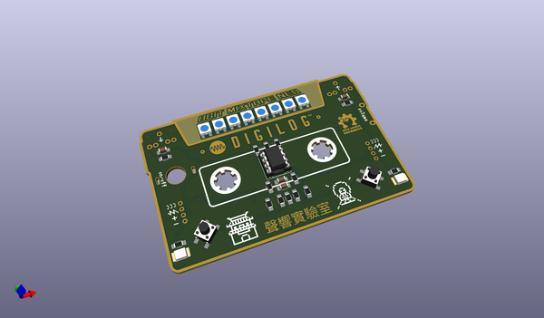
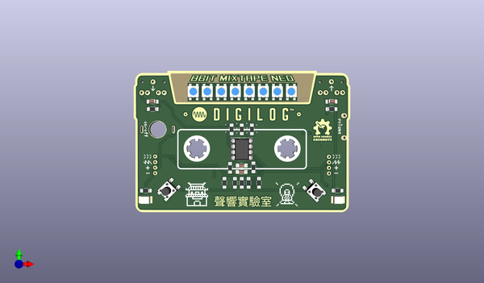
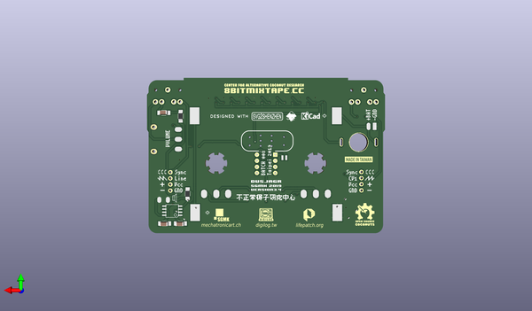

# 8bitmixtape_reworked
 
## summary 
* id: 8bitmixtape_8bitmixtape_reworked_mixtapeneo_3000
* user: 8bitmixtape
* name: 8bitmixtape_reworked
* board: mixtapeneo_3000
* repo: https://github.com/8BitMixtape/8Bitmixtape_reworked
* src_file_repo_kicad_pcb: KiCAD/MixtapeNEO-3000.kicad_pcb
* src_file_repo_kicad_pcb_link: https://github.com/8BitMixtape/8Bitmixtape_reworked/tree/master/KiCAD/MixtapeNEO-3000.kicad_pcb

* src_file_repo_sch: KiCAD/MixtapeNEO-3000.sch
* src_file_repo_sch_link: https://github.com/8BitMixtape/8Bitmixtape_reworked/tree/master/KiCAD/MixtapeNEO-3000.sch

## schematic  
  
[schematic (pdf)](working_schematic.pdf)  

## pcb  
 
  
  
  
[board (pdf)](working.pdf)  

## working_bom
| Id | Designator | Footprint | Quantity | Designation | Supplier and ref |  | None | 
| --- | --- | --- | --- | --- | --- | --- | --- | 
| 1 | C1,C2,C3 | C_1206_3d | 3 | 100nF |  |  | [''] | 
| 2 | C4,C5 | C_1206_3d | 2 | 10uF |  |  | [''] | 
| 3 | D-OUT1,D-POW1 | LED_PLCC_2835_Handsoldering | 2 | LED |  |  | [''] | 
| 4 | NEO1,NEO2,NEO3,NEO4,NEO5,NEO6,NEO7,NEO8 | Mixtape_NEO_WS2812B_3d | 8 | SK6812 |  |  | [''] | 
| 5 | POT1-MAIN1,POT2-CV1 | Potentiometer_backPads_noHole | 2 | POT 10K lin |  |  | [''] | 
| 6 | R1,R2,R3,R4,R5,R15 | R_1206_3d | 6 | 22k |  |  | [''] | 
| 7 | R6,R7 | R_1206_3d | 2 | 22K |  |  | [''] | 
| 8 | R8,R9,R14 | R_1206_3d | 3 | 330 |  |  | [''] | 
| 9 | R10,R11 | R_1206_3d | 2 | 4.7K |  |  | [''] | 
| 10 | R12,R13 | R_1206_3d | 2 | 1K |  |  | [''] | 
| 11 | U1 | DIP-8_Attiny_with_Socket_3d | 1 | ATTINY85-20SU |  |  | [''] | 
| 12 | ,,,,,,,,, | Speaker_Loch08 | 10 |  |  |  | [''] | 
| 13 | board1 | MixtapeNEO-3000_digilog | 1 | SVG2SHENZHEN |  |  | [''] | 
| 14 | R99 | R_1206_3d | 1 | 0 |  |  | [''] | 
| 15 | Ref** | Coconut_logo_sm | 1 | Val** |  |  | [''] | 
| 16 | BT1,BT2 | BAT_Holder_AAA-new_noHole | 2 | Battery_Cell |  |  | [''] | 
| 17 | C6 | C_1206_3d | 1 | 1uF |  |  | [''] | 
| 18 | C7 | C_1206_3d | 1 | 220uF |  |  | [''] | 
| 19 | J1,J2 | Angled_1x04_Pitch2.54mm-flip | 2 | CONN_01X04 |  |  | [''] | 
| 20 | J4 | Bat_connector_SMD | 1 | Con_3-5V |  |  | [''] | 
| 21 | J6 | Sync_jumper_small | 1 | Sync_Jumper |  |  | [''] | 
| 22 | Speaker1 | SpeakerPads_SMD | 1 | Speaker |  |  | [''] | 
| 23 | U2 | SO-8_fixed | 1 | PAM8002 |  |  | [''] | 
| 24 | POT3-Vol1 | Potentiometer_wheel | 1 | POT 10k |  |  | [''] | 
| 25 | Ref** | MadeInTaiwan_sm | 1 | Val** |  |  | [''] | 
| 26 | Ref** | CACR_chinese_hori | 1 | Val** |  |  | [''] | 
| 27 | Ref** | dusjagr | 1 | Val** |  |  | [''] | 

## bom_schematic
| Ref | Qnty | Value | Cmp name | Footprint | Description | Vendor | DNP | 
| --- | --- | --- | --- | --- | --- | --- | --- | 
| board1 | 1 | SVG2SHENZHEN | CONN_01X01 | 8Bitmixtape_reworked:Mixtape_reworked |  |  |  | 
| BT1, BT2 | 2 | Battery_Cell | Battery_Cell | 8Bitmixtape_reworked:BAT_Holder_AAA-new_noHole |  |  |  | 
| C1, C2, C3 | 3 | 100nF | C | 8Bitmixtape_reworked:C_1206_HandSoldering |  |  |  | 
| C4, C5 | 2 | 10uF | C | 8Bitmixtape_reworked:C_1206_HandSoldering |  |  |  | 
| C6 | 1 | 1uF | C | 8Bitmixtape_reworked:C_1206_HandSoldering |  |  |  | 
| C7 | 1 | 220uF | CP | 8Bitmixtape_reworked:C_1206_HandSoldering |  |  |  | 
| D-OUT1 | 1 | LED | LED | 8Bitmixtape_reworked:LED_2835_minimal |  |  |  | 
| D-POW1 | 1 | LED | LED | 8Bitmixtape_reworked:LED_2835_minimal |  |  |  | 
| J1, J2 | 2 | CONN_01X04 | CONN_01X04 | 8Bitmixtape_reworked:Angled_1x04_Pitch2.54mm-flip |  |  |  | 
| J3 | 1 | CONN_02X03 | CONN_02X03 | 8Bitmixtape_reworked:Socket_Strip_Straight_2x03_Pitch2.54mm |  |  |  | 
| J4 | 1 | Con_3-5V | CONN_01X02 | 8Bitmixtape_reworked:Bat_connector_SMD |  |  |  | 
| J5 | 1 | USB_OTG | USB_OTG | 8Bitmixtape_reworked:USB_Micro-B |  |  |  | 
| J6 | 1 | Sync_Jumper | CONN_01X02_MALE | 8Bitmixtape_reworked:Sync_jumper |  |  |  | 
| Jack1, Jack2 | 2 | JACK_TRS_6PINS | JACK_TRS_6PINS | 8Bitmixtape_reworked:AUDIO-Jack_3.5mm_5Pin |  |  |  | 
| NEO1, NEO2, NEO3, NEO4, NEO5, NEO6, NEO7, NEO8 | 8 | SK6812 | SK6812 | 8Bitmixtape_reworked:Mixtape_NEO_WS2812B |  |  |  | 
| POT1-MAIN1 | 1 | POT 10K lin | POT | 8Bitmixtape_reworked:Potentiometer_backPads_noHole |  |  |  | 
| POT2-CV1 | 1 | POT 10K lin | POT | 8Bitmixtape_reworked:Potentiometer_backPads_noHole |  |  |  | 
| POT3-Vol1 | 1 | POT 10k | POT | 8Bitmixtape_reworked:Potentiometer_wheel |  |  |  | 
| R1, R2, R3, R4, R5, R15 | 6 | 22k | R | 8Bitmixtape_reworked:R_1206_HandSoldering |  |  |  | 
| R6, R7 | 2 | 22K | R | 8Bitmixtape_reworked:R_1206_HandSoldering |  |  |  | 
| R8, R9, R14 | 3 | 330 | R | 8Bitmixtape_reworked:R_1206_HandSoldering |  |  |  | 
| R10, R11 | 2 | 4.7K | R | 8Bitmixtape_reworked:R_1206_HandSoldering |  |  |  | 
| R12, R13 | 2 | 1K | R | 8Bitmixtape_reworked:R_1206_HandSoldering |  |  |  | 
| R99 | 1 | 0 | R | 8Bitmixtape_reworked:R_1206_HandSoldering |  |  |  | 
| Speaker1 | 1 | Speaker | Speaker | 8Bitmixtape_reworked:SpeakerPads_SMD |  |  |  | 
| SW1 | 1 | SW_Push | SW_Push | 8Bitmixtape_reworked:Push_SWITCH_hole |  |  |  | 
| SW2, SW3 | 2 | SW_Push | SW_Push | 8Bitmixtape_reworked:TACTILE-PTH_6mm_SMD |  |  |  | 
| SW4 | 1 | SW_Push | SW_Push | 8Bitmixtape_reworked:SW_SPST_FSMSM |  |  |  | 
| U1 | 1 | ATTINY85-20SU | ATTINY85-20SU | 8Bitmixtape_reworked:Attiny_DIP-8_W7.62mm_mod |  |  |  | 
| U2 | 1 | PAM8002 | PAM8002 | 8Bitmixtape_reworked:SO-8_fixed |  |  |  | 
| U3 | 1 | 7805 | 7805 | TO_SOT_Packages_SMD:TO-252-3_TabPin2 |  |  |  | 

