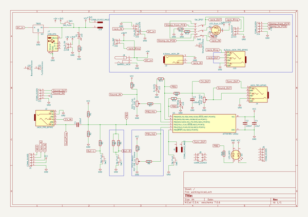
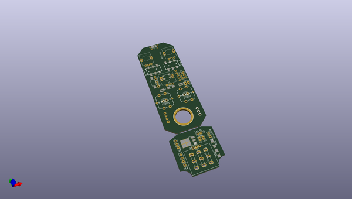
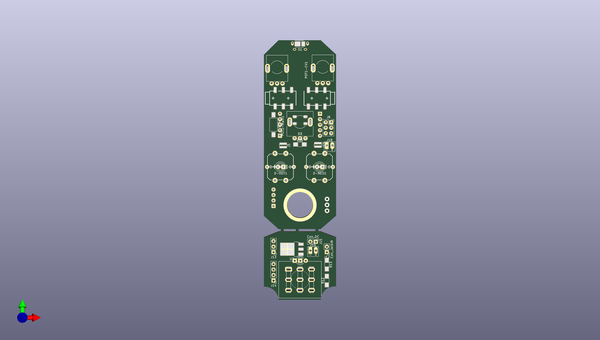
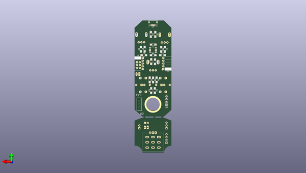

# atinystomp
 
## summary 
* id: 8bitmixtape_atinystomp_atinystompbox
* user: 8bitmixtape
* name: atinystomp
* board: atinystompbox
* repo: https://github.com/8BitMixtape/ATinyStomp
* src_file_repo_kicad_pcb: ATinyStompbox/ATinyStompbox.kicad_pcb
* src_file_repo_kicad_pcb_link: https://github.com/8BitMixtape/ATinyStomp/tree/master/ATinyStompbox/ATinyStompbox.kicad_pcb

* src_file_repo_sch: ATinyStompbox/ATinyStompbox.sch
* src_file_repo_sch_link: https://github.com/8BitMixtape/ATinyStomp/tree/master/ATinyStompbox/ATinyStompbox.sch

## schematic  
  
[schematic (pdf)](working_schematic.pdf)  

## pcb  
 
  
  
  
[board (pdf)](working.pdf)  

## working_bom
| Id | Designator | Footprint | Quantity | Designation | Supplier and ref |  | None | 
| --- | --- | --- | --- | --- | --- | --- | --- | 
| 1 | J2,J4 | AUDIO-JACK-TRS-SMD | 2 | JACK_TRS_6PINS |  |  | [''] | 
| 2 | J20 | CaseDim | 1 | BoardDimension |  |  | [''] | 
| 3 | J21 | StompCase_Full | 1 | FullDimension |  |  | [''] | 
| 4 | R12,R9,R10 | R_1206_HandSoldering | 3 | 4.7K |  |  | [''] | 
| 5 | R13,R16,R8 | R_1206_HandSoldering | 3 | 330 |  |  | [''] | 
| 6 | U2 | TO-252-3_TabPin2 | 1 | 7805 |  |  | [''] | 
| 7 | J14 | Socket_Strip_Straight_1x04_Pitch2.54mm | 1 | CONN_01X04 |  |  | [''] | 
| 8 | D1 | LED_PLCC_2835_Handsoldering | 1 | LED |  |  | [''] | 
| 9 | POT1-CV1 | Mixtape_Pot_Alps_RK09K_Horizontal | 1 | POT 10K lin |  |  | [''] | 
| 10 | POT2-Main1 | Mixtape_Pot_Alps_RK09L_Sleve_Single_Horizontal | 1 | POT 10K lin Sleeve |  |  | [''] | 
| 11 | POT3-Vol1 | Mixtape_Pot_Alps_RK09K_Horizontal | 1 | POT 10k |  |  | [''] | 
| 12 | D2 | Stomp_LED-Ring_DUAL | 1 | LED_Dual_CCA |  |  | [''] | 
| 13 | J17 | StompLoch | 1 | StompDrillHole |  |  | [''] | 
| 14 | J8 | Socket_Strip_Straight_2x03_Pitch2.54mm | 1 | CONN_02X03 |  |  | [''] | 
| 15 | J12 | Socket_Strip_Straight_1x02_Pitch2.54mm | 1 | Con_JackIN |  |  | [''] | 
| 16 | J15 | Socket_Strip_Straight_1x02_Pitch2.54mm | 1 | Con_DC |  |  | [''] | 
| 17 | J9 | 9V_BARREL_JACK | 1 | BARREL_JACK |  |  | [''] | 
| 18 | J13 | Socket_Strip_Straight_1x03_Pitch2.54mm | 1 | Con_JackOUT |  |  | [''] | 
| 19 | J16 | Bat_connector | 1 | Con_BAT |  |  | [''] | 
| 20 | J18 | Bat_connector | 1 | Con_3-5V |  |  | [''] | 
| 21 | J19,J5 | R_0612 | 2 | CONN_01X02_MALE |  |  | [''] | 
| 22 | SW6 | SW_SPST_FSMSM | 1 | SW_Push |  |  | [''] | 
| 23 | D-NEO1,D-OUT1 | LED_D3.0mm | 2 | LED |  |  | [''] | 
| 24 | D3 | Mixtape_NEO_WS2812B | 1 | LED_NEO |  |  | [''] | 
| 25 | C1,C2,C3 | C_1206_HandSoldering | 3 | 100nF |  |  | [''] | 
| 26 | C4 | C_1206_HandSoldering | 1 | 10uF |  |  | [''] | 
| 27 | R1,R2,R3,R4,R5 | R_1206_HandSoldering | 5 | 22k |  |  | [''] | 
| 28 | R6,R7 | R_1206_HandSoldering | 2 | 22K |  |  | [''] | 
| 29 | U1 | SOIC-8_3.9x4.9mm_Pitch1.27mm | 1 | ATTINY85-20SU |  |  | [''] | 
| 30 | J1,J6 | Socket_Strip_Angled_1x05_Pitch2.54mm | 2 | CONN_01X05 |  |  | [''] | 
| 31 | R14,R15,R11 | R_1206_HandSoldering | 3 | 1K |  |  | [''] | 
| 32 | J7 | USB_Micro-B | 1 | USB_OTG |  |  | [''] | 
| 33 | J11 | Socket_Strip_Straight_1x04_Pitch2.54mm | 1 | CONN_01X04 |  |  | [''] | 

## bom_schematic
| Ref | Qnty | Value | Cmp name | Footprint | Description | Vendor | DNP | 
| --- | --- | --- | --- | --- | --- | --- | --- | 
| C1, C2, C3 | 3 | 100nF | C | Capacitors_SMD:C_1206_HandSoldering |  |  |  | 
| C4 | 1 | 10uF | C | Capacitors_SMD:C_1206_HandSoldering |  |  |  | 
| D1 | 1 | LED | LED | LEDs:LED_PLCC_2835_Handsoldering |  |  |  | 
| D2 | 1 | LED_Dual_CCA | LED_Dual_CCA |  |  |  |  | 
| D3 | 1 | LED_NEO | LED_Dual_ACAC | 8BitMixtapes_all:Mixtape_NEO_WS2812B |  |  |  | 
| D-NEO1 | 1 | LED | LED | LEDs:LED_D3.0mm |  |  |  | 
| D-OUT1 | 1 | LED | LED | LEDs:LED_D3.0mm |  |  |  | 
| J1, J6 | 2 | CONN_01X05 | CONN_01X05 | Socket_Strips:Socket_Strip_Angled_1x05_Pitch2.54mm |  |  |  | 
| J2, J4 | 2 | JACK_TRS_6PINS | JACK_TRS_6PINS | 8BitMixtapes_all:AUDIO-JACK-TRS-SMD |  |  |  | 
| J3 | 1 | 6.5mm_JACK_3P | JACK_2P | 8BitMixtape_Stomp:AUDIO-6.5mm-JACK_Mono_switched |  |  |  | 
| J5, J19 | 2 | CONN_01X02_MALE | CONN_01X02_MALE | Resistors_SMD:R_0612 |  |  |  | 
| J7 | 1 | USB_OTG | USB_OTG | Connectors:USB_Micro-B |  |  |  | 
| J8 | 1 | CONN_02X03 | CONN_02X03 | 8BitMixtape_Stomp:Socket_Strip_Straight_2x03_Pitch2.54mm |  |  |  | 
| J9 | 1 | BARREL_JACK | BARREL_JACK | 8BitMixtape_Stomp:9V_BARREL_JACK |  |  |  | 
| J10 | 1 | 6.5mm_JACK_TRS_6PINS | JACK_TRS_6PINS | 8BitMixtape_Stomp:AUDIO-6.5mm-JACK_Stereo_switched |  |  |  | 
| J11 | 1 | CONN_01X04 | CONN_01X04 | Socket_Strips:Socket_Strip_Straight_1x04_Pitch2.54mm |  |  |  | 
| J12 | 1 | Con_JackIN | CONN_01X02 | 8BitMixtape_Stomp:Socket_Strip_Straight_1x02_Pitch2.54mm |  |  |  | 
| J13 | 1 | Con_JackOUT | CONN_01X03 | Socket_Strips:Socket_Strip_Straight_1x03_Pitch2.54mm |  |  |  | 
| J14 | 1 | CONN_01X04 | CONN_01X04 | 8BitMixtape_Stomp:Socket_Strip_Straight_1x04_Pitch2.54mm |  |  |  | 
| J15 | 1 | Con_DC | CONN_01X02 | 8BitMixtape_Stomp:Socket_Strip_Straight_1x02_Pitch2.54mm |  |  |  | 
| J16 | 1 | Con_BAT | CONN_01X02 | 8BitMixtape_Stomp:Bat_connector |  |  |  | 
| J17 | 1 | StompDrillHole | CONN_01X01 | 8BitMixtape_Stomp:StompLoch |  |  |  | 
| J18 | 1 | Con_3-5V | CONN_01X02 | 8BitMixtape_Stomp:Bat_connector |  |  |  | 
| J20 | 1 | BoardDimension | CONN_01X01 | 8BitMixtape_Stomp:CaseDim |  |  |  | 
| J21 | 1 | FullDimension | CONN_01X01 | 8BitMixtape_Stomp:StompCase_Full |  |  |  | 
| POT1-CV1 | 1 | POT 10K lin | POT | 8BitMixtapes_all:Mixtape_Pot_Alps_RK09K_Horizontal |  |  |  | 
| POT2-Main1 | 1 | POT 10K lin Sleeve | POT | 8BitMixtape_Stomp:Mixtape_Pot_Alps_RK09L_Sleve_Single_Horizontal |  |  |  | 
| POT3-Vol1 | 1 | POT 10k | POT | 8BitMixtapes_all:Mixtape_Pot_Alps_RK09K_Horizontal |  |  |  | 
| R1, R2, R3, R4, R5 | 5 | 22k | R | Resistors_SMD:R_1206_HandSoldering |  |  |  | 
| R6, R7 | 2 | 22K | R | Resistors_SMD:R_1206_HandSoldering |  |  |  | 
| R8, R13, R16 | 3 | 330 | R | Resistors_SMD:R_1206_HandSoldering |  |  |  | 
| R9, R10, R12 | 3 | 4.7K | R | Resistors_SMD:R_1206_HandSoldering |  |  |  | 
| R11, R14, R15 | 3 | 1K | R | Resistors_SMD:R_1206_HandSoldering |  |  |  | 
| SW1 | 1 | SW_Push | SW_Push | SparkFun-Electromechanical:SWITCH-SPDT_KIT | Push button switch, generic, two pins |  |  | 
| SW2, SW3 | 2 | SW_Push | SW_Push | 8BitMixtapes_all:TACTILE-PTH-LED-12MM | Push button switch, generic, two pins |  |  | 
| SW5 | 1 | SW_3PDT | SW_3PDT | 8BitMixtapes_all:STOMP-SWITCH-3PDT | Switch, single pole double throw |  |  | 
| SW6 | 1 | SW_Push | SW_Push | Buttons_Switches_SMD:SW_SPST_FSMSM | Push button switch, generic, two pins |  |  | 
| U1 | 1 | ATTINY85-20SU | ATTINY85-20SU | Housings_SOIC:SOIC-8_3.9x4.9mm_Pitch1.27mm |  |  |  | 
| U2 | 1 | 7805 | 7805 | TO_SOT_Packages_SMD:TO-252-3_TabPin2 |  |  |  | 

