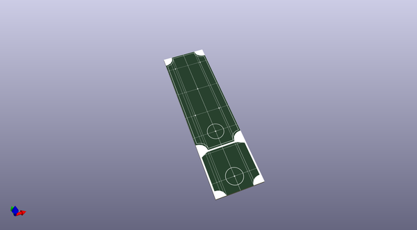
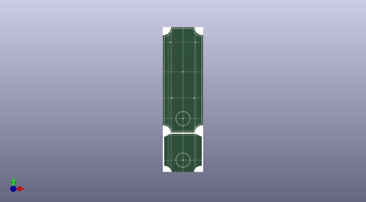
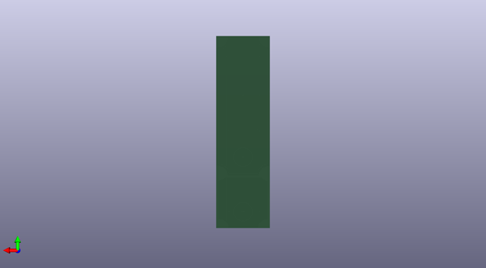

# atinystomp
 
## summary 
* id: 8bitmixtape_atinystomp_doubleboard_dimension
* user: 8bitmixtape
* name: atinystomp
* board: doubleboard_dimension
* repo: https://github.com/8BitMixtape/ATinyStomp
* src_file_repo_kicad_pcb: svg2Shenzhen_designs/DoubleBoard_dimension.kicad_pcb
* src_file_repo_kicad_pcb_link: https://github.com/8BitMixtape/ATinyStomp/tree/master/svg2Shenzhen_designs/DoubleBoard_dimension.kicad_pcb

* src_file_repo_sch: ATinyStompbox/ATinyStompbox.sch
*
 src_file_repo_sch_link: https://github.com/8BitMixtape/ATinyStomp/tree/master/ATinyStompbox/ATinyStompbox.sch
* full details link: https://github.com/oomlout/oomlout_oomp_project_bot_v_2/tree/main/projects/8bitmixtape_atinystomp_doubleboard_dimension/current_version/working  

## pcb  
 
  
  
  
[board (pdf)](working.pdf)  

## working_bom
| Id | Designator | Footprint | Quantity | Designation | Supplier and ref |  | None | 
| --- | --- | --- | --- | --- | --- | --- | --- | 
| 1 | G***,G*** | LOGO | 2 | LOGO |  |  | [''] | 

