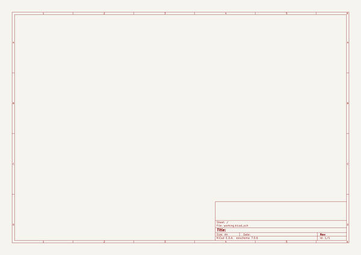
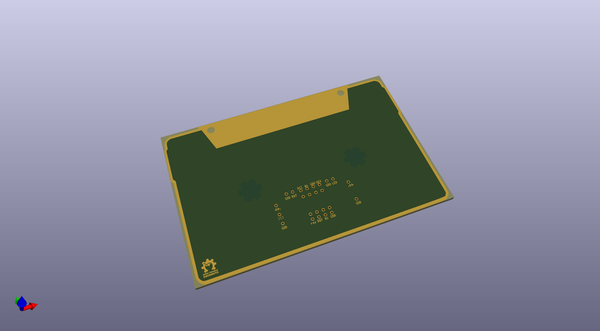
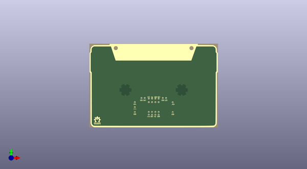
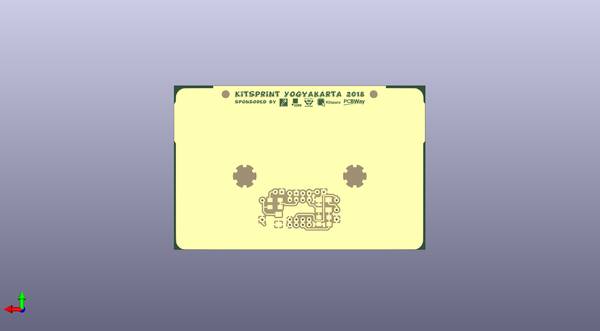

# diy_cad_mixtapefootprints
 
## summary 
* id: 8bitmixtape_diy_cad_mixtapefootprints_diy_cad_mcore
* user: 8bitmixtape
* name: diy_cad_mixtapefootprints
* board: diy_cad_mcore
* repo: https://github.com/8BitMixtape/DIY-CAD_MixtapeFootprints
* src_file_repo_kicad_pcb: DIY-CAD_mCore/DIY-CAD_mCore.kicad_pcb
* src_file_repo_kicad_pcb_link: https://github.com/8BitMixtape/DIY-CAD_MixtapeFootprints/tree/master/DIY-CAD_mCore/DIY-CAD_mCore.kicad_pcb

* src_file_repo_sch: DIY-CAD_mCore/DIY-CAD_mCore.sch
* src_file_repo_sch_link: https://github.com/8BitMixtape/DIY-CAD_MixtapeFootprints/tree/master/DIY-CAD_mCore/DIY-CAD_mCore.sch

## schematic  
  
[schematic (pdf)](working_schematic.pdf)  

## pcb  
 
  
  
  
[board (pdf)](working.pdf)  

## working_bom
| Id | Designator | Footprint | Quantity | Designation | Supplier and ref |  | None | 
| --- | --- | --- | --- | --- | --- | --- | --- | 
| 1 |  | mCore_brkout | 1 |  |  |  | [''] | 

## bom_schematic
no data

