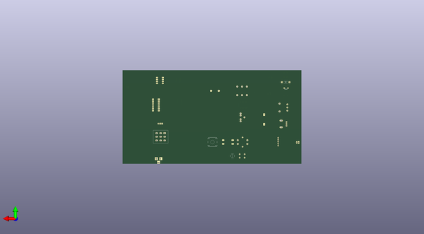

# diy_cad_mixtapefootprints
 
## summary 
* id: 8bitmixtape_diy_cad_mixtapefootprints_mixtapeminimal
* user: 8bitmixtape
* name: diy_cad_mixtapefootprints
* board: mixtapeminimal
* repo: https://github.com/8BitMixtape/DIY-CAD_MixtapeFootprints
* src_file_repo_kicad_pcb: Kicad_MixtapeBarebone/DIY-CAD_Mixtape.kicad_pcb
* src_file_repo_kicad_pcb_link: https://github.com/8BitMixtape/DIY-CAD_MixtapeFootprints/tree/master/Kicad_MixtapeBarebone/DIY-CAD_Mixtape.kicad_pcb

* src_file_repo_sch: KiCAD/DIY-CAD_Mixtape.sch
* src_file_repo_sch_link: https://github.com/8BitMixtape/DIY-CAD_MixtapeFootprints/tree/master/KiCAD/DIY-CAD_Mixtape.sch

## pcb  
 
  
  
  
[board (pdf)](working.pdf)  

## working_bom
| Id | Designator | Footprint | Quantity | Designation | Supplier and ref |  | None | 
| --- | --- | --- | --- | --- | --- | --- | --- | 
| 1 | J2 | AUDIO-JACK-3.5mm_SMD | 1 |  |  |  | [''] | 
| 2 | LS1 | BUZZER | 1 | Speaker |  |  | [''] | 
| 3 | J-USB1 | Socket_Strip_USB | 1 | CONN_01X05 |  |  | [''] | 
| 4 | SW2 | SW_PUSH-12mm_3D | 1 | SW_Push |  |  | [''] | 
| 5 | R3 | Resistor_SMD+THTuniversal | 1 | 22K |  |  | [''] | 
| 6 | RV1 | Mixtape_Pot_Alps_RK09K_Horizontal | 1 | POT 10K lin |  |  | [''] | 
| 7 |  | Mixtape_NEO_WS2812B | 1 | NEO |  |  | [''] | 
| 8 | C1 | Capacitor | 1 | 100nF |  |  | [''] | 
| 9 | BT1 | Bat_connector+- | 1 | Battery_Cell |  |  | [''] | 
| 10 | REF** | C_1206_mixtapeStyle | 1 | C_1206_HandSoldering |  |  | [''] | 
| 11 | SW3 | TACTILE-SMD-12MM | 1 | SW_Push |  |  | [''] | 
| 12 | >NAME | TACTILE-SWITCH-SMD | 1 | >VALUE |  |  | [''] | 
| 13 | U1 | SOIC-8_3.9x4.9mm_Pitch1.27mm | 1 | ATTINY85-20PU |  |  | [''] | 
| 14 | U2 | DIP-8_W7.62mm_Socket_LongPads | 1 | ATTINY85-20SU |  |  | [''] | 
| 15 | U3 | DIP-14_W7.62mm_Socket_LongPads | 1 | 4011 |  |  | [''] | 
| 16 | U3 | SOIC-14_3.9x8.7mm_Pitch1.27mm | 1 | 4011 |  |  | [''] | 
| 17 | J9 | 9V_BARREL_JACK | 1 | BARREL_JACK |  |  | [''] | 
| 18 | D2 | Stomp_LED-Ring_DUAL | 1 | LED_Dual_AAC |  |  | [''] | 
| 19 | REF** | LED_PLCC_2835 | 1 | LED_PLCC_2835 |  |  | [''] | 
| 20 | REF** | C_1210_HandSoldering | 1 | C_1210_HandSoldering |  |  | [''] | 
| 21 | REF** | R_1206_HandSoldering | 1 | R_1206_HandSoldering |  |  | [''] | 
| 22 | REF** | Potentiometer_wheel | 1 | Potentiometer_wheel |  |  | [''] | 
| 23 | REF** | LED_PLCC-2 | 1 | LED_PLCC-2 |  |  | [''] | 

