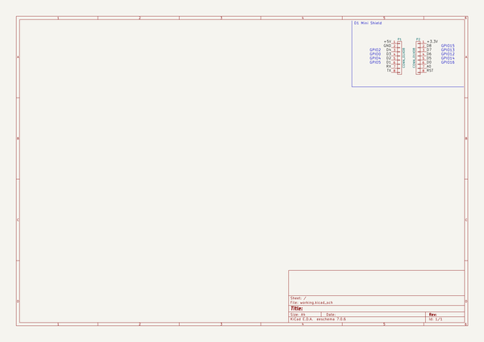
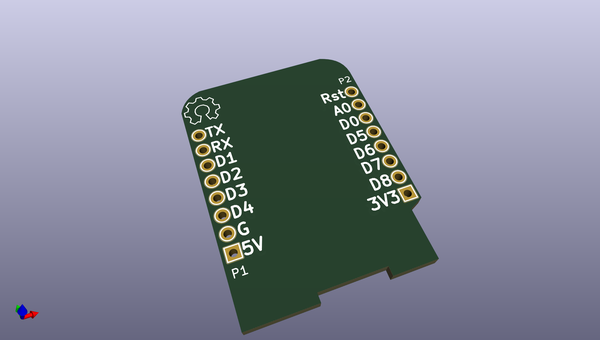
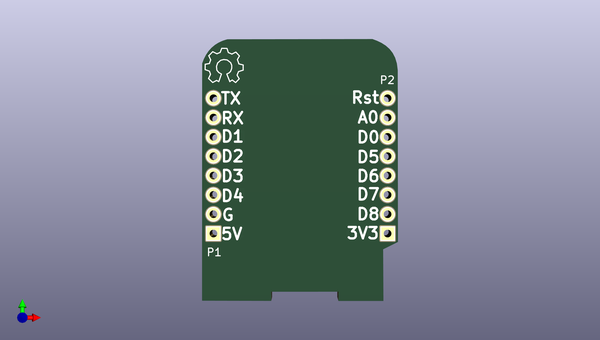
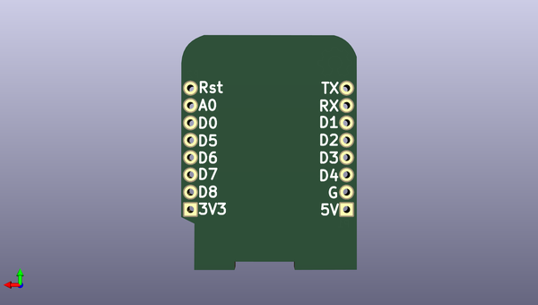

# esptiny86_mixtapepcb
 
## summary 
* id: 8bitmixtape_esptiny86_mixtapepcb_d1_mini_shield
* user: 8bitmixtape
* name: esptiny86_mixtapepcb
* board: d1_mini_shield
* repo: https://github.com/8BitMixtape/ESPTINY86_MixtapePCB
* src_file_repo_kicad_pcb: KiCAD/d1_mini_kicad-master/template/d1_mini_shield.kicad_pcb
* src_file_repo_kicad_pcb_link: https://github.com/8BitMixtape/ESPTINY86_MixtapePCB/tree/master/KiCAD/d1_mini_kicad-master/template/d1_mini_shield.kicad_pcb

* src_file_repo_sch: KiCAD/d1_mini_kicad-master/template/d1_mini_shield.sch
* src_file_repo_sch_link: https://github.com/8BitMixtape/ESPTINY86_MixtapePCB/tree/master/KiCAD/d1_mini_kicad-master/template/d1_mini_shield.sch

## schematic  
  
[schematic (pdf)](working_schematic.pdf)  

## pcb  
 
  
  
  
[board (pdf)](working.pdf)  

## working_bom
| Id | Designator | Footprint | Quantity | Designation | Supplier and ref |  | None | 
| --- | --- | --- | --- | --- | --- | --- | --- | 
| 1 | P1,P2 | D1_mini_Pin_Header | 2 | CONN_01X08 |  |  | [''] | 
| 2 |  | OSHW | 1 | OSHW |  |  | [''] | 

## bom_schematic
| Ref | Qnty | Value | Cmp name | Footprint | Description | Vendor | DNP | 
| --- | --- | --- | --- | --- | --- | --- | --- | 
| P1, P2 | 2 | CONN_01X08 | CONN_01X08 | D1_mini:D1_mini_Pin_Header |  |  |  | 

