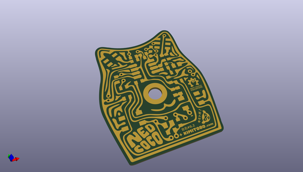
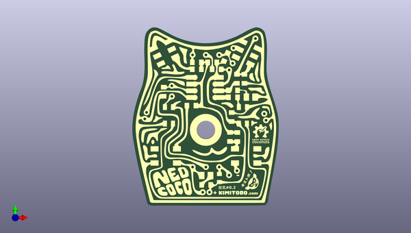
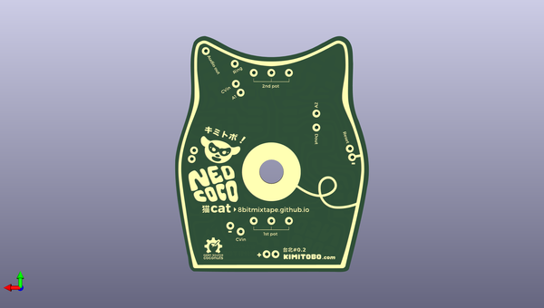

# neocococat
 
## summary 
* id: 8bitmixtape_neocococat_pcb
* user: 8bitmixtape
* name: neocococat
* board: pcb
* repo: https://github.com/8BitMixtape/Neocococat
* src_file_repo_kicad_pcb: Kicad/PCB.kicad_pcb
* src_file_repo_kicad_pcb_link: https://github.com/8BitMixtape/Neocococat/tree/master/Kicad/PCB.kicad_pcb

* src_file_repo_sch: Kicad/PCB.sch
* src_file_repo_sch_link: https://github.com/8BitMixtape/Neocococat/tree/master/Kicad/PCB.sch

## schematic  
  
[schematic (pdf)](working_schematic.pdf)  

## pcb  
 
  
  
  
[board (pdf)](working.pdf)  

## working_bom
| Id | Designator | Footprint | Quantity | Designation | Supplier and ref |  | None | 
| --- | --- | --- | --- | --- | --- | --- | --- | 
| 1 | G*** | Neocococat_Front_copper_1 | 1 | LOGO |  |  | [''] | 
| 2 | G*** | Neocococat_Back_copper_mirror | 1 | LOGO |  |  | [''] | 
| 3 | G*** | Neocococat_Frontmask | 1 | LOGO |  |  | [''] | 
| 4 | G*** | Neocococat_Backmask | 1 | LOGO |  |  | [''] | 
| 5 | REF**,REF**,REF**,REF**,REF**,REF**,REF**,REF**,REF**,REF**,REF**,REF**,REF**,REF**,REF**,REF**,REF**,REF**,REF**,REF** | Cococat_hole_1x01 | 20 | Hole_1mm |  |  | [''] | 

## bom_schematic
no data

