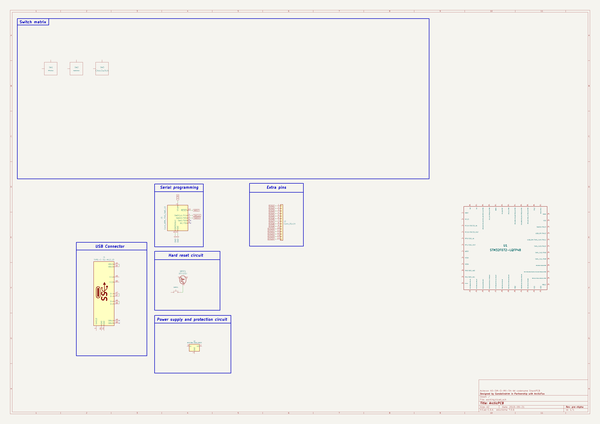

# acheronruler
 
## summary 
* id: acheronproject_acheronruler_ruler
* user: acheronproject
* name: acheronruler
* board: ruler
* repo: https://github.com/AcheronProject/AcheronRuler
* src_file_repo_kicad_pcb: kicadFiles/ruler.kicad_pcb
* src_file_repo_kicad_pcb_link: https://github.com/AcheronProject/AcheronRuler/tree/master/kicadFiles/ruler.kicad_pcb

* src_file_repo_sch: kicadFiles/ruler.sch
* src_file_repo_sch_link: https://github.com/AcheronProject/AcheronRuler/tree/master/kicadFiles/ruler.sch

## schematic  
  
[schematic (pdf)](working_schematic.pdf)  

## pcb  
 
  
  
  
[board (pdf)](working.pdf)  

## working_bom
| Id | Designator | Footprint | Quantity | Designation | Supplier and ref |  | None | 
| --- | --- | --- | --- | --- | --- | --- | --- | 
| 1 | L3 | acheronLong_40x12mm_Plated | 1 | Acheron Logo |  |  | [''] | 
| 2 | MX Switch | MX100 | 1 | MX100 |  |  | [''] | 
| 3 | L1,L1 | LED_THT_2.54mm | 2 | LED |  |  | [''] | 
| 4 | Kailh Choc | C100 | 1 | C100 |  |  | [''] | 
| 5 | QFN-44 | QFN-44-1EP_7x7mm_P0.5mm_EP5.2x5.2mm | 1 | QFN-44-1EP_7x7mm_P0.5mm_EP5.2x5.2mm |  |  | [''] | 
| 6 | QFN-28 | QFN-28-1EP_4x4mm_P0.4mm_EP2.3x2.3mm | 1 | IS31FL3731-QF |  |  | [''] | 
| 7 | TQFP-44 | TQPF-44_10x10mm_P0.8mm | 1 | TQPF-44_10x10mm_P0.8mm |  |  | [''] | 
| 8 | UQFN-48 | UQFN-48-1EP_6x6mm_P0.4mm_EP4.62x4.62mm | 1 | UQFN-48_6x6mm_P0.4mm |  |  | [''] | 
| 9 | 1206 | R_1206_3216Metric | 1 | R_1206_3216Metric |  |  | [''] | 
| 10 | 0805 | R_0805_2012Metric | 1 | R_0805_2012Metric |  |  | [''] | 
| 11 | 0603 | R_0603_1608Metric | 1 | R_0603_1608Metric |  |  | [''] | 
| 12 | 0402 | R_0402_1005Metric | 1 | R_0402_1005Metric |  |  | [''] | 
| 13 | ALPS | MXA100 | 1 | MXA100 |  |  | [''] | 
| 14 | ALPS EC11Ex | ALPS_EC11E | 1 | ALPS_EC11E |  |  | [''] | 
| 15 | SOD-123 | D_SOD-123 | 1 | D_SOD-123 |  |  | [''] | 
| 16 | SOD-323 | D_SOD-323 | 1 | D_SOD-323 |  |  | [''] | 
| 17 | SOD-523 | D_SOD-523 | 1 | D_SOD-523 |  |  | [''] | 
| 18 | 5032 2P | Crystal_SMD_5032-2Pin_5.0x3.2mm | 1 | Crystal_SMD_5032-2Pin_5.0x3.2mm |  |  | [''] | 
| 19 | J** | USB_MiniB_XM7D-0512 | 1 | USB_MiniB_XM7D-0512 |  |  | [''] | 
| 20 | J1 | TYPE-C-31-M-12 | 1 | TYPE-C-31-M12_13 |  |  | [''] | 
| 21 | 0603 | Crystal_SMD_0603-2Pin_6.0x3.5mm | 1 | Crystal_SMD_0603-2Pin_6.0x3.5mm |  |  | [''] | 
| 22 | DO-35 | D_DO-35_SOD27_P7.62mm | 1 | D_DO-35_SOD27_P7.62mm |  |  | [''] | 
| 23 | 1210 | R_1210_3225Metric | 1 | R_1210_3225Metric |  |  | [''] | 
| 24 | 1218 | R_1218_3246Metric | 1 | R_1218_3246Metric |  |  | [''] | 
| 25 | 1812 | R_1812_4532Metric | 1 | R_1812_4532Metric |  |  | [''] | 
| 26 | J** | USB_MiniB_Hirose_UX60-MB-5S8 | 1 | USB_MiniB_Hirose_UX60-MB-5S8 |  |  | [''] | 
| 27 | 5032 4P | Crystal_SMD_5032-4Pin_5.0x3.2mm | 1 | Crystal_SMD_5032-4Pin_5.0x3.2mm |  |  | [''] | 
| 28 | 2016 | Crystal_SMD_2016-4Pin_2.0x1.6mm | 1 | 16MHz |  |  | [''] | 
| 29 | 1806 | R_1806_4516Metric | 1 | R_1806_4516Metric |  |  | [''] | 
| 30 | E6C1209RGB | E6C1209RGB | 1 | E6C1209RGB |  |  | [''] | 
| 31 | WS2812 | LED_WS2812B_5.0x5.0mm_P3.2mm | 1 | LED_WS2812B_5.0x5.0mm_P3.2mm |  |  | [''] | 
| 32 | AXIAL 0.25W | R_Axial_DIN0207_L6.3mm_D2.5mm_P10.16mm_Horizontal | 1 | 10k |  |  | [''] | 
| 33 | 6028 RGB LED | LED_RGB_SMD_6028_2.8x3.5mm_Round | 1 | LED_RGB_SMD_6028_2.8x3.5mm_Round |  |  | [''] | 

## bom_schematic
| Ref | Qnty | Value | Cmp name | Footprint | Description | Vendor | DNP | 
| --- | --- | --- | --- | --- | --- | --- | --- | 
| J1 | 1 | TYPE-C-31-M12_13 | TYPE-C-31-M12_13-acheronSymbols | acheron_Connectors:TYPE-C-31-M-12 |  |  |  | 
| J2 | 1 | Conn_01x14 | Conn_01x14 | acheron_Connectors:PinHeader_1x14_P2.54mm_Vertical | Generic connector, single row, 01x14, script generated (kicad-library-utils/schlib/autogen/connector/) |  |  | 
| J3 | 1 | Conn_ARM_JTAG_SWD_10 | Conn_ARM_JTAG_SWD_10 | acheron_Connectors:Conn_ARM_JTAG_SWD_10 | Cortex Debug Connector, standard ARM Cortex-M SWD and JTAG interface |  |  | 
| QRST1 | 1 | DTC123J | DTC123J | Package_TO_SOT_SMD:SOT-23 | Digital NPN Transistor, 2k2/47k, SOT-23 |  |  | 
| SW1 | 1 | MXSwitch | MXSwitch-acheronSymbols | acheron_MX:MX100 |  |  |  | 
| SW2 | 1 | AlpsSwitch | MXSwitch-acheronSymbols | acheron_MX_SolderMask:MXA100 |  |  |  | 
| SW3 | 1 | ChocSwitch | MXSwitch-acheronSymbols | acheron_Choc:C100 |  |  |  | 
| SWRST1 | 1 | SW_Push | SW_Push | acheron_Hardware:smdPushBtn | Push button switch, generic, two pins |  |  | 
| U1 | 1 | STM32F072-LQFP48 | STM32F072-LQFP48-acheronSymbols | acheron_Components:LQFP-48_7x7mm_P0.5mm |  |  |  | 
| U3 | 1 | MCP1700-3302E_SOT23 | MCP1700-3302E_SOT23-Regulator_Linear | Package_TO_SOT_SMD:SOT-23 |  |  |  | 

