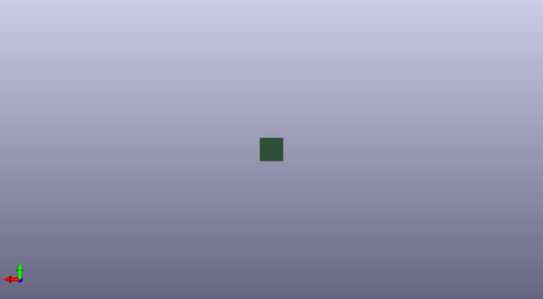

# acheronsetup
 
## summary 
* id: acheronproject_acheronsetup_blank
* user: acheronproject
* name: acheronsetup
* board: blank
* repo: https://github.com/AcheronProject/AcheronSetup
* src_file_repo_kicad_pcb: keyboard_creator/blank_template/blank.kicad_pcb
* src_file_repo_kicad_pcb_link: https://github.com/AcheronProject/AcheronSetup/tree/main/keyboard_creator/blank_template/blank.kicad_pcb
* src_file_repo_kicad_sch: keyboard_creator/blank_template/blank.kicad_sch
* src_file_repo_kicad_sch_link: https://github.com/AcheronProject/AcheronSetup/tree/main/keyboard_creator/blank_template/blank.kicad_sch

* src_file_repo_sch: 
* src_file_repo_sch_link: https://github.com/AcheronProject/AcheronSetup/tree/main/

## schematic  
  
[schematic (pdf)](working_schematic.pdf)  

## pcb  
 
  
  
  
[board (pdf)](working.pdf)  

## bom_schematic
no data

