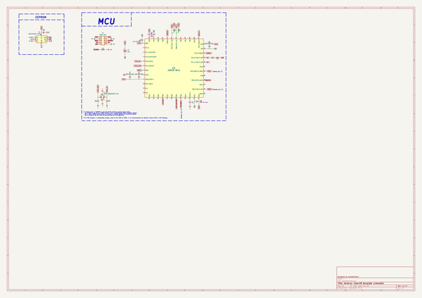
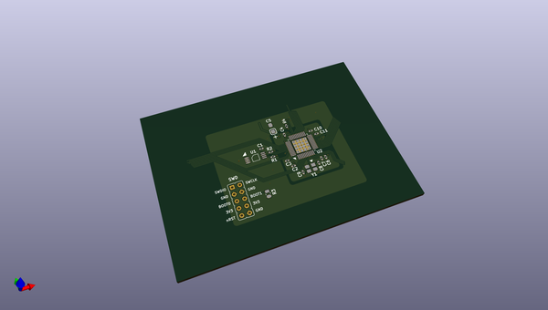
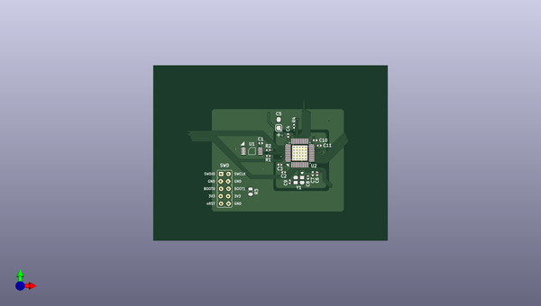
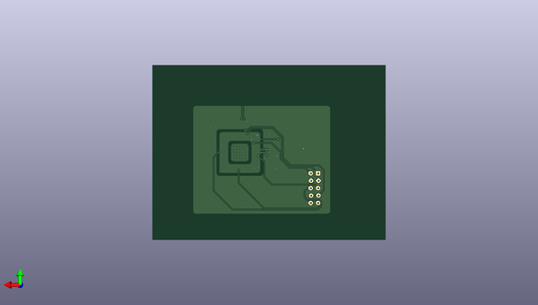

# acheronsetup
 
## summary 
* id: acheronproject_acheronsetup_joker48
* user: acheronproject
* name: acheronsetup
* board: joker48
* repo: https://github.com/AcheronProject/AcheronSetup
* src_file_repo_kicad_pcb: keyboard_creator/joker48_template/joker48.kicad_pcb
* src_file_repo_kicad_pcb_link: https://github.com/AcheronProject/AcheronSetup/tree/main/keyboard_creator/joker48_template/joker48.kicad_pcb
* src_file_repo_kicad_sch: keyboard_creator/joker48_template/joker48.kicad_sch
* src_file_repo_kicad_sch_link: https://github.com/AcheronProject/AcheronSetup/tree/main/keyboard_creator/joker48_template/joker48.kicad_sch

* src_file_repo_sch: 
* src_file_repo_sch_link: https://github.com/AcheronProject/AcheronSetup/tree/main/

## schematic  
  
[schematic (pdf)](working_schematic.pdf)  

## pcb  
 
  
  
  
[board (pdf)](working.pdf)  

## working_bom
| Id | Designator | Footprint | Quantity | Designation | Supplier and ref |  | None | 
| --- | --- | --- | --- | --- | --- | --- | --- | 
| 1 | U1 | TSSOP-8_4.4x3mm_P0.65mm | 1 | BL24C256A-SFRC |  |  | [''] | 
| 2 | C9,C8 | C_0402_1005Metric | 2 | 16p |  |  | [''] | 
| 3 | C11 | C_0402_1005Metric | 1 | 4.7u |  |  | [''] | 
| 4 | C1,C10,C2,C3,C4 | C_0402_1005Metric | 5 | 100n |  |  | [''] | 
| 5 | U2 | STM_UFQFPN-48_LQFP-48-1EP_7x7mm_P0.5mm_HandSoldering_ThermalReliefs | 1 | STM32F411CEU6 |  |  | [''] | 
| 6 | C5 | CP_EIA-3216-10_Kemet-I_Pad1.58x1.35mm_HandSolder | 1 | 10u |  |  | [''] | 
| 7 | C6 | C_0402_1005Metric | 1 | 1u |  |  | [''] | 
| 8 | Y1 | Crystal_SMD_3225-4Pin_3.2x2.5mm | 1 | 7325-0800A2010-00 |  |  | [''] | 
| 9 | R1,R4,R2 | R_0402_1005Metric | 3 | 1.5k |  |  | [''] | 
| 10 | R3 | R_0805_2012Metric | 1 | 10k |  |  | [''] | 
| 11 | C7 | C_0402_1005Metric | 1 | 10n |  |  | [''] | 

## bom_schematic
| Ref | Qnty | Value | Cmp name | Footprint | Description | Vendor | DNP | 
| --- | --- | --- | --- | --- | --- | --- | --- | 
| C1, C2, C3, C4, C10 | 5 | 100n | C_Small | Capacitor_SMD:C_0402_1005Metric | Unpolarized capacitor, small symbol |  |  | 
| C5 | 1 | 10u | CP1 | acheron_Components:CP_EIA-3216-10_Kemet-I_Pad1.58x1.35mm_HandSolder | Polarized capacitor, US symbol |  |  | 
| C6 | 1 | 1u | C_Small | Capacitor_SMD:C_0402_1005Metric | Unpolarized capacitor, small symbol |  |  | 
| C7 | 1 | 10n | C_Small | Capacitor_SMD:C_0402_1005Metric | Unpolarized capacitor, small symbol |  |  | 
| C8, C9 | 2 | 16p | C_Small | Capacitor_SMD:C_0402_1005Metric | Unpolarized capacitor, small symbol |  |  | 
| C11 | 1 | 4.7u | C_Small | Capacitor_SMD:C_0402_1005Metric | Unpolarized capacitor, small symbol |  |  | 
| R1, R2 | 2 | 4.7k | R_Small | Resistor_SMD:R_0402_1005Metric | Resistor, small symbol |  |  | 
| R3 | 1 | 10k | R_Small | Resistor_SMD:R_0805_2012Metric | Resistor, small symbol |  |  | 
| R4 | 1 | 1.5k | R_Small | Resistor_SMD:R_0402_1005Metric | Resistor, small symbol |  |  | 
| U1 | 1 | BL24C256A-SFRC | 24LC256 | acheron_Components:TSSOP-8_4.4x3mm_P0.65mm | I2C Serial EEPROM, 256Kb, DIP-8/SOIC-8/TSSOP-8/DFN-8 |  |  | 
| U2 | 1 | JOKER MCU | STM32F411-48 | acheron_Components:STM_UFQFPN-48_LQFP-48-1EP_7x7mm_P0.5mm_HandSoldering_ThermalReliefs | UFQFPN-48 Arm® Cortex®-M4 32bits MCU+FPU, 125 DMIPS, 512KB Flash,   128KB RAM, USB OTG FS, 11 TIMs, 1 ADC, 13 comm. interfaces |  |  | 
| Y1 | 1 | 7325-0800A2010-00 | Crystal_GND24 | acheron_Components:Crystal_SMD_3225-4Pin_3.2x2.5mm | Four pin crystal, GND on pins 2 and 4 |  |  | 

