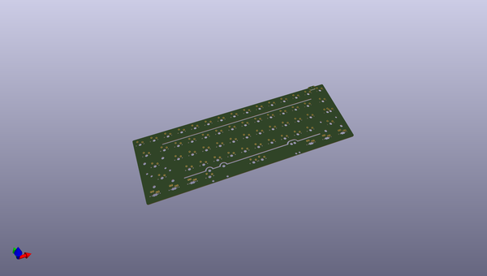
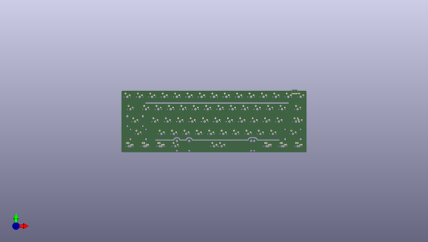
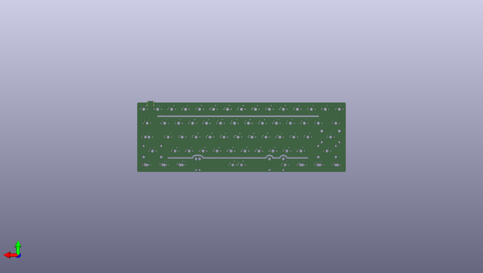

# alioth
 
## summary 
* id: acheronproject_alioth_alioth
* user: acheronproject
* name: alioth
* board: alioth
* repo: https://github.com/AcheronProject/Alioth
* src_file_repo_kicad_pcb: kicad_files/alioth.kicad_pcb
* src_file_repo_kicad_pcb_link: https://github.com/AcheronProject/Alioth/tree/master/kicad_files/alioth.kicad_pcb

* src_file_repo_sch: 
* src_file_repo_sch_link: https://github.com/AcheronProject/Alioth/tree/master/

## pcb  
 
  
  
  
[board (pdf)](working.pdf)  

## working_bom
| Id | Designator | Footprint | Quantity | Designation | Supplier and ref |  | None | 
| --- | --- | --- | --- | --- | --- | --- | --- | 
| 1 | SW62 | MX125 | 1 | RCTRL |  |  | [''] | 
| 2 | D23,D8,D54,D2,D21,D36,D37,D5,D51,D25,D34,D9,D40,D13,D32,D4,D22,D59,D16,D62,D26,D60,D53,D43,D55,D19,D27,D58,D38,D35,D17,D24,D33,D52,D44,D12,D31,D6,D39,D1,D46,D45,D61,D48,D18,D7,D28,D15,D29,D20,D11,D14,D41,D30,D3,D49,D56,D57,D47,D10,D50,D42 | D_SOD-123 | 62 | 1N4148W |  |  | [''] | 
| 3 | SW69 | MX150 | 1 | RCTRL |  |  | [''] | 
| 4 | SW13 | MX100 | 1 | PLUS |  |  | [''] | 
| 5 | SW22 | MX100 | 1 | Y |  |  | [''] | 
| 6 | SW37 | MX100 | 1 | J |  |  | [''] | 
| 7 | SW1 | MX100 | 1 | ESC |  |  | [''] | 
| 8 | SW45 | MX100 | 1 | Z |  |  | [''] | 
| 9 | SW21 | MX100 | 1 | T |  |  | [''] | 
| 10 | SW59 | MX125 | 1 | RALT |  |  | [''] | 
| 11 | SW5 | MX100 | 1 | 4 |  |  | [''] | 
| 12 | SW65 | MX150 | 1 | LALT |  |  | [''] | 
| 13 | SW32 | MX100 | 1 | S |  |  | [''] | 
| 14 | SW36 | MX100 | 1 | H |  |  | [''] | 
| 15 | SW31 | MX100 | 1 | A |  |  | [''] | 
| 16 | SW28 | MX100 | 1 | RBRKT |  |  | [''] | 
| 17 | SW24 | MX100 | 1 | I |  |  | [''] | 
| 18 | SW55 | MX125 | 1 | LCTRL |  |  | [''] | 
| 19 | SW4 | MX100 | 1 | 3 |  |  | [''] | 
| 20 | SW7 | MX100 | 1 | 6 |  |  | [''] | 
| 21 | SW38 | MX100 | 1 | K |  |  | [''] | 
| 22 | SW18 | MX100 | 1 | W |  |  | [''] | 
| 23 | SW46 | MX100 | 1 | X |  |  | [''] | 
| 24 | SW27 | MX100 | 1 | LBRKT |  |  | [''] | 
| 25 | SW42 | MX225R | 1 | ENTER |  |  | [''] | 
| 26 | SW50 | MX100 | 1 | M |  |  | [''] | 
| 27 | SW57 | MX125 | 1 | LALT |  |  | [''] | 
| 28 | SW35 | MX100 | 1 | G |  |  | [''] | 
| 29 | SW8 | MX100 | 1 | 7 |  |  | [''] | 
| 30 | SW56 | MX125 | 1 | LWIN |  |  | [''] | 
| 31 | SW3 | MX100 | 1 | 2 |  |  | [''] | 
| 32 | SW19 | MX100 | 1 | E |  |  | [''] | 
| 33 | SW67 | MX150 | 1 | RALT |  |  | [''] | 
| 34 | SW14 | MX100 | 1 | LBKSP |  |  | [''] | 
| 35 | SW61 | MX125 | 1 | FN |  |  | [''] | 
| 36 | SW63 | MX150 | 1 | LCTRL |  |  | [''] | 
| 37 | SW?B1 | MX100 | 1 | B |  |  | [''] | 
| 38 | SW58 | MX625R | 1 | SPACE |  |  | [''] | 
| 39 | SW52 | MX100 | 1 | DOT |  |  | [''] | 
| 40 | SW30 | MX175 | 1 | CAPS |  |  | [''] | 
| 41 | SW39 | MX100 | 1 | L |  |  | [''] | 
| 42 | SW20 | MX100 | 1 | R |  |  | [''] | 
| 43 | SW49 | MX100 | 1 | N |  |  | [''] | 
| 44 | SW68 | MX100 | 1 | RWIN |  |  | [''] | 
| 45 | J1 | TYPE-C-31-M-12 | 1 | TYPE-C-31-M12_13 |  |  | [''] | 
| 46 | SW41 | MX100 | 1 | APOST |  |  | [''] | 
| 47 | SW12 | MX100 | 1 | MINUS |  |  | [''] | 
| 48 | SW54 | MX275 | 1 | RSHFT |  |  | [''] | 
| 49 | SW11 | MX100 | 1 | 0 |  |  | [''] | 
| 50 | SW51 | MX100 | 1 | COMMA |  |  | [''] | 
| 51 | SW9 | MX100 | 1 | 8 |  |  | [''] | 
| 52 | SW34 | MX100 | 1 | F |  |  | [''] | 
| 53 | SW6 | MX100 | 1 | 5 |  |  | [''] | 
| 54 | SW40 | MX100 | 1 | QUOTE |  |  | [''] | 
| 55 | SW33 | MX100 | 1 | D |  |  | [''] | 
| 56 | SW43 | MX125 | 1 | STEPPED |  |  | [''] | 
| 57 | SW48 | MX100 | 1 | V |  |  | [''] | 
| 58 | SW15 | MX100 | 1 | RBKSP |  |  | [''] | 
| 59 | SW47 | MX100 | 1 | C |  |  | [''] | 
| 60 | SW60 | MX125 | 1 | RWIN |  |  | [''] | 
| 61 | SW23 | MX100 | 1 | U |  |  | [''] | 
| 62 | SW53 | MX100 | 1 | SLASH |  |  | [''] | 
| 63 | SW16 | MX150 | 1 | TAB |  |  | [''] | 
| 64 | SW10 | MX100 | 1 | 9 |  |  | [''] | 
| 65 | SW25 | MX100 | 1 | O |  |  | [''] | 
| 66 | SW26 | MX100 | 1 | P |  |  | [''] | 
| 67 | SW64 | MX100 | 1 | LWIN |  |  | [''] | 
| 68 | SW2 | MX100 | 1 | 1 |  |  | [''] | 
| 69 | SW44 | MX225 | 1 | LSHFT |  |  | [''] | 
| 70 | SW66 | MX700R | 1 | SPACE |  |  | [''] | 
| 71 | SW17 | MX100 | 1 | Q |  |  | [''] | 
| 72 | SW29 | MX150 | 1 | BKSLSH |  |  | [''] | 

