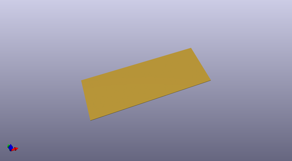

# alioth
 
## summary 
* id: acheronproject_alioth_polaris_half_iso_plate
* user: acheronproject
* name: alioth
* board: polaris_half_iso_plate
* repo: https://github.com/AcheronProject/Alioth
* src_file_repo_kicad_pcb: polaris_plates/polaris_ansi_plate.kicad_pcb
* src_file_repo_kicad_pcb_link: https://github.com/AcheronProject/Alioth/tree/master/polaris_plates/polaris_ansi_plate.kicad_pcb

* src_file_repo_sch: 
* src_file_repo_sch_link: https://github.com/AcheronProject/Alioth/tree/master/

## pcb  
 
  
  
  
[board (pdf)](working.pdf)  

## working_bom
| Id | Designator | Footprint | Quantity | Designation | Supplier and ref |  | None | 
| --- | --- | --- | --- | --- | --- | --- | --- | 
| 1 | REF**,REF**,REF**,REF**,REF**,REF**,REF**,REF**,REF**,REF**,REF**,REF**,REF**,REF**,REF**,REF**,REF**,REF**,REF**,REF**,REF**,REF**,REF**,REF**,REF**,REF**,REF**,REF**,REF**,REF**,REF**,REF**,REF**,REF**,REF**,REF**,REF**,REF**,REF**,REF**,REF**,REF**,REF**,REF**,REF**,REF** | MX100 | 46 | MX100 |  |  | [''] | 
| 2 | REF**,REF** | MX150 | 2 | MX150 |  |  | [''] | 
| 3 | REF**,REF** | MX225 | 2 | MX225 |  |  | [''] | 

