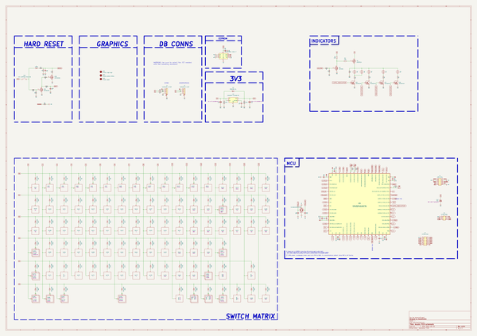
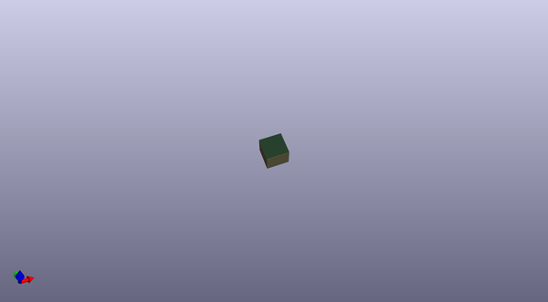

# anubis
 
## summary 
* id: acheronproject_anubis_anubis
* user: acheronproject
* name: anubis
* board: anubis
* repo: https://github.com/AcheronProject/Anubis
* src_file_repo_kicad_pcb: kicad_files/anubis.kicad_pcb
* src_file_repo_kicad_pcb_link: https://github.com/AcheronProject/Anubis/tree/main/kicad_files/anubis.kicad_pcb
* src_file_repo_kicad_sch: kicad_files/anubis.kicad_sch
* src_file_repo_kicad_sch_link: https://github.com/AcheronProject/Anubis/tree/main/kicad_files/anubis.kicad_sch

* src_file_repo_sch: 
* src_file_repo_sch_link: https://github.com/AcheronProject/Anubis/tree/main/

## schematic  
  
[schematic (pdf)](working_schematic.pdf)  

## pcb  
 
  
  
  
[board (pdf)](working.pdf)  

## working_bom
| Id | Designator | Footprint | Quantity | Designation | Supplier and ref |  | None | 
| --- | --- | --- | --- | --- | --- | --- | --- | 
| 1 | C9,C3,C16,C1,C15,C8,C7 | C_0402_1005Metric | 7 | 100n |  |  | [''] | 
| 2 | SW95,SW47,SW48,SW16,SW6,SW24,SW34,SW27,SW56,SW26,SW49,SW42,SW38,SW66,SW74,SW39,SW30,SW97,SW53,SW23,SW55,SW51,SW103,SW40,SW13,SW75,SW46,SW81,SW29,SW36,SW28,SW63,SW77,SW5,SW19,SW72,SW78,SW33,SW71,SW41,SW45,SW99,SW64,SW59,SW21,SW76,SW15,SW20,SW9,SW31,SW62,SW73,SW43,SW14,SW83,SW57,SW61,SW4,SW84,SW18,SW3,SW35,SW96,SW44,SW7,SW52,SW10,SW8,SW25,SW17,SW58,SW22,SW2,SW60,SW79,SW65,SW80,SW12,SW11 | MX100 | 79 | MX Switch |  |  | [''] | 
| 3 | R18,R6,R8,R21,R7,R1 | R_0402_1005Metric | 6 | 10k |  |  | [''] | 
| 4 | D89,D55,D74,D72,D34,D3,D22,D80,D48,D1,D67,D57,D4,D83,D13,D35,D29,D56,D18,D87,D88,D12,D9,D31,D78,D16,D93,D65,D38,D49,D21,D51,D11,D5,D76,D64,D54,D81,D25,D19,D46,D58,D45,D85,D75,D73,D42,D33,D61,D30,D23,D68,D71,D17,D50,D77,D66,D24,D47,D44,D6,D8,D41,D70,D15,D36,D37,D40,D14,D90,D84,D39,D91,D79,D52,D82,D10,D27,D28,D20,D53,D43,D60,D26,D62,D59,D69,D32,D63,D86,D7,D92 | D_SOD-123 | 92 | 1N4148W |  |  | [''] | 
| 5 | J1,J2 | SM04B-SRSS-TB(LF)(SN)_mounting-reliefs | 2 | A1001WR-S-04P |  |  | [''] | 
| 6 | C5,C4 | C_0805_2012Metric | 2 | 1u |  |  | [''] | 
| 7 | U3 | SOT-23-5 | 1 | SGM2007-3.3XN5/TR |  |  | [''] | 
| 8 | R11,R12,R10,R13 | R_0402_1005Metric | 4 | 1k |  |  | [''] | 
| 9 | SW85,SW54 | MX175 | 2 | MX Switch |  |  | [''] | 
| 10 | SW104,SW102,SW98,SW37,SW100,SW50 | MX150 | 6 | MX Switch |  |  | [''] | 
| 11 | SW67 | MX225R | 1 | MX Switch |  |  | [''] | 
| 12 | R15,R4,R9,R14 | R_0402_1005Metric | 4 | 100R |  |  | [''] | 
| 13 | R20,R19 | R_0805_2012Metric | 2 | 100k |  |  | [''] | 
| 14 | U4 | LQFP-64_10x10mm_P0.5mm | 1 | STM32F401RCT6 |  |  | [''] | 
| 15 | R17,R16 | R_0805_2012Metric | 2 | 0R |  |  | [''] | 
| 16 | C11,C12 | C_0402_1005Metric | 2 | 15p |  |  | [''] | 
| 17 | U1 | SOIC-8 | 1 | AT24C256C-SSHL-T |  |  | [''] | 
| 18 | SW82 | MX275 | 1 | MX Switch |  |  | [''] | 
| 19 | SW89,SW94,SW93,SW87,SW92,SW91,SW88,SW86,SW68 | MX125 | 9 | MX Switch |  |  | [''] | 
| 20 | Q1 | SOT-23 | 1 | AO3401A |  |  | [''] | 
| 21 | SW32 | MX200 | 1 | MX Switch |  |  | [''] | 
| 22 | R3 | R_0402_1005Metric | 1 | 330k |  |  | [''] | 
| 23 | C6,C14 | C_0402_1005Metric | 2 | 10n |  |  | [''] | 
| 24 | SW70 | MX225 | 1 | MX Switch |  |  | [''] | 
| 25 | R5 | R_0402_1005Metric | 1 | 1M |  |  | [''] | 
| 26 | Q3,Q5,Q4,Q6 | SOT-23 | 4 | DTC123JKAT146 |  |  | [''] | 
| 27 | R22,R23 | R_0402_1005Metric | 2 | 4.7k |  |  | [''] | 
| 28 | C17,C13 | C_0402_1005Metric | 2 | 4.7u |  |  | [''] | 
| 29 | SW1 | K2-1187SQ-A4SW-06 | 1 | K2-1187SQ-A4SW-06 |  |  | [''] | 
| 30 | U2 | SOT-363_SC-70-6 | 1 | 2N7002DW |  |  | [''] | 
| 31 | SW90 | MX625R | 1 | MX Switch |  |  | [''] | 
| 32 | C10 | CP_EIA-3216-10_Kemet-I_Pad1.58x1.35mm_HandSolder | 1 | 10u |  |  | [''] | 
| 33 | C2 | C_0402_1005Metric | 1 | 10u |  |  | [''] | 
| 34 | R2 | R_0402_1005Metric | 1 | 100 |  |  | [''] | 
| 35 | SW69 | MX_ISOEnter | 1 | MX Switch |  |  | [''] | 
| 36 | D2 | D_SOD-123 | 1 | B5819W-SL |  |  | [''] | 
| 37 | R24 | R_0402_1005Metric | 1 | 1.5k |  |  | [''] | 
| 38 | Y1 | Crystal_SMD_3225-4Pin_3.2x2.5mm | 1 | TAXM8M4RFDCET2T |  |  | [''] | 
| 39 | SW101 | MX700R | 1 | MX Switch |  |  | [''] | 
| 40 | Q2 | SOT-23 | 1 | 2N7002 |  |  | [''] | 

## bom_schematic
| Ref | Qnty | Value | Cmp name | Footprint | Description | Vendor | DNP | 
| --- | --- | --- | --- | --- | --- | --- | --- | 
| C1, C3, C7, C8, C9, C15, C16 | 7 | 100n | C_Small | Capacitor_SMD:C_0402_1005Metric | Unpolarized capacitor, small symbol |  |  | 
| C2 | 1 | 10u | C_Small | Capacitor_SMD:C_0402_1005Metric | Unpolarized capacitor, small symbol |  |  | 
| C4, C5 | 2 | 1u | C | Capacitor_SMD:C_0805_2012Metric | Unpolarized capacitor |  |  | 
| C6, C14 | 2 | 10n | C_Small | Capacitor_SMD:C_0402_1005Metric | Unpolarized capacitor, small symbol |  |  | 
| C10 | 1 | 10u | CP1 | acheron_Components:CP_EIA-3216-10_Kemet-I_Pad1.58x1.35mm_HandSolder | Polarized capacitor, US symbol |  |  | 
| C11, C12 | 2 | 15p | C_Small | Capacitor_SMD:C_0402_1005Metric | Unpolarized capacitor, small symbol |  |  | 
| C13, C17 | 2 | 4.7u | C_Small | Capacitor_SMD:C_0402_1005Metric | Unpolarized capacitor, small symbol |  |  | 
| D1, D3, D4, D5, D6, D7, D8, D9, D10, D11, D12, D13, D14, D15, D16, D17, D18, D19, D20, D21, D22, D23, D24, D25, D26, D27, D28, D29, D30, D31, D32, D33, D34, D35, D36, D37, D38, D39, D40, D41, D42, D43, D44, D45, D46, D47, D48, D49, D50, D51, D52, D53, D54, D55, D56, D57, D58, D59, D60, D61, D62, D63, D64, D65, D66, D67, D68, D69, D70, D71, D72, D73, D74, D75, D76, D77, D78, D79, D80, D81, D82, D83, D84, D85, D86, D87, D88, D89, D90, D91, D92, D93 | 92 | 1N4148W | D | acheron_Components:D_SOD-123 | Diode |  |  | 
| D2 | 1 | B5819W-SL | D_Schottky | acheron_Components:D_SOD-123 | Schottky diode |  |  | 
| J1, J2 | 2 | A1001WR-S-04P | Conn_01x04_MountingPin | acheron_Connectors:SM04B-SRSS-TB(LF)(SN)_mounting-reliefs | Generic connectable mounting pin connector, single row, 01x04, script generated (kicad-library-utils/schlib/autogen/connector/) |  |  | 
| Q1 | 1 | AO3401A | AO3401A | Package_TO_SOT_SMD:SOT-23 | -4.0A Id, -30V Vds, P-Channel MOSFET, SOT-23 |  |  | 
| Q2 | 1 | 2N7002 | 2N7002 | Package_TO_SOT_SMD:SOT-23 | 0.115A Id, 60V Vds, N-Channel MOSFET, SOT-23 |  |  | 
| Q3, Q4, Q5, Q6 | 4 | DTC123JKAT146 | DTC123J | Package_TO_SOT_SMD:SOT-23 |  |  |  | 
| R1, R6, R7, R8, R18, R21 | 6 | 10k | R_Small | Resistor_SMD:R_0402_1005Metric | Resistor, small symbol |  |  | 
| R2 | 1 | 100 | R_Small | Resistor_SMD:R_0402_1005Metric | Resistor, small symbol |  |  | 
| R3 | 1 | 330k | R_Small | Resistor_SMD:R_0402_1005Metric | Resistor, small symbol |  |  | 
| R4, R9, R14, R15 | 4 | 100R | R_Small | Resistor_SMD:R_0402_1005Metric | Resistor, small symbol |  |  | 
| R5 | 1 | 1M | R_Small | Resistor_SMD:R_0402_1005Metric | Resistor, small symbol |  |  | 
| R10, R11, R12, R13 | 4 | 1k | R_Small | Resistor_SMD:R_0402_1005Metric | Resistor, small symbol |  |  | 
| R16, R17 | 2 | 0R | R_Small | Resistor_SMD:R_0805_2012Metric | Resistor, small symbol |  |  | 
| R19, R20 | 2 | 100k | R | Resistor_SMD:R_0805_2012Metric | Resistor |  |  | 
| R22, R23 | 2 | 4.7k | R_Small | Resistor_SMD:R_0402_1005Metric | Resistor, small symbol |  |  | 
| R24 | 1 | 1.5k | R_Small | Resistor_SMD:R_0402_1005Metric | Resistor, small symbol |  |  | 
| SW1 | 1 | K2-1187SQ-A4SW-06 | SW_SPST | acheron_Hardware:K2-1187SQ-A4SW-06 | Single Pole Single Throw (SPST) switch |  |  | 
| SW2, SW3, SW4, SW5, SW6, SW7, SW8, SW9, SW10, SW11, SW12, SW13, SW14, SW15, SW16, SW17, SW18, SW19, SW20, SW21, SW22, SW23, SW24, SW25, SW26, SW27, SW28, SW29, SW30, SW31, SW33, SW34, SW35, SW36, SW38, SW39, SW40, SW41, SW42, SW43, SW44, SW45, SW46, SW47, SW48, SW49, SW51, SW52, SW53, SW55, SW56, SW57, SW58, SW59, SW60, SW61, SW62, SW63, SW64, SW65, SW66, SW71, SW72, SW73, SW74, SW75, SW76, SW77, SW78, SW79, SW80, SW81, SW83, SW84, SW95, SW96, SW97, SW99, SW103 | 79 | MX Switch | Mechanical_Switch | acheron_MX_SolderMask:MX100 | Keyboard mechanical switch |  |  | 
| SW32 | 1 | MX Switch | Mechanical_Switch | acheron_MX_SolderMask:MX200 | Keyboard mechanical switch |  |  | 
| SW37, SW50, SW98, SW100, SW102, SW104 | 6 | MX Switch | Mechanical_Switch | acheron_MX_SolderMask:MX150 | Keyboard mechanical switch |  |  | 
| SW54, SW85 | 2 | MX Switch | Mechanical_Switch | acheron_MX_SolderMask:MX175 | Keyboard mechanical switch |  |  | 
| SW67 | 1 | MX Switch | Mechanical_Switch | acheron_MX_SolderMask:MX225R | Keyboard mechanical switch |  |  | 
| SW68, SW86, SW87, SW88, SW89, SW91, SW92, SW93, SW94 | 9 | MX Switch | Mechanical_Switch | acheron_MX_SolderMask:MX125 | Keyboard mechanical switch |  |  | 
| SW69 | 1 | MX Switch | Mechanical_Switch | acheron_MX_SolderMask:MX_ISOEnter | Keyboard mechanical switch |  |  | 
| SW70 | 1 | MX Switch | Mechanical_Switch | acheron_MX_SolderMask:MX225 | Keyboard mechanical switch |  |  | 
| SW82 | 1 | MX Switch | Mechanical_Switch | acheron_MX_SolderMask:MX275 | Keyboard mechanical switch |  |  | 
| SW90 | 1 | MX Switch | Mechanical_Switch | acheron_MX_SolderMask:MX625R | Keyboard mechanical switch |  |  | 
| SW101 | 1 | MX Switch | Mechanical_Switch | acheron_MX_SolderMask:MX700R | Keyboard mechanical switch |  |  | 
| U1 | 1 | AT24C256C-SSHL-T | 24LC256 | acheron_Components:SOIC-8 | I2C Serial EEPROM, 256Kb, DIP-8/SOIC-8/TSSOP-8/DFN-8 |  |  | 
| U2 | 1 | 2N7002DW | 2N7002DW | acheron_Components:SOT-363_SC-70-6 | Dual N-channel enhancement mode MOSFET |  |  | 
| U3 | 1 | SGM2007-3.3XN5/TR | SGM2036 | acheron_Components:SOT-23-5 | 300mA, Low Power, Low Dropout Linear Regulators |  |  | 
| U4 | 1 | STM32F401RCT6 | STM32F401-LQFP64 | acheron_Components:LQFP-64_10x10mm_P0.5mm | 32-bit 256kBytes flash ARM Cortex-M4  microcontroller |  |  | 
| Y1 | 1 | TAXM8M4RFDCET2T | Crystal_GND24 | acheron_Components:Crystal_SMD_3225-4Pin_3.2x2.5mm | Four pin crystal, GND on pins 2 and 4 |  |  | 

