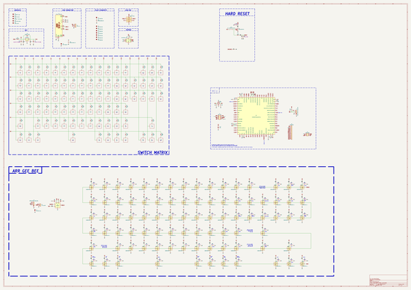
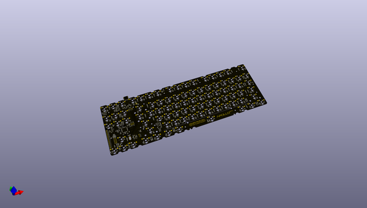

# apollo87h
 
## summary 
* id: acheronproject_apollo87h_apollo87h
* user: acheronproject
* name: apollo87h
* board: apollo87h
* repo: https://github.com/AcheronProject/Apollo87H
* src_file_repo_kicad_pcb: kicad_files/apollo87h.kicad_pcb
* src_file_repo_kicad_pcb_link: https://github.com/AcheronProject/Apollo87H/tree/main/kicad_files/apollo87h.kicad_pcb
* src_file_repo_kicad_sch: kicad_files/apollo87h.kicad_sch
* src_file_repo_kicad_sch_link: https://github.com/AcheronProject/Apollo87H/tree/main/kicad_files/apollo87h.kicad_sch

* src_file_repo_sch: 
* src_file_repo_sch_link: https://github.com/AcheronProject/Apollo87H/tree/main/

## schematic  
  
[schematic (pdf)](working_schematic.pdf)  

## pcb  
 
  
  
  
[board (pdf)](working.pdf)  

## working_bom
| Id | Designator | Footprint | Quantity | Designation | Supplier and ref |  | None | 
| --- | --- | --- | --- | --- | --- | --- | --- | 
| 1 | R67,R76,R28,R23,R30,R43,R63,R41,R78,R20,R31,R45,R54,R60,R77,R14,R92,R39,R61,R21,R58,R42,R34,R81,R66,R27,R56,R37,R59,R18,R36,R19,R51,R69,R32,R65,R35,R17,R73,R85,R84,R13,R75,R91,R22,R95,R48,R82,R74,R98,R44,R50,R64,R94,R57,R33,R93,R38,R96,R24,R40,R55,R88,R86,R89,R83,R49,R25,R29,R90,R72,R53,R47,R70,R46,R68,R71,R52,R16,R80,R99,R26,R97,R62,R87,R79,R15 | R_0402_1005Metric_1 | 87 | 5.1R |  |  | [''] | 
| 2 | F1 | Fuse_1812_4532Metric | 1 | mSMD110-16V |  |  | [''] | 
| 3 | D20,D84,D31,D1,D18,D27,D38,D30,D4,D75,D39,D37,D21,D3,D52,D8,D64,D58,D10,D7,D28,D59,D25,D5,D14,D82,D15,D87,D73,D16,D80,D57,D88,D76,D33,D46,D69,D11,D29,D67,D32,D83,D72,D49,D9,D54,D65,D89,D60,D74,D19,D34,D86,D17,D47,D12,D56,D78,D77,D79,D24,D26,D23,D40,D71,D62,D66,D53,D22,D42,D50,D45,D85,D55,D51,D48,D44,D41,D6,D63,D13,D36,D61,D43,D81,D35,D70,D68 | D_SOD-123 | 88 | 1N4148W |  |  | [''] | 
| 4 | SW50,SW8,SW20,SW14,SW72,SW3,SW66,SW53,SW12,SW9,SW77,SW62,SW13,SW24,SW36,SW63,SW47,SW57,SW69,SW67,SW54,SW11,SW56,SW34,SW21,SW60,SW71,SW87,SW44,SW2,SW33,SW61,SW19,SW32,SW73,SW10,SW39,SW40,SW7,SW86,SW45,SW51,SW75,SW59,SW26,SW29,SW46,SW58,SW41,SW4,SW6,SW23,SW43,SW88,SW37,SW42,SW68,SW74,SW30,SW18,SW15,SW16,SW55,SW70,SW22,SW27,SW28,SW5,SW49,SW25,SW38,SW17 | MX100H | 72 | CPG151101S11 |  |  | [''] | 
| 5 | D166,D116,D145,D159,D126,D92,D109,D91,D157,D104,D136,D94,D122,D135,D132,D103,D119,D134,D167,D96,D152,D121,D107,D101,D138,D112,D99,D141,D105,D113,D162,D168,D163,D111,D95,D172,D97,D155,D114,D173,D106,D108,D175,D128,D127,D93,D154,D149,D133,D151,D129,D160,D153,D176,D144,D137,D100,D139,D124,D171,D143,D164,D150,D174,D148,D169,D117,D130,D90,D146,D165,D98,D147,D156,D140,D161,D115,D110,D123,D170,D102,D118,D158,D131,D120,D125,D142 | SK6812MINI_3535_6028_3.2x2.8mm_Round | 87 | SK6812MINI-E |  |  | [''] | 
| 6 | C21,C42,C79,C64,C56,C31,C46,C53,C91,C93,C59,C94,C78,C62,C99,C27,C23,C69,C49,C51,C101,C50,C87,C33,C103,C70,C83,C100,C80,C45,C76,C54,C96,C57,C30,C97,C43,C74,C77,C24,C32,C44,C63,C92,C81,C37,C28,C68,C36,C39,C82,C26,C89,C61,C71,C47,C58,C34,C72,C29,C52,C55,C105,C98,C75,C88,C65,C104,C85,C90,C48,C19,C40,C41,C60,C67,C20,C66,C22,C25,C73,C95,C38,C102,C86,C84,C35 | C_0402_1005Metric_1 | 87 | 100n |  |  | [''] | 
| 7 | SW52 | MX175H | 1 | CPG151101S11 |  |  | [''] | 
| 8 | C2 | C_0805_2012Metric | 1 | 10u |  |  | [''] | 
| 9 | SW79,SW80,SW78,SW83,SW82 | MX125H | 5 | CPG151101S11 |  |  | [''] | 
| 10 | C13 | CP_EIA-3216-10_Kemet-I_Pad1.58x1.35mm_HandSolder | 1 | 10u |  |  | [''] | 
| 11 | C16,C11 | C_0402_1005Metric | 2 | 4.7u |  |  | [''] | 
| 12 | FB2,FB1 | L_0805_2012Metric | 2 | CBW201209U121T |  |  | [''] | 
| 13 | C18,C17,C1,C3 | C_0805_2012Metric | 4 | 100n |  |  | [''] | 
| 14 | U3 | TSSOP-8_4.4x3mm_P0.65mm | 1 | BL24C256A-SFRC |  |  | [''] | 
| 15 | SW81 | MX625HR | 1 | CPG151101S11 |  |  | [''] | 
| 16 | C7,C8,C14,C15,C6 | C_0402_1005Metric | 5 | 100n |  |  | [''] | 
| 17 | SW64 | MX225HR | 1 | CPG151101S11 |  |  | [''] | 
| 18 | SW1 | K2-1187SQ-A4SW-06 | 1 | K2-1187SQ-A4SW-06 |  |  | [''] | 
| 19 | C9,C10 | C_0402_1005Metric | 2 | 15p |  |  | [''] | 
| 20 | R3 | R_0805_2012Metric | 1 | 100R |  |  | [''] | 
| 21 | U5 | SOT-23-6 | 1 | TXS0101DBVR |  |  | [''] | 
| 22 | J3,J2 | SM04B-SRSS-TB(LF)(SN)_mounting-reliefs | 2 | SM04B-SRSS-TB(LF)(SN) |  |  | [''] | 
| 23 | U4 | LQFP-64_10x10mm_P0.5mm | 1 | STM32F401RCT6 |  |  | [''] | 
| 24 | R12 | R_0805_2012Metric | 1 | 10k |  |  | [''] | 
| 25 | C12 | C_0402_1005Metric | 1 | 10n |  |  | [''] | 
| 26 | Y1 | Crystal_SMD_3225-4Pin_3.2x2.5mm | 1 | TAXM8M4RFDCET2T |  |  | [''] | 
| 27 | SW35,SW48 | MX150H | 2 | CPG151101S11 |  |  | [''] | 
| 28 | R11 | R_0402_1005Metric | 1 | 1.5k |  |  | [''] | 
| 29 | R9,R10 | R_0402_1005Metric | 2 | 4.7k |  |  | [''] | 
| 30 | U2 | SOT-23 | 1 | MCP1700T-3302E/TT |  |  | [''] | 
| 31 | SW31 | MX200H | 1 | CPG151101S11 |  |  | [''] | 
| 32 | C4,C5 | C_0805_2012Metric | 2 | 1u |  |  | [''] | 
| 33 | D2 | D_SOD-123 | 1 | RB060M-60TR |  |  | [''] | 
| 34 | R8 | R_0805_2012Metric | 1 | 10k |  |  | [''] | 
| 35 | SW65 | MX225H | 1 | CPG151101S11 |  |  | [''] | 
| 36 | R7,R6 | R_0805_2012Metric | 2 | 100k |  |  | [''] | 
| 37 | R5 | R_0805_2012Metric | 1 | 1M |  |  | [''] | 
| 38 | SW76 | MX275H | 1 | CPG151101S11 |  |  | [''] | 
| 39 | R4 | R_0805_2012Metric | 1 | 330k |  |  | [''] | 
| 40 | Q1 | SOT-23 | 1 | DTC123JKAT146 |  |  | [''] | 
| 41 | H2,H5,H1,H6,H7,H8,H4,H3 | 9774035243R | 8 | 9774035243R |  |  | [''] | 
| 42 | U1 | SOT-23-6 | 1 | USBLC6-2SC6 |  |  | [''] | 
| 43 | R2,R1 | R_0805_2012Metric | 2 | 5.1k |  |  | [''] | 
| 44 | J1 | TYPE-C-31-M-12 | 1 | TYPE-C-31-M12 |  |  | [''] | 

## bom_schematic
| Ref | Qnty | Value | Cmp name | Footprint | Description | Vendor | DNP | 
| --- | --- | --- | --- | --- | --- | --- | --- | 
| C1, C3, C17, C18 | 4 | 100n | C | Capacitor_SMD:C_0805_2012Metric | Unpolarized capacitor |  |  | 
| C2 | 1 | 10u | C_Small | Capacitor_SMD:C_0805_2012Metric | Unpolarized capacitor, small symbol |  |  | 
| C4, C5 | 2 | 1u | C | Capacitor_SMD:C_0805_2012Metric | Unpolarized capacitor |  |  | 
| C6, C7, C8, C14, C15 | 5 | 100n | C_Small | Capacitor_SMD:C_0402_1005Metric | Unpolarized capacitor, small symbol |  |  | 
| C9, C10 | 2 | 15p | C_Small | Capacitor_SMD:C_0402_1005Metric | Unpolarized capacitor, small symbol |  |  | 
| C11, C16 | 2 | 4.7u | C_Small | Capacitor_SMD:C_0402_1005Metric | Unpolarized capacitor, small symbol |  |  | 
| C12 | 1 | 10n | C_Small | Capacitor_SMD:C_0402_1005Metric | Unpolarized capacitor, small symbol |  |  | 
| C13 | 1 | 10u | CP1 | acheron_Components:CP_EIA-3216-10_Kemet-I_Pad1.58x1.35mm_HandSolder | Polarized capacitor, US symbol |  |  | 
| C19, C20, C21, C22, C23, C24, C25, C26, C27, C28, C29, C30, C31, C32, C33, C34, C35, C36, C37, C38, C39, C40, C41, C42, C43, C44, C45, C46, C47, C48, C49, C50, C51, C52, C53, C54, C55, C56, C57, C58, C59, C60, C61, C62, C63, C64, C65, C66, C67, C68, C69, C70, C71, C72, C73, C74, C75, C76, C77, C78, C79, C80, C81, C82, C83, C84, C85, C86, C87, C88, C89, C90, C91, C92, C93, C94, C95, C96, C97, C98, C99, C100, C101, C102, C103, C104, C105 | 87 | 100n | C_Small | apollo87h_kicad_library:C_0402_1005Metric_1 | Unpolarized capacitor, small symbol |  |  | 
| D1, D3, D4, D5, D6, D7, D8, D9, D10, D11, D12, D13, D14, D15, D16, D17, D18, D19, D20, D21, D22, D23, D24, D25, D26, D27, D28, D29, D30, D31, D32, D33, D34, D35, D36, D37, D38, D39, D40, D41, D42, D43, D44, D45, D46, D47, D48, D49, D50, D51, D52, D53, D54, D55, D56, D57, D58, D59, D60, D61, D62, D63, D64, D65, D66, D67, D68, D69, D70, D71, D72, D73, D74, D75, D76, D77, D78, D79, D80, D81, D82, D83, D84, D85, D86, D87, D88, D89 | 88 | 1N4148W | D | acheron_Components:D_SOD-123 | Diode |  |  | 
| D2 | 1 | RB060M-60TR | D_Schottky | acheron_Components:D_SOD-123 | Schottky diode |  |  | 
| D90, D91, D92, D93, D94, D95, D96, D97, D98, D99, D100, D101, D102, D103, D104, D105, D106, D107, D108, D109, D110, D111, D112, D113, D114, D115, D116, D117, D118, D119, D120, D121, D122, D123, D124, D125, D126, D127, D128, D129, D130, D131, D132, D133, D134, D135, D136, D137, D138, D139, D140, D141, D142, D143, D144, D145, D146, D147, D148, D149, D150, D151, D152, D153, D154, D155, D156, D157, D158, D159, D160, D161, D162, D163, D164, D165, D166, D167, D168, D169, D170, D171, D172, D173, D174, D175, D176 | 87 | SK6812MINI-E | SK6812MINI-E | acheron_Components:SK6812MINI_3535_6028_3.2x2.8mm_Round |  |  |  | 
| F1 | 1 | mSMD110-16V | Fuse | Fuse:Fuse_1812_4532Metric | Fuse |  |  | 
| FB1, FB2 | 2 | CBW201209U121T | Ferrite_Bead_Small | Inductor_SMD:L_0805_2012Metric | Ferrite bead, small symbol |  |  | 
| H1, H2, H3, H4, H5, H6, H7, H8 | 8 | 9774035243R | MountingHole | acheron_Hardware:9774035243R | Mounting Hole without connection |  |  | 
| J1 | 1 | TYPE-C-31-M12 | USB_C_16_pin | acheron_Connectors:TYPE-C-31-M-12 | 16-pin USB type C (USB 2.0) connector |  |  | 
| J2, J3 | 2 | SM04B-SRSS-TB(LF)(SN) | Conn_01x04_MountingPin | acheron_Connectors:SM04B-SRSS-TB(LF)(SN)_mounting-reliefs | Generic connectable mounting pin connector, single row, 01x04, script generated (kicad-library-utils/schlib/autogen/connector/) |  |  | 
| Q1 | 1 | DTC123JKAT146 | DTC123J | Package_TO_SOT_SMD:SOT-23 |  |  |  | 
| R1, R2 | 2 | 5.1k | R_Small | Resistor_SMD:R_0805_2012Metric | Resistor, small symbol |  |  | 
| R3 | 1 | 100R | R_Small | Resistor_SMD:R_0805_2012Metric | Resistor, small symbol |  |  | 
| R4 | 1 | 330k | R_Small | Resistor_SMD:R_0805_2012Metric | Resistor, small symbol |  |  | 
| R5 | 1 | 1M | R_Small | Resistor_SMD:R_0805_2012Metric | Resistor, small symbol |  |  | 
| R6, R7 | 2 | 100k | R | Resistor_SMD:R_0805_2012Metric | Resistor |  |  | 
| R8 | 1 | 10k | R_Small | Resistor_SMD:R_0805_2012Metric | Resistor, small symbol |  |  | 
| R9, R10 | 2 | 4.7k | R_Small | Resistor_SMD:R_0402_1005Metric | Resistor, small symbol |  |  | 
| R11 | 1 | 1.5k | R_Small | acheron_Components:R_0402_1005Metric | Resistor, small symbol |  |  | 
| R12 | 1 | 10k | R_Small | apollo87h_kicad_library:R_0805_2012Metric | Resistor, small symbol |  |  | 
| R13, R14, R15, R16, R17, R18, R19, R20, R21, R22, R23, R24, R25, R26, R27, R28, R29, R30, R31, R32, R33, R34, R35, R36, R37, R38, R39, R40, R41, R42, R43, R44, R45, R46, R47, R48, R49, R50, R51, R52, R53, R54, R55, R56, R57, R58, R59, R60, R61, R62, R63, R64, R65, R66, R67, R68, R69, R70, R71, R72, R73, R74, R75, R76, R77, R78, R79, R80, R81, R82, R83, R84, R85, R86, R87, R88, R89, R90, R91, R92, R93, R94, R95, R96, R97, R98, R99 | 87 | 5.1R | R_Small | apollo87h_kicad_library:R_0402_1005Metric_1 | Resistor, small symbol |  |  | 
| SW1 | 1 | K2-1187SQ-A4SW-06 | SW_SPST | acheron_Hardware:K2-1187SQ-A4SW-06 | Single Pole Single Throw (SPST) switch |  |  | 
| SW2, SW3, SW4, SW5, SW6, SW7, SW8, SW9, SW10, SW11, SW12, SW13, SW14, SW15, SW16, SW17, SW18, SW19, SW20, SW21, SW22, SW23, SW24, SW25, SW26, SW27, SW28, SW29, SW30, SW32, SW33, SW34, SW36, SW37, SW38, SW39, SW40, SW41, SW42, SW43, SW44, SW45, SW46, SW47, SW49, SW50, SW51, SW53, SW54, SW55, SW56, SW57, SW58, SW59, SW60, SW61, SW62, SW63, SW66, SW67, SW68, SW69, SW70, SW71, SW72, SW73, SW74, SW75, SW77, SW86, SW87, SW88 | 72 | CPG151101S11 | Mechanical_Switch | acheron_MXH:MX100H | Keyboard mechanical switch |  |  | 
| SW31 | 1 | CPG151101S11 | Mechanical_Switch | acheron_MXH:MX200H | Keyboard mechanical switch |  |  | 
| SW35, SW48 | 2 | CPG151101S11 | Mechanical_Switch | acheron_MXH:MX150H | Keyboard mechanical switch |  |  | 
| SW52 | 1 | CPG151101S11 | Mechanical_Switch | acheron_MXH:MX175H | Keyboard mechanical switch |  |  | 
| SW64 | 1 | CPG151101S11 | Mechanical_Switch | acheron_MXH:MX225HR | Keyboard mechanical switch |  |  | 
| SW65 | 1 | CPG151101S11 | Mechanical_Switch | acheron_MXH:MX225H | Keyboard mechanical switch |  |  | 
| SW76 | 1 | CPG151101S11 | Mechanical_Switch | acheron_MXH:MX275H | Keyboard mechanical switch |  |  | 
| SW78, SW79, SW80, SW82, SW83 | 5 | CPG151101S11 | Mechanical_Switch | acheron_MXH:MX125H | Keyboard mechanical switch |  |  | 
| SW81 | 1 | CPG151101S11 | Mechanical_Switch | acheron_MXH:MX625HR | Keyboard mechanical switch |  |  | 
| U1 | 1 | USBLC6-2SC6 | USBLC6-2SC6 | acheron_Components:SOT-23-6 | Very low capacitance ESD protection diode, 2 data-line, SOT-23-6 |  |  | 
| U2 | 1 | MCP1700T-3302E/TT | MCP1700-3302E_SOT23 | Package_TO_SOT_SMD:SOT-23 | 250mA Low Quiscent Current LDO, 3.3V output, SOT-23 |  |  | 
| U3 | 1 | BL24C256A-SFRC | 24LC256 | acheron_Components:TSSOP-8_4.4x3mm_P0.65mm | I2C Serial EEPROM, 256Kb, DIP-8/SOIC-8/TSSOP-8/DFN-8 |  |  | 
| U4 | 1 | STM32F401RCT6 | STM32F401-LQFP64 | acheron_Components:LQFP-64_10x10mm_P0.5mm | 32-bit 256kBytes flash ARM Cortex-M4  microcontroller |  |  | 
| U5 | 1 | TXS0101DBVR | TXS0101 | acheron_Components:SOT-23-6 | 1-bit bidirectional level shifting voltage level translator |  |  | 
| Y1 | 1 | TAXM8M4RFDCET2T | Crystal_GND24 | acheron_Components:Crystal_SMD_3225-4Pin_3.2x2.5mm | Four pin crystal, GND on pins 2 and 4 |  |  | 

