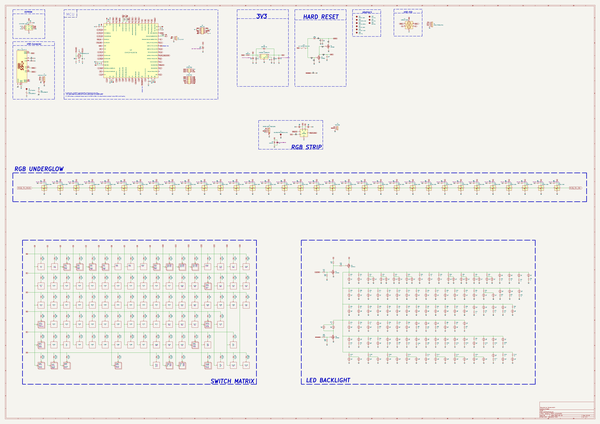

# athena
 
## summary 
* id: acheronproject_athena_athena
* user: acheronproject
* name: athena
* board: athena
* repo: https://github.com/AcheronProject/Athena
* src_file_repo_kicad_pcb: kicad_files/athena.kicad_pcb
* src_file_repo_kicad_pcb_link: https://github.com/AcheronProject/Athena/tree/main/kicad_files/athena.kicad_pcb
* src_file_repo_kicad_sch: kicad_files/athena.kicad_sch
* src_file_repo_kicad_sch_link: https://github.com/AcheronProject/Athena/tree/main/kicad_files/athena.kicad_sch

* src_file_repo_sch: 
*
 src_file_repo_sch_link: https://github.com/AcheronProject/Athena/tree/main/
* full details link: https://github.com/oomlout/oomlout_oomp_project_bot_v_2/tree/main/projects/acheronproject_athena_athena/current_version/working  

## schematic  
  
[schematic (pdf)](working_schematic.pdf)  

## pcb  
 
  
  
  
[board (pdf)](working.pdf)  

## bom_schematic
| Ref | Qnty | Value | Cmp name | Footprint | Description | Vendor | DNP | 
| --- | --- | --- | --- | --- | --- | --- | --- | 
| C1, C2, C3, C4, C7, C15, C16, C18, C19 | 9 | 100n | C | Capacitor_SMD:C_0402_1005Metric | Unpolarized capacitor |  |  | 
| C5 | 1 | 10u | C_Small | Capacitor_SMD:C_0402_1005Metric | Unpolarized capacitor, small symbol |  |  | 
| C6 | 1 | 10u | CP1 | acheron_Components:CP_EIA-3216-10_Kemet-I_Pad1.58x1.35mm_HandSolder | Polarized capacitor, US symbol |  |  | 
| C8, C9, C20 | 3 | 1u | C | Capacitor_SMD:C_0805_2012Metric | Unpolarized capacitor |  |  | 
| C10, C11 | 2 | 15p | C_Small | Capacitor_SMD:C_0402_1005Metric | Unpolarized capacitor, small symbol |  |  | 
| C12, C14 | 2 | 10n | C_Small | Capacitor_SMD:C_0402_1005Metric | Unpolarized capacitor, small symbol |  |  | 
| C13, C17 | 2 | 4.7u | C_Small | Capacitor_SMD:C_0402_1005Metric | Unpolarized capacitor, small symbol |  |  | 
| C21, C22, C23, C24, C25, C26, C27, C28, C29, C30, C31, C32, C33, C34, C35, C36, C37, C38, C39, C40, C41, C42, C43, C44, C45, C46, C47, C48, C49, C50, C51, C52, C53 | 33 | 100n | C_Small | Capacitor_SMD:C_0805_2012Metric | Unpolarized capacitor, small symbol |  |  | 
| D1, D37, D38, D39, D40, D41, D42, D43, D44, D45, D46, D47, D48, D49, D50, D51, D52, D53, D54, D55, D56, D57, D58, D59, D60, D61, D62, D63, D64, D65, D66, D67, D68, D69, D70, D71, D72, D73, D74, D75, D76, D77, D78, D79, D80, D81, D82, D83, D84, D85, D86, D87, D88, D89, D90, D91, D92, D93, D94, D95, D96, D97, D98, D99, D100, D101, D102, D103, D104, D105, D106, D107, D108, D109, D110, D111, D112, D113, D114, D115, D116, D117, D118, D119, D120, D121, D122, D123, D124, D125, D126, D127, D128 | 93 | 1N4148W | D | acheron_Components:D_SOD-123 | Diode |  |  | 
| D2 | 1 | B5819W-SL | D_Schottky | acheron_Components:D_SOD-123 | Schottky diode |  |  | 
| D3 | 1 | SMF6.0A | D_Schottky_1 | acheron_Components:D_SOD-123 | Schottky diode |  |  | 
| D4, D5, D6, D7, D8, D9, D10, D11, D12, D13, D14, D15, D16, D17, D18, D19, D20, D31, D32, D33, D34, D35, D36 | 23 | WS2812C-2020 | WS2812B-2020 | acheron_Components:LED_WS2812_2020 | Intelligent control RGB LED integrated light source, 3.5x3.5mm package |  |  | 
| D21, D22, D23, D24, D25, D26, D27, D28, D29, D30 | 10 | WS2812C-2020 | WS2812B-2020 | acheron_Components:LED_WS2812_2020_uparrow | Intelligent control RGB LED integrated light source, 3.5x3.5mm package |  |  | 
| F1 | 1 | nSMD100-16V | Fuse | Fuse:Fuse_1206_3216Metric | Fuse |  |  | 
| FB1, FB2 | 2 | GZ2012D601TF | Ferrite_Bead_Small | Inductor_SMD:L_0805_2012Metric | Ferrite bead, small symbol |  |  | 
| J1 | 1 | TYPE-C-31-M-12 | USB_C_16_pin | acheron_Connectors:TYPE-C-31-M-12 | 16-pin USB type C (USB 2.0) connector |  |  | 
| J2 | 1 | A1001WR-S-04P | Conn_01x04_MountingPin | acheron_Connectors:SM04B-SRSS-TB(LF)(SN)_mounting-reliefs | Generic connectable mounting pin connector, single row, 01x04, script generated (kicad-library-utils/schlib/autogen/connector/) |  |  | 
| J3 | 1 | SM04B-SRSS-TB(LF)(SN) | Conn_01x04_MountingPin | acheron_Connectors:SM04B-SRSS-TB(LF)(SN)_mounting-reliefs | Generic connectable mounting pin connector, single row, 01x04, script generated (kicad-library-utils/schlib/autogen/connector/) |  |  | 
| Q1, Q2, Q4, Q5 | 4 | 2N7002 | 2N7002 | Package_TO_SOT_SMD:SOT-23 | 0.115A Id, 60V Vds, N-Channel MOSFET, SOT-23 |  |  | 
| Q3 | 1 | AO3401A | AO3401A | Package_TO_SOT_SMD:SOT-23 | -4.0A Id, -30V Vds, P-Channel MOSFET, SOT-23 |  |  | 
| R1, R2 | 2 | 4.7k | R_Small | Resistor_SMD:R_0402_1005Metric | Resistor, small symbol |  |  | 
| R3 | 1 | 1.5k | R_Small | Resistor_SMD:R_0402_1005Metric | Resistor, small symbol |  |  | 
| R4 | 1 | 330k | R_Small | Resistor_SMD:R_0402_1005Metric | Resistor, small symbol |  |  | 
| R5 | 1 | 1M | R_Small | Resistor_SMD:R_0402_1005Metric | Resistor, small symbol |  |  | 
| R6, R13, R16, R17, R33 | 5 | 10k | R_Small | Resistor_SMD:R_0402_1005Metric | Resistor, small symbol |  |  | 
| R7, R8, R9 | 3 | 100R | R_Small | Resistor_SMD:R_0402_1005Metric | Resistor, small symbol |  |  | 
| R10, R14 | 2 | 5.1k | R_Small | Resistor_SMD:R_0402_1005Metric | Resistor, small symbol |  |  | 
| R11, R12 | 2 | 100k | R | Resistor_SMD:R_0805_2012Metric | Resistor |  |  | 
| R15, R92 | 2 | 10k | R_Small | Resistor_SMD:R_0805_2012Metric | Resistor, small symbol |  |  | 
| R18, R19 | 2 | 100 | R_Small | Resistor_SMD:R_0402_1005Metric | Resistor, small symbol |  |  | 
| R20, R21, R22, R23, R24, R25, R26, R27, R28, R29, R30, R31, R32, R34, R35, R36, R37, R38, R39, R40, R41, R42, R43, R44, R45, R46, R47, R48, R49, R50, R51, R52, R53, R54, R55, R56, R57, R58, R59, R60, R61, R62, R63, R64, R65, R66, R67, R68, R69, R70, R71, R72, R73, R74, R75, R76, R77, R78, R79, R80, R81, R82, R83, R84, R85, R86, R87, R89, R90, R91, R93, R94, R95, R96, R97, R98, R99, R100, R101, R102, R103, R104, R105, R106, R107, R108, R109, R110, R111, R112, R113, R114, R115, R116, R117 | 95 | 1k | R_Small | Resistor_SMD:R_0805_2012Metric | Resistor, small symbol |  |  | 
| R88 | 1 | 100R | R_Small | Resistor_SMD:R_0805_2012Metric | Resistor, small symbol |  |  | 
| SW1 | 1 | K2-1187SQ-A4SW-06 | SW_SPST | acheron_Hardware:K2-1187SQ-A4SW-06 | Single Pole Single Throw (SPST) switch |  |  | 
| SW2, SW3, SW4, SW5, SW6, SW7, SW8, SW9, SW10, SW11, SW12, SW13, SW14, SW15, SW16, SW17, SW18, SW19, SW20, SW21, SW22, SW23, SW24, SW25, SW26, SW27, SW28, SW29, SW30, SW31, SW32, SW33, SW34, SW35, SW36, SW37, SW38, SW39, SW41, SW42, SW43, SW44, SW46, SW47, SW48, SW49, SW50, SW51, SW52, SW53, SW54, SW55, SW56, SW57, SW59, SW60, SW61, SW63, SW64, SW65, SW66, SW67, SW68, SW69, SW70, SW71, SW72, SW73, SW74, SW76, SW80, SW81, SW82, SW83, SW84, SW85, SW86, SW87, SW88, SW89, SW90, SW92, SW93, SW104, SW105, SW106, SW108, SW112 | 88 | MX Switch | Mechanical_Switch | acheron_MX_SolderMask:MX100 | Keyboard mechanical switch |  |  | 
| SW40 | 1 | MX Switch | Mechanical_Switch | acheron_MX_SolderMask:MX200 | Keyboard mechanical switch |  |  | 
| SW45, SW58, SW107, SW109, SW111, SW113 | 6 | MX Switch | Mechanical_Switch | acheron_MX_SolderMask:MX150 | Keyboard mechanical switch |  |  | 
| SW62, SW94 | 2 | MX Switch | Mechanical_Switch | acheron_MX_SolderMask:MX175 | Keyboard mechanical switch |  |  | 
| SW75 | 1 | MX Switch | Mechanical_Switch | acheron_MX_SolderMask:MX225R | Keyboard mechanical switch |  |  | 
| SW77, SW95, SW96, SW97, SW98, SW100, SW101, SW102, SW103 | 9 | MX Switch | Mechanical_Switch | acheron_MX_SolderMask:MX125 | Keyboard mechanical switch |  |  | 
| SW78 | 1 | MX Switch | Mechanical_Switch | acheron_MX_SolderMask:MX_ISOEnter_Horizontal | Keyboard mechanical switch |  |  | 
| SW79 | 1 | MX Switch | Mechanical_Switch | acheron_MX_SolderMask:MX225 | Keyboard mechanical switch |  |  | 
| SW91 | 1 | MX Switch | Mechanical_Switch | acheron_MX_SolderMask:MX275 | Keyboard mechanical switch |  |  | 
| SW99 | 1 | MX Switch | Mechanical_Switch | acheron_MX_SolderMask:MX625R | Keyboard mechanical switch |  |  | 
| SW110 | 1 | MX Switch | Mechanical_Switch | acheron_MX_SolderMask:MX700R | Keyboard mechanical switch |  |  | 
| U1 | 1 | USBLC6-2SC6 | USBLC6-2SC6 | acheron_Components:SOT-23-6 | Very low capacitance ESD protection diode, 2 data-line, SOT-23-6 |  |  | 
| U2 | 1 | AT24C256C-SSHL-T | 24LC256 | acheron_Components:SOIC-8 | I2C Serial EEPROM, 256Kb, DIP-8/SOIC-8/TSSOP-8/DFN-8 |  |  | 
| U3 | 1 | STM32F401RCT6 | STM32F401-LQFP64 | acheron_Components:LQFP-64_10x10mm_P0.5mm | 32-bit 256kBytes flash ARM Cortex-M4  microcontroller |  |  | 
| U4 | 1 | SGM2007-3.3XN5/TR | SGM2036 | acheron_Components:SOT-23-5 | 300mA, Low Power, Low Dropout Linear Regulators |  |  | 
| U5 | 1 | TXS0101DRLR | TXS0101 | acheron_Components:SOT-563 | 1-bit bidirectional level shifting voltage level translator |  |  | 
| Y1 | 1 | TAXM8M4RFDCET2T | Crystal_GND24 | acheron_Components:Crystal_SMD_3225-4Pin_3.2x2.5mm | Four pin crystal, GND on pins 2 and 4 |  |  | 

