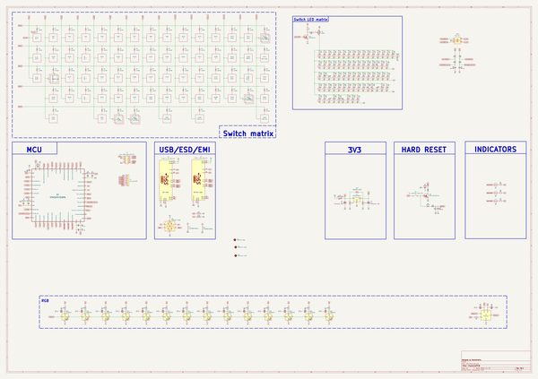
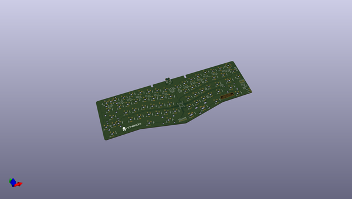
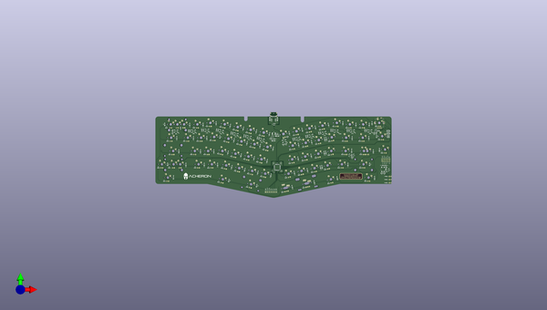
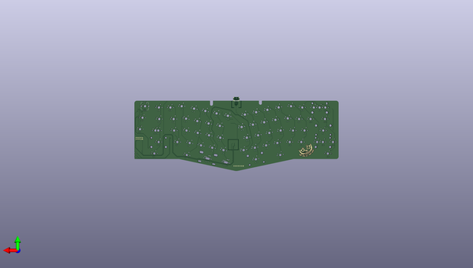

# cheshire
 
## summary 
* id: acheronproject_cheshire_cheshire
* user: acheronproject
* name: cheshire
* board: cheshire
* repo: https://github.com/AcheronProject/Cheshire
* src_file_repo_kicad_pcb: kicadFiles/cheshire.kicad_pcb
* src_file_repo_kicad_pcb_link: https://github.com/AcheronProject/Cheshire/tree/master/kicadFiles/cheshire.kicad_pcb
* src_file_repo_kicad_sch: kicadFiles/cheshire.kicad_sch
* src_file_repo_kicad_sch_link: https://github.com/AcheronProject/Cheshire/tree/master/kicadFiles/cheshire.kicad_sch

* src_file_repo_sch: 
* src_file_repo_sch_link: https://github.com/AcheronProject/Cheshire/tree/master/

## schematic  
  
[schematic (pdf)](working_schematic.pdf)  

## pcb  
 
  
  
  
[board (pdf)](working.pdf)  

## working_bom
| Id | Designator | Footprint | Quantity | Designation | Supplier and ref |  | None | 
| --- | --- | --- | --- | --- | --- | --- | --- | 
| 1 | LED72,LED73,LED74,LED24,LED6,LED23,LED62,LED8,LED70,LED26,LED47,LED34,LED45,LED2,LED30,LED40,LED43,LED59,LED21,LED36,LED28,LED1,LED9,LED4,LED48,LED56,LED54,LED33,LED14,LED29,LED38,LED5,LED37,LED69,LED71,LED63,LED51,LED42,LED60,LED10,LED35,LED58,LED41,LED3,LED13,LED12,LED66,LED64,LED32,LED15,LED19,LED67,LED57,LED49,LED22,LED68,LED20,LED7,LED50,LED61,LED18,LED31,LED25,LED44,LED65,LED52,LED53,LED27,LED17,LED39,LED55,LED46,LED11,LED16 | LED_THT_2.54mm | 74 | LED |  |  | [''] | 
| 2 | L1,L2 | L_1206_3216Metric_Pad1.42x1.75mm_HandSolder | 2 | 120R@100MHz |  |  | [''] | 
| 3 | R31,R50,R36,R9,R24,R67,R27,R61,R62,R57,R14,R34,R7,R71,R8,R56,R43,R59,R55,R33,R12,R17,R20,R63,R30,R45,R44,R60,R22,R25,R37,R49,R4,R29,R15,R11,R41,R6,R18,R53,R3,R35,R26,R23,R64,R52,R10,R28,R51,R40,R54,R16,R69,R46,R42,R32,R66,R39,R19,R48,R47,R38,R13,R5,R21,R70 | R_0805_2012Metric | 66 | 420 |  |  | [''] | 
| 4 | C11,C1,C2,C3 | C_0402_1005Metric | 4 | 100n |  |  | [''] | 
| 5 | D24,D63,D55,D34,D40,D2,D30,D49,D48,D26,D60,D66,D39,D15,D7,D32,D20,D50,D64,D42,D22,D27,D35,D62,D4,D9,D56,D16,D1,D51,D14,D3,D19,D43,D33,D17,D54,D10,D21,D8,D41,D13,D29,D6,D57,D47,D38,D45,D65,D23,D28,D12,D11,D5,D46,D58,D61,D31,D25,D18,D37,D53,D36,D52 | D_SOD-123 | 64 | 1N4148W |  |  | [''] | 
| 6 | D81,D72,D78,D76,D69,D74,D71,D75,D70,D77,D73,D86,D79,D80 | LED_WS2812B_5.0x5.0mm_P3.2mm | 14 | WS2812C |  |  | [''] | 
| 7 | C7,C6 | CP_EIA-3216-10_Kemet-I_Pad1.58x1.35mm_HandSolder | 2 | 1u |  |  | [''] | 
| 8 | R73,R74 | R_0805_2012Metric | 2 | 100k |  |  | [''] | 
| 9 | F1 | Fuse_1812_4532Metric | 1 | mSMD110-16V |  |  | [''] | 
| 10 | R93,R94,R99,R95,R92 | R_0805_2012Metric | 5 | 10k |  |  | [''] | 
| 11 | R80,R81,R79 | R_0805_2012Metric | 3 | 420R |  |  | [''] | 
| 12 | C26,C21,C22,C19,C13,C20,C24,C14,C23,C16,C18,C25,C17,C32,C27,C5,C15 | C_0805_2012Metric | 17 | 100n |  |  | [''] | 
| 13 | R96,R89,R84,R90,R65,R85,R58,R88,R86,R68,R91,R83,R87,R82 | R_0805_2012Metric | 14 | 5R |  |  | [''] | 
| 14 | U4 | SOT-23-6 | 1 | TXS0101 |  |  | [''] | 
| 15 | R2,R72 | R_0805_2012Metric | 2 | 100R |  |  | [''] | 
| 16 | Q1 | SOT-23 | 1 | AO3401A |  |  | [''] | 
| 17 | R1 | R_0805_2012Metric | 1 | 1k |  |  | [''] | 
| 18 | D44,D59,D68 | D_SOD-123 | 3 | 1N4148W |  |  | [''] | 
| 19 | SW72 | ALPS_EC11E | 1 | EC11ECx |  |  | [''] | 
| 20 | C8 | C_0402_1005Metric | 1 | 1u |  |  | [''] | 
| 21 | R78,R77 | R_0805_2012Metric | 2 | 5.1k |  |  | [''] | 
| 22 | C10 | C_0805_2012Metric | 1 | 10u |  |  | [''] | 
| 23 | Q2,Q3 | SOT-23 | 2 | DTC123JKAT146 |  |  | [''] | 
| 24 | U2 | SOT-23 | 1 | MCP1700T-3302E/TT |  |  | [''] | 
| 25 | D67 | D_SOD-123 | 1 | RB060M-60TR |  |  | [''] | 
| 26 | C9 | C_0402_1005Metric | 1 | 10n |  |  | [''] | 
| 27 | C29,C28 | C_0805_2012Metric | 2 | 10n |  |  | [''] | 
| 28 | J2,J3 | TYPE-C-31-M-12 | 2 | TYPE-C-31-M12_13 |  |  | [''] | 
| 29 | S1 | K2-1187SQ-A4SW-06 | 1 | K2-1187SQ-A4SW-06 |  |  | [''] | 
| 30 | U3 | SOT-23-6 | 1 | USBLC6-2SC6 |  |  | [''] | 
| 31 | U1 | LQFP-48_7x7mm_P0.5mm | 1 | STM32F072CBT6 |  |  | [''] | 
| 32 | C4,C12 | C_0402_1005Metric | 2 | 4.7u |  |  | [''] | 
| 33 | R75 | R_0805_2012Metric | 1 | 330k |  |  | [''] | 
| 34 | R76 | R_0805_2012Metric | 1 | 1M |  |  | [''] | 

## bom_schematic
| Ref | Qnty | Value | Cmp name | Footprint | Description | Vendor | DNP | 
| --- | --- | --- | --- | --- | --- | --- | --- | 
| C1, C2, C3, C11 | 4 | 100n | C_Small | Capacitor_SMD:C_0402_1005Metric | Unpolarized capacitor, small symbol |  |  | 
| C4, C12 | 2 | 4.7u | C_Small | Capacitor_SMD:C_0402_1005Metric | Unpolarized capacitor, small symbol |  |  | 
| C5, C13, C14, C15, C16, C17, C18, C19, C20, C21, C22, C23, C24, C25, C26, C27, C32 | 17 | 100n | C | Capacitor_SMD:C_0805_2012Metric | Unpolarized capacitor |  |  | 
| C6, C7 | 2 | 1u | CP1 | acheron_Components:CP_EIA-3216-10_Kemet-I_Pad1.58x1.35mm_HandSolder | Polarized capacitor, US symbol |  |  | 
| C8 | 1 | 1u | C_Small | Capacitor_SMD:C_0402_1005Metric | Unpolarized capacitor, small symbol |  |  | 
| C9 | 1 | 10n | C_Small | Capacitor_SMD:C_0402_1005Metric | Unpolarized capacitor, small symbol |  |  | 
| C10 | 1 | 10u | C_Small | Capacitor_SMD:C_0805_2012Metric | Unpolarized capacitor, small symbol |  |  | 
| C28, C29 | 2 | 10n | C_Small | Capacitor_SMD:C_0805_2012Metric | Unpolarized capacitor, small symbol |  |  | 
| D1, D2, D3, D4, D5, D6, D7, D8, D9, D10, D11, D12, D13, D14, D15, D16, D17, D18, D19, D20, D21, D22, D23, D24, D25, D26, D27, D28, D29, D30, D31, D32, D33, D34, D35, D36, D37, D38, D39, D40, D41, D42, D43, D45, D46, D47, D48, D49, D50, D51, D52, D53, D54, D55, D56, D57, D58, D60, D61, D62, D63, D64, D65, D66 | 64 | 1N4148W | D | Acheron Components:D_SOD-123 | Diode |  |  | 
| D44, D59, D68 | 3 | 1N4148W | D | acheron_Components:D_SOD-123 | Diode |  |  | 
| D67 | 1 | RB060M-60TR | D_Schottky | acheron_Components:D_SOD-123 | Schottky diode |  |  | 
| D69, D70, D71, D72, D73, D74, D75, D76, D77, D78, D79, D80, D81, D86 | 14 | WS2812C | WS2812B | acheron_Components:LED_WS2812B_5.0x5.0mm_P3.2mm | RGB LED with integrated controller |  |  | 
| F1 | 1 | mSMD110-16V | Polyfuse | Fuse:Fuse_1812_4532Metric | Resettable fuse, polymeric positive temperature coefficient |  |  | 
| J2, J3 | 2 | TYPE-C-31-M12_13 | TYPE-C-31-M12_13 | acheron_Connectors:TYPE-C-31-M-12 |  |  |  | 
| L1, L2 | 2 | 120R@100MHz | L_Core_Ferrite | Inductor_SMD:L_1206_3216Metric_Pad1.42x1.75mm_HandSolder | Inductor with ferrite core |  |  | 
| LED1, LED2, LED3, LED4, LED5, LED6, LED7, LED8, LED9, LED10, LED11, LED12, LED13, LED14, LED15, LED16, LED17, LED18, LED19, LED20, LED21, LED22, LED23, LED24, LED25, LED26, LED27, LED28, LED29, LED30, LED31, LED32, LED33, LED34, LED35, LED36, LED37, LED38, LED39, LED40, LED41, LED42, LED43, LED44, LED45, LED46, LED47, LED48, LED49, LED50, LED51, LED52, LED53, LED54, LED55, LED56, LED57, LED58, LED59, LED60, LED61, LED62, LED63, LED64, LED65, LED66, LED67, LED68, LED69, LED70, LED71, LED72, LED73, LED74 | 74 | LED | LED | acheron_Components:LED_THT_2.54mm |  |  |  | 
| Q1 | 1 | AO3401A | AO3401A | Package_TO_SOT_SMD:SOT-23 | -4.0A Id, -30V Vds, P-Channel MOSFET, SOT-23 |  |  | 
| Q2, Q3 | 2 | DTC123JKAT146 | DTC123J | Package_TO_SOT_SMD:SOT-23 |  |  |  | 
| R1 | 1 | 1k | R | Resistor_SMD:R_0805_2012Metric | Resistor |  |  | 
| R2, R72 | 2 | 100R | R_Small | Resistor_SMD:R_0805_2012Metric | Resistor, small symbol |  |  | 
| R3, R4, R5, R6, R7, R8, R9, R10, R11, R12, R13, R14, R15, R16, R17, R18, R19, R20, R21, R22, R23, R24, R25, R26, R27, R28, R29, R30, R31, R32, R33, R34, R35, R36, R37, R38, R39, R40, R41, R42, R43, R44, R45, R46, R47, R48, R49, R50, R51, R52, R53, R54, R55, R56, R57, R59, R60, R61, R62, R63, R64, R66, R67, R69, R70, R71 | 66 | 420 | R_Small | Resistor_SMD:R_0805_2012Metric | Resistor, small symbol |  |  | 
| R58, R65, R68, R82, R83, R84, R85, R86, R87, R88, R89, R90, R91, R96 | 14 | 5R | R | Resistor_SMD:R_0805_2012Metric | Resistor |  |  | 
| R73, R74 | 2 | 100k | R | Resistor_SMD:R_0805_2012Metric | Resistor |  |  | 
| R75 | 1 | 330k | R_Small | Resistor_SMD:R_0805_2012Metric | Resistor, small symbol |  |  | 
| R76 | 1 | 1M | R_Small | Resistor_SMD:R_0805_2012Metric | Resistor, small symbol |  |  | 
| R77, R78 | 2 | 5.1k | R | Resistor_SMD:R_0805_2012Metric | Resistor |  |  | 
| R79, R80, R81 | 3 | 420R | R_Small | Resistor_SMD:R_0805_2012Metric | Resistor, small symbol |  |  | 
| R92, R93, R94, R95, R99 | 5 | 10k | R | Resistor_SMD:R_0805_2012Metric | Resistor |  |  | 
| S1 | 1 | K2-1187SQ-A4SW-06 | SW_SPST | acheron_Hardware:K2-1187SQ-A4SW-06 | Single Pole Single Throw (SPST) switch |  |  | 
| SW72 | 1 | EC11ECx | Rotary_Encoder_Switch | acheron_Hardware:ALPS_EC11E | Rotary encoder, dual channel, incremental quadrate outputs, with switch |  |  | 
| U1 | 1 | STM32F072CBT6 | STM32F072-LQFP48 | acheron_Components:LQFP-48_7x7mm_P0.5mm |  |  |  | 
| U2 | 1 | MCP1700T-3302E/TT | MCP1700-3302E_SOT23 | Package_TO_SOT_SMD:SOT-23 | 250mA Low Quiscent Current LDO, 3.3V output, SOT-23 |  |  | 
| U3 | 1 | USBLC6-2SC6 | USBLC6-2SC6 | acheron_Components:SOT-23-6 | Very low capacitance ESD protection diode, 2 data-line, SOT-23-6 |  |  | 
| U4 | 1 | TXS0101 | TXS0101 | acheron_Components:SOT-23-6 | 1-bit bidirectional level shifting voltage level translator |  |  | 

