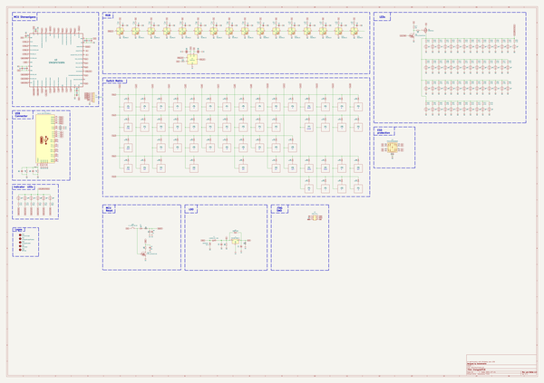
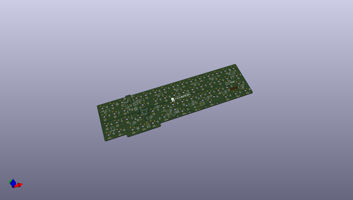
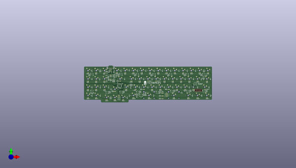
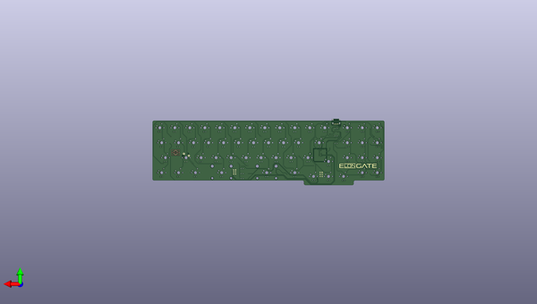

# elongate
 
## summary 
* id: acheronproject_elongate_elongate
* user: acheronproject
* name: elongate
* board: elongate
* repo: https://github.com/AcheronProject/Elongate
* src_file_repo_kicad_pcb: kicadFiles/elongate.kicad_pcb
* src_file_repo_kicad_pcb_link: https://github.com/AcheronProject/Elongate/tree/master/kicadFiles/elongate.kicad_pcb
* src_file_repo_kicad_sch: kicadFiles/elongate.kicad_sch
* src_file_repo_kicad_sch_link: https://github.com/AcheronProject/Elongate/tree/master/kicadFiles/elongate.kicad_sch

* src_file_repo_sch: 
* src_file_repo_sch_link: https://github.com/AcheronProject/Elongate/tree/master/

## schematic  
  
[schematic (pdf)](working_schematic.pdf)  

## pcb  
 
  
  
  
[board (pdf)](working.pdf)  

## working_bom
| Id | Designator | Footprint | Quantity | Designation | Supplier and ref |  | None | 
| --- | --- | --- | --- | --- | --- | --- | --- | 
| 1 | D44,D48,D60,D66,D47,D58,D28,D64,D67,D19,D51,D37,D23,D39,D40,D49,D53,D42,D43,D35,D52,D36,D33,D50,D38,D54,D41,D34,D31,D18,D65,D57,D61,D26,D62,D59,D30,D70,D17,D63,D46,D27,D45,D21,D55,D69,D20,D32,D25,D22,D56,D24,D68,D29,D71 | D_SOD-123 | 55 | 1N4148 |  |  | [''] | 
| 2 | R77,R76,R85 | R_SMD_1206 | 3 | 1M |  |  | [''] | 
| 3 | C28,C27,C32 | C_0805_2012Metric_Pad1.15x1.40mm_HandSolder | 3 | 100n |  |  | [''] | 
| 4 | R78,R79,R80,R81,R82,R83,R61,R35,R62,R60,R28,R38,R48,R25,R50,R37,R32,R54,R66,R63,R72,R40,R20,R58,R26,R36,R64,R73,R30,R39,R31,R42,R71,R56,R70,R27,R55,R51,R29,R49,R22,R69,R52,R44,R23,R59,R53,R24,R41,R68,R65,R43,R45,R19,R21,R33,R47,R57,R67,R46 | R_SMD_1206 | 60 | 470 |  |  | [''] | 
| 5 | C16,C13,C5,C3,C14,C2,C15,C7,C10,C6,C11,C9,C8,C4,C12,C1 | C_0805_2012Metric_Pad1.15x1.40mm_HandSolder | 16 | 1u |  |  | [''] | 
| 6 | D72 | D_SOD-123 | 1 | RB060M-60TR |  |  | [''] | 
| 7 | R87,R86 | R_SMD_1206 | 2 | 100k |  |  | [''] | 
| 8 | R2,R6,R1,R3,R9,R12,R5,R7,R15,R4,R10,R8,R13,R16,R14,R11 | R_SMD_1206 | 16 | 4.7 |  |  | [''] | 
| 9 | D12,D2,D1,D3,D16,D10,D4,D5,D9,D15,D13,D11,D7,D6,D8,D14 | LED_WS2812B_5.0x5.0mm_P3.2mm | 16 | WS2812C |  |  | [''] | 
| 10 | R88 | R_SMD_1206 | 1 | 100 |  |  | [''] | 
| 11 | R75,R74 | R_SMD_1206 | 2 | 5.1k |  |  | [''] | 
| 12 | C24 | C_0402_1005Metric | 1 | 10n |  |  | [''] | 
| 13 | J1 | USB_C_Receptacle_Wurth_Elektronik_632723x00011 | 1 | Wurth 632723300011 |  |  | [''] | 
| 14 | U3 | USON-10_2.5x1.0mm_P0.5mm | 1 | TPD4E05U06DQAR |  |  | [''] | 
| 15 | C31,C30 | CP_EIA-3216-10_Kemet-I_Pad1.58x1.35mm_HandSolder | 2 | 1u |  |  | [''] | 
| 16 | U2 | LQFP-48_7x7mm_P0.5mm | 1 | STM32F072CBT6 |  |  | [''] | 
| 17 | R84 | R_SMD_1206 | 1 | 330k |  |  | [''] | 
| 18 | C20,C26 | C_0402_1005Metric | 2 | 4.7u |  |  | [''] | 
| 19 | Q1 | SOT-23 | 1 | AO3401A |  |  | [''] | 
| 20 | Q2,Q3 | SOT-23 | 2 | DTC123JKAT146 |  |  | [''] | 
| 21 | C23 | C_0402_1005Metric | 1 | 1u |  |  | [''] | 
| 22 | C22,C21 | C_0805_2012Metric | 2 | 100n |  |  | [''] | 
| 23 | R18 | R_SMD_1206 | 1 | 100R |  |  | [''] | 
| 24 | F1 | Fuse_1812_4532Metric_Pad1.30x3.40mm_HandSolder | 1 | RF1338-000 |  |  | [''] | 
| 25 | R17,R34 | R_SMD_1206 | 2 | 10k |  |  | [''] | 
| 26 | C29 | C_0805_2012Metric_Pad1.15x1.40mm_HandSolder | 1 | 10u |  |  | [''] | 
| 27 | C25,C18,C17,C19 | C_0402_1005Metric | 4 | 100n |  |  | [''] | 
| 28 | U4 | SOT-23 | 1 | MCP1700T-3302E/TT |  |  | [''] | 
| 29 | D73 | D_SOD-123 | 1 | SMF6.0A |  |  | [''] | 
| 30 | U1 | SOT-23-6 | 1 | TXS0101 |  |  | [''] | 
| 31 | SW55 | smdPushBtn | 1 | K2-1187SQ-A4SW-06 |  |  | [''] | 

## bom_schematic
| Ref | Qnty | Value | Cmp name | Footprint | Description | Vendor | DNP | 
| --- | --- | --- | --- | --- | --- | --- | --- | 
| C1, C2, C3, C4, C5, C6, C7, C8, C9, C10, C11, C12, C13, C14, C15, C16 | 16 | 1u | C_Small | Capacitor_SMD:C_0805_2012Metric_Pad1.15x1.40mm_HandSolder | Unpolarized capacitor, small symbol |  |  | 
| C17, C18, C19, C25 | 4 | 100n | C_Small | Capacitor_SMD:C_0402_1005Metric | Unpolarized capacitor, small symbol |  |  | 
| C20, C26 | 2 | 4.7u | C_Small | Capacitor_SMD:C_0402_1005Metric | Unpolarized capacitor, small symbol |  |  | 
| C21, C22 | 2 | 100n | C | Capacitor_SMD:C_0805_2012Metric | Unpolarized capacitor |  |  | 
| C23 | 1 | 1u | C_Small | Capacitor_SMD:C_0402_1005Metric | Unpolarized capacitor, small symbol |  |  | 
| C24 | 1 | 10n | C_Small | Capacitor_SMD:C_0402_1005Metric | Unpolarized capacitor, small symbol |  |  | 
| C27, C28, C32 | 3 | 100n | C_Small | Capacitor_SMD:C_0805_2012Metric_Pad1.15x1.40mm_HandSolder | Unpolarized capacitor, small symbol |  |  | 
| C29 | 1 | 10u | C_Small | Capacitor_SMD:C_0805_2012Metric_Pad1.15x1.40mm_HandSolder | Unpolarized capacitor, small symbol |  |  | 
| C30, C31 | 2 | 1u | CP1_Small | acheron_Components:CP_EIA-3216-10_Kemet-I_Pad1.58x1.35mm_HandSolder | Polarized capacitor, small US symbol |  |  | 
| D1, D2, D3, D4, D5, D6, D7, D8, D9, D10, D11, D12, D13, D14, D15, D16 | 16 | WS2812C | WS2812B | acheron_Components:LED_WS2812B_5.0x5.0mm_P3.2mm | RGB LED with integrated controller |  |  | 
| D17, D18, D19, D20, D21, D22, D23, D24, D25, D26, D27, D28, D29, D30, D31, D32, D33, D34, D35, D36, D37, D38, D39, D40, D41, D42, D43, D44, D45, D46, D47, D48, D49, D50, D51, D52, D53, D54, D55, D56, D57, D58, D59, D60, D61, D62, D63, D64, D65, D66, D67, D68, D69, D70, D71 | 55 | 1N4148 | D | acheron_Components:D_SOD-123 | Diode |  |  | 
| D72 | 1 | RB060M-60TR | D_Schottky | acheron_Components:D_SOD-123 | Schottky diode |  |  | 
| D73 | 1 | SMF6.0A | Device:D_Schottky_1 | acheron_Components:D_SOD-123 | Schottky diode |  |  | 
| F1 | 1 | mSMD110-16V  | Polyfuse | Fuse:Fuse_1812_4532Metric_Pad1.30x3.40mm_HandSolder | Resettable fuse, polymeric positive temperature coefficient |  |  | 
| J1 | 1 | Wurth 632723300011 | USB_C_Receptacle | acheron_Connectors:USB_C_Receptacle_Wurth_Elektronik_632723x00011 | USB Full-Featured Type-C Receptacle connector |  |  | 
| Q1 | 1 | AO3401A | AO3401A | Package_TO_SOT_SMD:SOT-23 | -4.0A Id, -30V Vds, P-Channel MOSFET, SOT-23 |  |  | 
| Q2, Q3 | 2 | DTC123JKAT146 | DTC123J | Package_TO_SOT_SMD:SOT-23 | Digital NPN Transistor, 2k2/47k, SOT-23 |  |  | 
| R1, R2, R3, R4, R5, R6, R7, R8, R9, R10, R11, R12, R13, R14, R15, R16 | 16 | 4.7 | Device:R_Small_18 | acheron_Components:R_SMD_1206 | Resistor, small symbol |  |  | 
| R17, R34 | 2 | 10k | R_Small | acheron_Components:R_SMD_1206 | Resistor, small symbol |  |  | 
| R18 | 1 | 100R | Device:R_Small_6 | acheron_Components:R_SMD_1206 | Resistor, small symbol |  |  | 
| R19, R20, R21, R22, R23, R24, R25, R26, R27, R28, R29, R30, R31, R32, R33, R35, R36, R37, R38, R39, R40, R41, R42, R43, R44, R45, R46, R47, R48, R49, R50, R51, R52, R53, R54, R55, R56, R57, R58, R59, R60, R61, R62, R63, R64, R65, R66, R67, R68, R69, R70, R71, R72, R73, R78, R79, R80, R81, R82, R83 | 60 | 470 | R_Small | acheron_Components:R_SMD_1206 | Resistor, small symbol |  |  | 
| R74, R75 | 2 | 5.1k | Device:R_Small_2 | acheron_Components:R_SMD_1206 | Resistor, small symbol |  |  | 
| R76, R77, R85 | 3 | 1M | Device:R_Small_23 | acheron_Components:R_SMD_1206 | Resistor, small symbol |  |  | 
| R84 | 1 | 330k | Device:R_Small_25 | acheron_Components:R_SMD_1206 | Resistor, small symbol |  |  | 
| R86, R87 | 2 | 100k | Device:R_Small_5 | acheron_Components:R_SMD_1206 | Resistor, small symbol |  |  | 
| R88 | 1 | 100 | Device:R_Small_24 | acheron_Components:R_SMD_1206 | Resistor, small symbol |  |  | 
| SW55 | 1 | K2-1187SQ-A4SW-06 | SW_Push | acheron_Hardware:smdPushBtn | Push button switch, generic, two pins |  |  | 
| U1 | 1 | TXS0101 | TXS0101 | acheron_Components:SOT-23-6 | 1-bit bidirectional level shifting voltage level translator |  |  | 
| U2 | 1 | STM32F072CBT6 | STM32F072-LQFP48 | acheron_Components:LQFP-48_7x7mm_P0.5mm |  |  |  | 
| U3 | 1 | TPD4E05U06DQAR | TPD4E05U06DQAR | acheron_Components:USON-10_2.5x1.0mm_P0.5mm |  |  |  | 
| U4 | 1 | MCP1700T-3302E/TT | MCP1700-3302E_SOT23 | Package_TO_SOT_SMD:SOT-23 | 250mA Low Quiscent Current LDO, 3.3V output, SOT-23 |  |  | 

