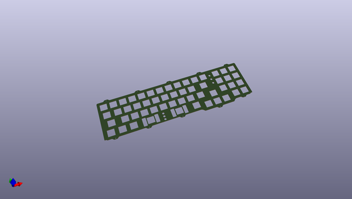
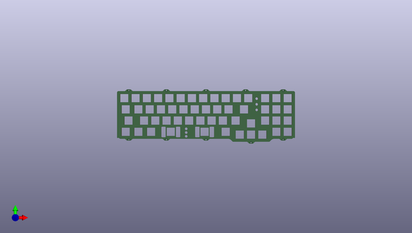
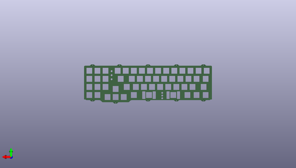

# elongate
 
## summary 
* id: acheronproject_elongate_elongateplate
* user: acheronproject
* name: elongate
* board: elongateplate
* repo: https://github.com/AcheronProject/Elongate
* src_file_repo_kicad_pcb: kicadFiles/plate/elongatePlate.kicad_pcb
* src_file_repo_kicad_pcb_link: https://github.com/AcheronProject/Elongate/tree/master/kicadFiles/plate/elongatePlate.kicad_pcb
* src_file_repo_kicad_sch: kicadFiles/elongate.kicad_sch
* src_file_repo_kicad_sch_link: https://github.com/AcheronProject/Elongate/tree/master/kicadFiles/elongate.kicad_sch

* src_file_repo_sch: 
* src_file_repo_sch_link: https://github.com/AcheronProject/Elongate/tree/master/

## pcb  
 
  
  
  
[board (pdf)](working.pdf)  

