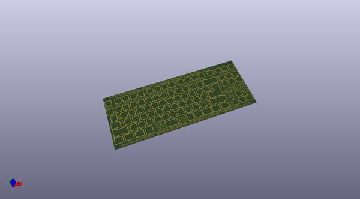
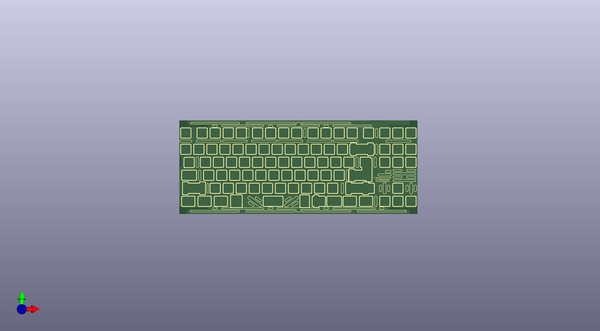

# f1_69_plates
 
## summary 
* id: acheronproject_f1_69_plates_f169_halfplate
* user: acheronproject
* name: f1_69_plates
* board: f169_halfplate
* repo: https://github.com/AcheronProject/F1-69_plates
* src_file_repo_kicad_pcb: kicad_files/f169_fullplate.kicad_pcb
* src_file_repo_kicad_pcb_link: https://github.com/AcheronProject/F1-69_plates/tree/master/kicad_files/f169_fullplate.kicad_pcb
* src_file_repo_kicad_sch: kicad_files/f169_fullplate.kicad_sch
* src_file_repo_kicad_sch_link: https://github.com/AcheronProject/F1-69_plates/tree/master/kicad_files/f169_fullplate.kicad_sch

* src_file_repo_sch: 
* src_file_repo_sch_link: https://github.com/AcheronProject/F1-69_plates/tree/master/

## schematic  
  
[schematic (pdf)](working_schematic.pdf)  

## pcb  
 
  
  
  
[board (pdf)](working.pdf)  

## working_bom
| Id | Designator | Footprint | Quantity | Designation | Supplier and ref |  | None | 
| --- | --- | --- | --- | --- | --- | --- | --- | 
| 1 | G*** | full_plate_inscription | 1 | full_plate_inscription |  |  | [''] | 

## bom_schematic
no data

