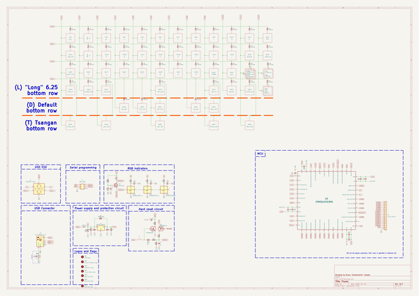
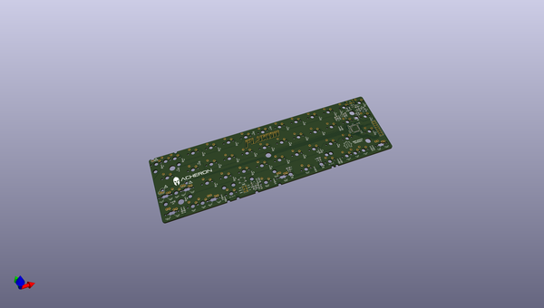
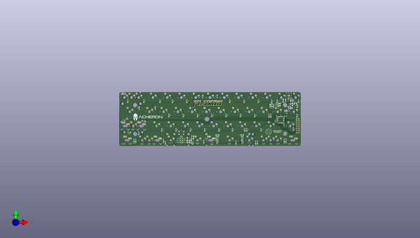
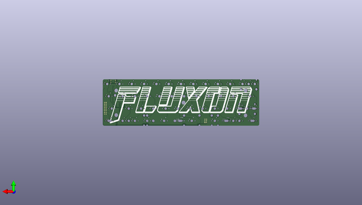

# fluxon
 
## summary 
* id: acheronproject_fluxon_fluxon
* user: acheronproject
* name: fluxon
* board: fluxon
* repo: https://github.com/AcheronProject/Fluxon
* src_file_repo_kicad_pcb: kicad_files/fluxon.kicad_pcb
* src_file_repo_kicad_pcb_link: https://github.com/AcheronProject/Fluxon/tree/master/kicad_files/fluxon.kicad_pcb
* src_file_repo_kicad_sch: kicad_files/fluxon.kicad_sch
* src_file_repo_kicad_sch_link: https://github.com/AcheronProject/Fluxon/tree/master/kicad_files/fluxon.kicad_sch

* src_file_repo_sch: 
* src_file_repo_sch_link: https://github.com/AcheronProject/Fluxon/tree/master/

## schematic  
  
[schematic (pdf)](working_schematic.pdf)  

## pcb  
 
  
  
  
[board (pdf)](working.pdf)  

## working_bom
| Id | Designator | Footprint | Quantity | Designation | Supplier and ref |  | None | 
| --- | --- | --- | --- | --- | --- | --- | --- | 
| 1 | SW8 | MX100 | 1 | U |  |  | [''] | 
| 2 | C10,C15,C11,C9 | C_0402_1005Metric | 4 | 100n |  |  | [''] | 
| 3 | C3,C1,C2 | C_0805_2012Metric_Pad1.15x1.40mm_HandSolder | 3 | 100n |  |  | [''] | 
| 4 | SW57 | MX150 | 1 | RCTRL_150 |  |  | [''] | 
| 5 | R2,R3,R1 | R_SMD_1206 | 3 | 3R |  |  | [''] | 
| 6 | D41,D37,D12,D13,D33,D19,D16,D53,D9,D32,D42,D34,D1,D35,D8,D36,D24,D21,D20,D26,D38,D23,D4,D5,D17,D40,D3,D30,D28,D39,D29,D6,D31,D15,D2,D43,D44,D45,D46,D18,D27,D14,D7,D11,D47,D10,D25,D22 | D_SOD-123 | 48 | 1N4148W |  |  | [''] | 
| 7 | GR7,GR5,GR6 | warning_sign_3.6x3.2mm | 3 | Warning Sign |  |  | [''] | 
| 8 | SW28 | MX100 | 1 | C |  |  | [''] | 
| 9 | SW17 | MX100 | 1 | F |  |  | [''] | 
| 10 | SW27 | MX100 | 1 | X |  |  | [''] | 
| 11 | U1 | SOT-23-6 | 1 | USBLC6-2SC6 |  |  | [''] | 
| 12 | C7 | C_0805_2012Metric_Pad1.15x1.40mm_HandSolder | 1 | 4.7n |  |  | [''] | 
| 13 | SW7 | MX100 | 1 | Y |  |  | [''] | 
| 14 | R9,R13,R8 | R_SMD_1206 | 3 | 100k |  |  | [''] | 
| 15 | C12,C16 | C_0402_1005Metric | 2 | 4.7u |  |  | [''] | 
| 16 | SW4 | MX100 | 1 | E |  |  | [''] | 
| 17 | SW44 | MX125 | 1 | RALT_125 |  |  | [''] | 
| 18 | SW32 | MX100 | 1 | M |  |  | [''] | 
| 19 | C5,C6 | CP_EIA-3216-10_Kemet-I_Pad1.58x1.35mm_HandSolder | 2 | 1u |  |  | [''] | 
| 20 | SW51 | MX275R | 1 | SPC_275 |  |  | [''] | 
| 21 | SW3 | MX100 | 1 | W |  |  | [''] | 
| 22 | J3 | PinHeader_2x8_P2.54mm_Vertical | 1 | Conn_02x10 |  |  | [''] | 
| 23 | D52 | D_SOD-123 | 1 | SMF6.0A |  |  | [''] | 
| 24 | SW11 | MX100 | 1 | P |  |  | [''] | 
| 25 | SW35 | MX125 | 1 | (D) RSHIFT_125 |  |  | [''] | 
| 26 | R5 | R_SMD_1206 | 1 | 510R |  |  | [''] | 
| 27 | SW14 | MX100 | 1 | A |  |  | [''] | 
| 28 | U2 | SOT-23 | 1 | MCP1700-3302E/TT |  |  | [''] | 
| 29 | SW47 | MX100 | 1 | BKSP |  |  | [''] | 
| 30 | SW43 | MX625R | 1 | SPC_625 |  |  | [''] | 
| 31 | R4,R6 | R_SMD_1206 | 2 | 1k |  |  | [''] | 
| 32 | SW29 | MX100 | 1 | V |  |  | [''] | 
| 33 | D48,D50,D49 | SK6812MINI_3535_6028_3.2x2.8mm_Round | 3 | SK6812MINI-E |  |  | [''] | 
| 34 | SW9 | MX100 | 1 | I |  |  | [''] | 
| 35 | SW20 | MX100 | 1 | J |  |  | [''] | 
| 36 | R10 | R_SMD_1206 | 1 | 100R |  |  | [''] | 
| 37 | SW5 | MX100 | 1 | R |  |  | [''] | 
| 38 | GR3 | acheronLong | 1 | Acheron Logo |  |  | [''] | 
| 39 | Q1 | SOT-23 | 1 | BSS138 |  |  | [''] | 
| 40 | SW54 | MX150 | 1 | LCTRL_150 |  |  | [''] | 
| 41 | SW53 | MX100 | 1 | RALT_100 |  |  | [''] | 
| 42 | SW41 | MX100 | 1 | SUPER_100 |  |  | [''] | 
| 43 | SW40 | MX125 | 1 | LCTRL_125 |  |  | [''] | 
| 44 | J1 | Conn_ARM_JTAG_SWD_6 | 1 | ARM SWD |  |  | [''] | 
| 45 | SW21 | MX100 | 1 | K |  |  | [''] | 
| 46 | SW16 | MX100 | 1 | D |  |  | [''] | 
| 47 | SW18 | MX100 | 1 | G |  |  | [''] | 
| 48 | D51 | D_SOD-123 | 1 | RB060M-60TR |  |  | [''] | 
| 49 | SW48 | MX200 | 1 | BKSP_2U |  |  | [''] | 
| 50 | SW31 | MX100 | 1 | N |  |  | [''] | 
| 51 | SW45 | MX100 | 1 | RGUI_100 |  |  | [''] | 
| 52 | C4 | C_0805_2012Metric | 1 | 4.7nF |  |  | [''] | 
| 53 | SW19 | MX100 | 1 | H |  |  | [''] | 
| 54 | SW50 | MX175 | 1 | SPC_175 |  |  | [''] | 
| 55 | C14 | C_0402_1005Metric | 1 | 10n |  |  | [''] | 
| 56 | SW25 | MX175 | 1 | LSHIFT_175 |  |  | [''] | 
| 57 | SW13 | MX125 | 1 | TAB_125 |  |  | [''] | 
| 58 | SW39 | MX100 | 1 | (I) SLASH_100 |  |  | [''] | 
| 59 | SW30 | MX100 | 1 | B |  |  | [''] | 
| 60 | SW24 | MX175 | 1 | ENTER_175 |  |  | [''] | 
| 61 | R7 | R_SMD_1206 | 1 | 1M |  |  | [''] | 
| 62 | SW6 | MX100 | 1 | T |  |  | [''] | 
| 63 | SW56 | MX700R | 1 | SPC_700 |  |  | [''] | 
| 64 | C17 | C_0805_2012Metric_Pad1.15x1.40mm_HandSolder | 1 | 1u |  |  | [''] | 
| 65 | SW42 | MX100 | 1 | LALT_100 |  |  | [''] | 
| 66 | C8 | C_0805_2012Metric_Pad1.15x1.40mm_HandSolder | 1 | 10u |  |  | [''] | 
| 67 | SW58 | MX150 | 1 | RALT_150 |  |  | [''] | 
| 68 | SW33 | MX100 | 1 | COMMA |  |  | [''] | 
| 69 | R11 | R_SMD_1206 | 1 | 100 |  |  | [''] | 
| 70 | SW12 | MX100 | 1 | DEL |  |  | [''] | 
| 71 | SW1 | MX100 | 1 | ESC |  |  | [''] | 
| 72 | SW55 | MX150 | 1 | LALT_150 |  |  | [''] | 
| 73 | SW52 | MX100 | 1 | FN_100 |  |  | [''] | 
| 74 | SW46 | MX125 | 1 | RCTRL_125 |  |  | [''] | 
| 75 | SW15 | MX100 | 1 | S |  |  | [''] | 
| 76 | SW2 | MX100 | 1 | Q |  |  | [''] | 
| 77 | SW26 | MX100 | 1 | Z |  |  | [''] | 
| 78 | SW10 | MX100 | 1 | O |  |  | [''] | 
| 79 | SW34 | MX100 | 1 | DOT |  |  | [''] | 
| 80 | SW38 | MX125 | 1 | (I) RSHIFT_125 |  |  | [''] | 
| 81 | SW37 | MX225 | 1 | (F) RSHIFT_225 |  |  | [''] | 
| 82 | U3 | LQFP-48_7x7mm_P0.5mm | 1 | STM32L072CBT6 |  |  | [''] | 
| 83 | SW23 | MX100 | 1 | QUOTE |  |  | [''] | 
| 84 | GR1 | osh-logo | 1 | OSHLogo |  |  | [''] | 
| 85 | SW22 | MX100 | 1 | L |  |  | [''] | 
| 86 | SW36 | MX100 | 1 | (D) FN_100 |  |  | [''] | 
| 87 | R12 | R_SMD_1206 | 1 | 33k |  |  | [''] | 
| 88 | GR2 | fluxon_logo | 1 | Fluxon Plated Logo |  |  | [''] | 
| 89 | F1 | Fuse_1210_3225Metric | 1 | SL1210150 |  |  | [''] | 
| 90 | SW49 | MX100 | 1 | PN_100 |  |  | [''] | 
| 91 | Q2 | SOT-363_SC-70-6 | 1 | MUN5335DW1T1G |  |  | [''] | 
| 92 | S1 | K2-1187SQ-A4SW-06 | 1 | SW_Push |  |  | [''] | 
| 93 | C13 | C_0402_1005Metric | 1 | 1u |  |  | [''] | 
| 94 | J2 | Korean-Hroparts_ U-F-M5DD-W-2 | 1 | U-F-M5DD-W-2 |  |  | [''] | 
| 95 | GR4 | fluxon_logo_220x56.8mm | 1 | Fluxon Big Logo |  |  | [''] | 

## bom_schematic
| Ref | Qnty | Value | Cmp name | Footprint | Description | Vendor | DNP | 
| --- | --- | --- | --- | --- | --- | --- | --- | 
| C1, C2, C3 | 3 | 100n | C_Small | Capacitor_SMD:C_0805_2012Metric_Pad1.15x1.40mm_HandSolder | Unpolarized capacitor, small symbol |  |  | 
| C4 | 1 | 4.7nF | C_Small | Capacitor_SMD:C_0805_2012Metric | Unpolarized capacitor, small symbol |  |  | 
| C5, C6 | 2 | 1u | CP_Small | acheron_Components:CP_EIA-3216-10_Kemet-I_Pad1.58x1.35mm_HandSolder | Polarized capacitor, small symbol |  |  | 
| C7 | 1 | 4.7n | C_Small | Capacitor_SMD:C_0805_2012Metric_Pad1.15x1.40mm_HandSolder | Unpolarized capacitor, small symbol |  |  | 
| C8 | 1 | 10u | C_Small | Capacitor_SMD:C_0805_2012Metric_Pad1.15x1.40mm_HandSolder | Unpolarized capacitor, small symbol |  |  | 
| C9, C10, C11, C15 | 4 | 100n | C_Small | Capacitor_SMD:C_0402_1005Metric | Unpolarized capacitor, small symbol |  |  | 
| C12, C16 | 2 | 4.7u | C_Small | Capacitor_SMD:C_0402_1005Metric | Unpolarized capacitor, small symbol |  |  | 
| C13 | 1 | 1u | C_Small | Capacitor_SMD:C_0402_1005Metric | Unpolarized capacitor, small symbol |  |  | 
| C14 | 1 | 10n | C_Small | Capacitor_SMD:C_0402_1005Metric | Unpolarized capacitor, small symbol |  |  | 
| C17 | 1 | 1u | C_Small | Capacitor_SMD:C_0805_2012Metric_Pad1.15x1.40mm_HandSolder | Unpolarized capacitor, small symbol |  |  | 
| D1, D2, D3, D4, D5, D6, D7, D8, D9, D10, D11, D12, D13, D14, D15, D16, D17, D18, D19, D20, D21, D22, D23, D24, D25, D26, D27, D28, D29, D30, D31, D32, D33, D34, D35, D36, D37, D38, D39, D40, D41, D42, D43, D44, D45, D46, D47, D53 | 48 | 1N4148W | D | acheron_Components:D_SOD-123 | Diode |  |  | 
| D48, D49, D50 | 3 | SK6812MINI-E | SK6812MINI-E | acheron_Components:SK6812MINI_3535_6028_3.2x2.8mm_Round |  |  |  | 
| D51 | 1 | RB060M-60TR | D_Schottky | acheron_Components:D_SOD-123 | Schottky diode |  |  | 
| D52 | 1 | SMF6.0A | D_Schottky | acheron_Components:D_SOD-123 | Schottky diode |  |  | 
| F1 | 1 | SL1210150 | Polyfuse_Small | Fuse:Fuse_1210_3225Metric | Resettable fuse, polymeric positive temperature coefficient, small symbol |  |  | 
| GR1 | 1 | OSHLogo | MountingHole | acheron_Graphics:osh-logo | Mounting Hole without connection |  |  | 
| GR2 | 1 | Fluxon Plated Logo | MountingHole | fluxon_graphics:fluxon_logo | Mounting Hole without connection |  |  | 
| GR3 | 1 | Acheron Logo | MountingHole | acheron_Logos:acheronLong | Mounting Hole without connection |  |  | 
| GR4 | 1 | Fluxon Big Logo | MountingHole | fluxon_graphics:fluxon_logo_220x56.8mm | Mounting Hole without connection |  |  | 
| GR5, GR6, GR7 | 3 | Warning Sign | MountingHole | acheron_Graphics:warning_sign_3.6x3.2mm | Mounting Hole without connection |  |  | 
| J2 | 1 | U-F-M5DD-W-2 | USB_B_Mini | acheron_Connectors:Korean-Hroparts_ U-F-M5DD-W-2 | USB Mini Type B connector |  |  | 
| J3 | 1 | Conn_02x10 | Conn_01x16 | acheron_Connectors:PinHeader_2x8_P2.54mm_Vertical | Generic connector, single row, 01x16, script generated (kicad-library-utils/schlib/autogen/connector/) |  |  | 
| Q1 | 1 | BSS138 | Q_NMOS_GSD | Package_TO_SOT_SMD:SOT-23 | N-MOSFET transistor, gate/source/drain |  |  | 
| Q2 | 1 | MUN5335DW1T1G | MUN5335DW1T1G | acheron_Components:SOT-363_SC-70-6 | Dual NPN-PNP bias resistor transistors |  |  | 
| R1, R2, R3 | 3 | 3R | R_Small | acheron_Components:R_SMD_1206 | Resistor, small symbol |  |  | 
| R4, R6 | 2 | 1k | R_Small | acheron_Components:R_SMD_1206 | Resistor, small symbol |  |  | 
| R5 | 1 | 510R | R_Small | acheron_Components:R_SMD_1206 | Resistor, small symbol |  |  | 
| R7 | 1 | 1M | R_Small | acheron_Components:R_SMD_1206 | Resistor, small symbol |  |  | 
| R8, R9, R13 | 3 | 100k | R_Small | acheron_Components:R_SMD_1206 | Resistor, small symbol |  |  | 
| R10 | 1 | 100R | R_Small | acheron_Components:R_SMD_1206 | Resistor, small symbol |  |  | 
| R11 | 1 | 100 | R_Small | acheron_Components:R_SMD_1206 | Resistor, small symbol |  |  | 
| R12 | 1 | 33k | R_Small | acheron_Components:R_SMD_1206 | Resistor, small symbol |  |  | 
| S1 | 1 | SW_Push | SW_Push | acheron_Hardware:K2-1187SQ-A4SW-06 | Push button switch, generic, two pins |  |  | 
| SW1 | 1 | ESC | MXSwitch | acheron_MX_SolderMask:MX100 |  |  |  | 
| SW2 | 1 | Q | MXSwitch | acheron_MX_SolderMask:MX100 |  |  |  | 
| SW3 | 1 | W | MXSwitch | acheron_MX_SolderMask:MX100 |  |  |  | 
| SW4 | 1 | E | MXSwitch | acheron_MX_SolderMask:MX100 |  |  |  | 
| SW5 | 1 | R | MXSwitch | acheron_MX_SolderMask:MX100 |  |  |  | 
| SW6 | 1 | T | MXSwitch | acheron_MX_SolderMask:MX100 |  |  |  | 
| SW7 | 1 | Y | MXSwitch | acheron_MX_SolderMask:MX100 |  |  |  | 
| SW8 | 1 | U | MXSwitch | acheron_MX_SolderMask:MX100 |  |  |  | 
| SW9 | 1 | I | MXSwitch | acheron_MX_SolderMask:MX100 |  |  |  | 
| SW10 | 1 | O | MXSwitch | acheron_MX_SolderMask:MX100 |  |  |  | 
| SW11 | 1 | P | MXSwitch | acheron_MX_SolderMask:MX100 |  |  |  | 
| SW12 | 1 | DEL | MXSwitch | acheron_MX_SolderMask:MX100 |  |  |  | 
| SW13 | 1 | TAB_125 | MXSwitch | acheron_MX_SolderMask:MX125 |  |  |  | 
| SW14 | 1 | A | MXSwitch | acheron_MX_SolderMask:MX100 |  |  |  | 
| SW15 | 1 | S | MXSwitch | acheron_MX_SolderMask:MX100 |  |  |  | 
| SW16 | 1 | D | MXSwitch | acheron_MX_SolderMask:MX100 |  |  |  | 
| SW17 | 1 | F | MXSwitch | acheron_MX_SolderMask:MX100 |  |  |  | 
| SW18 | 1 | G | MXSwitch | acheron_MX_SolderMask:MX100 |  |  |  | 
| SW19 | 1 | H | MXSwitch | acheron_MX_SolderMask:MX100 |  |  |  | 
| SW20 | 1 | J | MXSwitch | acheron_MX_SolderMask:MX100 |  |  |  | 
| SW21 | 1 | K | MXSwitch | acheron_MX_SolderMask:MX100 |  |  |  | 
| SW22 | 1 | L | MXSwitch | acheron_MX_SolderMask:MX100 |  |  |  | 
| SW23 | 1 | QUOTE | MXSwitch | acheron_MX_SolderMask:MX100 |  |  |  | 
| SW24 | 1 | ENTER_175 | MXSwitch | acheron_MX_SolderMask:MX175 |  |  |  | 
| SW25 | 1 | LSHIFT_175 | MXSwitch | acheron_MX_SolderMask:MX175 |  |  |  | 
| SW26 | 1 | Z | MXSwitch | acheron_MX_SolderMask:MX100 |  |  |  | 
| SW27 | 1 | X | MXSwitch | acheron_MX_SolderMask:MX100 |  |  |  | 
| SW28 | 1 | C | MXSwitch | acheron_MX_SolderMask:MX100 |  |  |  | 
| SW29 | 1 | V | MXSwitch | acheron_MX_SolderMask:MX100 |  |  |  | 
| SW30 | 1 | B | MXSwitch | acheron_MX_SolderMask:MX100 |  |  |  | 
| SW31 | 1 | N | MXSwitch | acheron_MX_SolderMask:MX100 |  |  |  | 
| SW32 | 1 | M | MXSwitch | acheron_MX_SolderMask:MX100 |  |  |  | 
| SW33 | 1 | COMMA | MXSwitch | acheron_MX_SolderMask:MX100 |  |  |  | 
| SW34 | 1 | DOT | MXSwitch | acheron_MX_SolderMask:MX100 |  |  |  | 
| SW35 | 1 | (D) RSHIFT_125 | MXSwitch | acheron_MX_SolderMask:MX125 |  |  |  | 
| SW36 | 1 | (D) FN_100 | MXSwitch | acheron_MX_SolderMask:MX100 |  |  |  | 
| SW37 | 1 | (F) RSHIFT_225 | MXSwitch | acheron_MX_SolderMask:MX225 |  |  |  | 
| SW38 | 1 | (I) RSHIFT_125 | MXSwitch | acheron_MX_SolderMask:MX125 |  |  |  | 
| SW39 | 1 | (I) SLASH_100 | MXSwitch | acheron_MX_SolderMask:MX100 |  |  |  | 
| SW40 | 1 | LCTRL_125 | MXSwitch | acheron_MX_SolderMask:MX125 |  |  |  | 
| SW41 | 1 | SUPER_100 | MXSwitch | acheron_MX_SolderMask:MX100 |  |  |  | 
| SW42 | 1 | LALT_100 | MXSwitch | acheron_MX_SolderMask:MX100 |  |  |  | 
| SW43 | 1 | SPC_625 | MXSwitch | acheron_MX_SolderMask:MX625R |  |  |  | 
| SW44 | 1 | RALT_125 | MXSwitch | acheron_MX_SolderMask:MX125 |  |  |  | 
| SW45 | 1 | RGUI_100 | MXSwitch | acheron_MX_SolderMask:MX100 |  |  |  | 
| SW46 | 1 | RCTRL_125 | MXSwitch | acheron_MX_SolderMask:MX125 |  |  |  | 
| SW47 | 1 | BKSP | MXSwitch | acheron_MX_SolderMask:MX100 |  |  |  | 
| SW48 | 1 | BKSP_2U | MXSwitch | acheron_MX_SolderMask:MX200 |  |  |  | 
| SW49 | 1 | PN_100 | MXSwitch | acheron_MX_SolderMask:MX100 |  |  |  | 
| SW50 | 1 | SPC_175 | MXSwitch | acheron_MX_SolderMask:MX175 |  |  |  | 
| SW51 | 1 | SPC_275 | MXSwitch | acheron_MX_SolderMask:MX275R |  |  |  | 
| SW52 | 1 | FN_100 | MXSwitch | acheron_MX_SolderMask:MX100 |  |  |  | 
| SW53 | 1 | RALT_100 | MXSwitch | acheron_MX_SolderMask:MX100 |  |  |  | 
| SW54 | 1 | LCTRL_150 | MXSwitch | acheron_MX_SolderMask:MX150 |  |  |  | 
| SW55 | 1 | LALT_150 | MXSwitch | acheron_MX_SolderMask:MX150 |  |  |  | 
| SW56 | 1 | SPC_700 | MXSwitch | acheron_MX_SolderMask:MX700R |  |  |  | 
| SW57 | 1 | RCTRL_150 | MXSwitch | acheron_MX_SolderMask:MX150 |  |  |  | 
| SW58 | 1 | RALT_150 | MXSwitch | acheron_MX_SolderMask:MX150 |  |  |  | 
| U1 | 1 | USBLC6-2SC6 | USBLC6-2SC6 | acheron_Components:SOT-23-6 | Very low capacitance ESD protection diode, 2 data-line, SOT-23-6 |  |  | 
| U2 | 1 | MCP1700-3302E/TT | MCP1700-3302E_SOT23 | Package_TO_SOT_SMD:SOT-23 | 250mA Low Quiscent Current LDO, 3.3V output, SOT-23 |  |  | 
| U3 | 1 | STM32L072CBT6 | STM32F072-LQFP48 | acheron_Components:LQFP-48_7x7mm_P0.5mm |  |  |  | 

