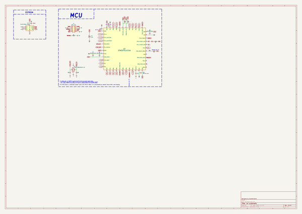
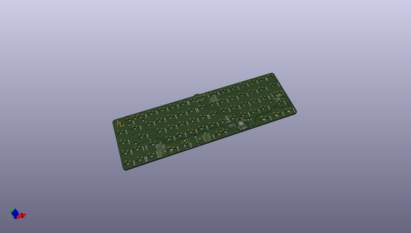
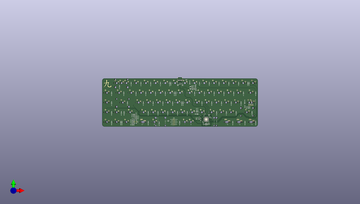
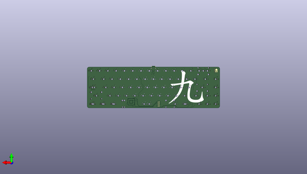

# jiu
 
## summary 
* id: acheronproject_jiu_jiu
* user: acheronproject
* name: jiu
* board: jiu
* repo: https://github.com/AcheronProject/Jiu
* src_file_repo_kicad_pcb: pcb_kicad_files/jiu.kicad_pcb
* src_file_repo_kicad_pcb_link: https://github.com/AcheronProject/Jiu/tree/master/pcb_kicad_files/jiu.kicad_pcb
* src_file_repo_kicad_sch: pcb_kicad_files/jiu.kicad_sch
* src_file_repo_kicad_sch_link: https://github.com/AcheronProject/Jiu/tree/master/pcb_kicad_files/jiu.kicad_sch

* src_file_repo_sch: 
* src_file_repo_sch_link: https://github.com/AcheronProject/Jiu/tree/master/

## schematic  
  
[schematic (pdf)](working_schematic.pdf)  

## pcb  
 
  
  
  
[board (pdf)](working.pdf)  

## working_bom
| Id | Designator | Footprint | Quantity | Designation | Supplier and ref |  | None | 
| --- | --- | --- | --- | --- | --- | --- | --- | 
| 1 | R16,R3,R12,R11,R8 | R_0805_2012Metric | 5 | 10k |  |  | [''] | 
| 2 | J2 | TYPE-C-31-M-12 | 1 | TYPE-C-31-M-12 |  |  | [''] | 
| 3 | D66,D61,D13,D27,D23,D51,D68,D57,D22,D35,D62,D4,D65,D49,D21,D58,D37,D46,D63,D59,D28,D6,D2,D47,D1,D33,D34,D26,D14,D24,D43,D42,D11,D41,D44,D19,D55,D29,D3,D52,D5,D48,D64,D8,D16,D39,D45,D50,D9,D17,D20,D32,D15,D7,D30,D18,D31,D54,D10,D25,D12,D53,D67,D56,D40,D60,D36,D38 | D_SOD-123 | 68 | 1N4148W |  |  | [''] | 
| 4 | SW75 | K2-1187SQ-A4SW-06 | 1 | K2-1187SQ-A4SW-06 |  |  | [''] | 
| 5 | R9 | R_0805_2012Metric | 1 | 330k |  |  | [''] | 
| 6 | R18,R17 | R_0805_2012Metric | 2 | 5.1k |  |  | [''] | 
| 7 | C7 | C_0402_1005Metric | 1 | 10n |  |  | [''] | 
| 8 | R4,R2,R1 | R_0402_1005Metric | 3 | 1.5k |  |  | [''] | 
| 9 | D69 | D_SOD-123 | 1 | RB060M-60 |  |  | [''] | 
| 10 | C9,C8 | C_0402_1005Metric | 2 | 16p |  |  | [''] | 
| 11 | C14,C15 | C_0805_2012Metric | 2 | 1u |  |  | [''] | 
| 12 | C6 | C_0402_1005Metric | 1 | 1u |  |  | [''] | 
| 13 | C5 | CP_EIA-3216-10_Kemet-I_Pad1.58x1.35mm_HandSolder | 1 | 10u |  |  | [''] | 
| 14 | R15,R7,R14 | R_0805_2012Metric | 3 | 100 |  |  | [''] | 
| 15 | R6 | R_0805_2012Metric | 1 | 1k |  |  | [''] | 
| 16 | C3,C2,C1,C10,C4 | C_0402_1005Metric | 5 | 100n |  |  | [''] | 
| 17 | U1 | TSSOP-8_4.4x3mm_P0.65mm | 1 | BL24C256A-SFRC |  |  | [''] | 
| 18 | R5 | R_0805_2012Metric | 1 | 0R |  |  | [''] | 
| 19 | R19,R20,R10 | R_0805_2012Metric | 3 | 1M |  |  | [''] | 
| 20 | F1 | Fuse_1812_4532 | 1 | mSMD110-16V |  |  | [''] | 
| 21 | Q2,Q3,Q1 | SOT-23 | 3 | 2N7002 |  |  | [''] | 
| 22 | U4 | SOT-23 | 1 | MCP1700T-3302E/TT |  |  | [''] | 
| 23 | U2 | STM_UFQFPN-48_LQFP-48-1EP_7x7mm_P0.5mm_HandSoldering_ThermalReliefs | 1 | STM32F411CEU6 |  |  | [''] | 
| 24 | C11 | C_0402_1005Metric | 1 | 4.7u |  |  | [''] | 
| 25 | R13 | R_0805_2012Metric | 1 | 100k |  |  | [''] | 
| 26 | U3 | SOT-23-6 | 1 | SRV05-4-P-T7 |  |  | [''] | 
| 27 | FB1 | L_0805_2012Metric | 1 | GZ2012D601TF |  |  | [''] | 
| 28 | C13 | C_0805_2012Metric | 1 | 100n |  |  | [''] | 
| 29 | C12 | C_0805_2012Metric | 1 | 10u |  |  | [''] | 
| 30 | Y1 | Crystal_SMD_3225-4Pin_3.2x2.5mm | 1 | 7325-0800A2010-00 |  |  | [''] | 

## bom_schematic
| Ref | Qnty | Value | Cmp name | Footprint | Description | Vendor | DNP | 
| --- | --- | --- | --- | --- | --- | --- | --- | 
| C1, C2, C3, C4, C10 | 5 | 100n | C_Small | Capacitor_SMD:C_0402_1005Metric | Unpolarized capacitor, small symbol |  |  | 
| C5 | 1 | 10u | CP1 | acheron_Components:CP_EIA-3216-10_Kemet-I_Pad1.58x1.35mm_HandSolder | Polarized capacitor, US symbol |  |  | 
| C6 | 1 | 1u | C_Small | Capacitor_SMD:C_0402_1005Metric | Unpolarized capacitor, small symbol |  |  | 
| C7 | 1 | 10n | C_Small | Capacitor_SMD:C_0402_1005Metric | Unpolarized capacitor, small symbol |  |  | 
| C8, C9 | 2 | 16p | C_Small | Capacitor_SMD:C_0402_1005Metric | Unpolarized capacitor, small symbol |  |  | 
| C11 | 1 | 4.7u | C_Small | Capacitor_SMD:C_0402_1005Metric | Unpolarized capacitor, small symbol |  |  | 
| C12 | 1 | 10u | C_Small | Capacitor_SMD:C_0805_2012Metric | Unpolarized capacitor, small symbol |  |  | 
| C13 | 1 | 100n | C_Small | Capacitor_SMD:C_0805_2012Metric | Unpolarized capacitor, small symbol |  |  | 
| C14, C15 | 2 | 1u | C_Small | Capacitor_SMD:C_0805_2012Metric | Unpolarized capacitor, small symbol |  |  | 
| D1, D2, D3, D4, D5, D6, D7, D8, D9, D10, D11, D12, D13, D14, D15, D16, D17, D18, D19, D20, D21, D22, D23, D24, D25, D26, D27, D28, D29, D30, D31, D32, D33, D34, D35, D36, D37, D38, D39, D40, D41, D42, D43, D44, D45, D46, D47, D48, D49, D50, D51, D52, D53, D54, D55, D56, D57, D58, D59, D60, D61, D62, D63, D64, D65, D66, D67, D68 | 68 | 1N4148W | D | acheron_Components:D_SOD-123 | Diode |  |  | 
| D69 | 1 | RB060M-60 | D | acheron_Components:D_SOD-123 | Diode |  |  | 
| F1 | 1 | mSMD110-16V | Polyfuse_Small | acheron_Components:Fuse_1812_4532 | Resettable fuse, polymeric positive temperature coefficient, small symbol |  |  | 
| FB1 | 1 | GZ2012D601TF | Ferrite_Bead | Inductor_SMD:L_0805_2012Metric | Ferrite bead |  |  | 
| J2 | 1 | TYPE-C-31-M-12 | TYPE-C-31-M12_13 | acheron_Connectors:TYPE-C-31-M-12 |  |  |  | 
| Q1, Q2, Q3 | 3 | 2N7002 | 2N7002 | Package_TO_SOT_SMD:SOT-23 | 0.115A Id, 60V Vds, N-Channel MOSFET, SOT-23 |  |  | 
| R1, R2, R4 | 3 | 1.5k | R_Small | Resistor_SMD:R_0402_1005Metric | Resistor, small symbol |  |  | 
| R3, R8, R11, R12, R16 | 5 | 10k | R_Small | Resistor_SMD:R_0805_2012Metric | Resistor, small symbol |  |  | 
| R5 | 1 | 0R | R_Small | Resistor_SMD:R_0805_2012Metric | Resistor, small symbol |  |  | 
| R6 | 1 | 1k | R_Small | Resistor_SMD:R_0805_2012Metric | Resistor, small symbol |  |  | 
| R7, R14, R15 | 3 | 100 | R_Small | Resistor_SMD:R_0805_2012Metric | Resistor, small symbol |  |  | 
| R9 | 1 | 330k | R_Small | Resistor_SMD:R_0805_2012Metric | Resistor, small symbol |  |  | 
| R10 | 1 | 1M | R_Small | Resistor_SMD:R_0805_2012Metric | Resistor, small symbol |  |  | 
| R13, R19, R20 | 3 | 100k | R_Small | Resistor_SMD:R_0805_2012Metric | Resistor, small symbol |  |  | 
| R17, R18 | 2 | 5.1k | R_Small | Resistor_SMD:R_0805_2012Metric |  |  |  | 
| SW75 | 1 | K2-1187SQ-A4SW-06 | SW_Push | acheron_Hardware:K2-1187SQ-A4SW-06 | Push button switch, generic, two pins |  |  | 
| U1 | 1 | BL24C256A-SFRC | 24LC256 | acheron_Components:TSSOP-8_4.4x3mm_P0.65mm | I2C Serial EEPROM, 256Kb, DIP-8/SOIC-8/TSSOP-8/DFN-8 |  |  | 
| U2 | 1 | STM32F411CEU6 | STM32F411-48 | acheron_Components:STM_UFQFPN-48_LQFP-48-1EP_7x7mm_P0.5mm_HandSoldering_ThermalReliefs | UFQFPN-48 Arm® Cortex®-M4 32bits MCU+FPU, 125 DMIPS, 512KB Flash,   128KB RAM, USB OTG FS, 11 TIMs, 1 ADC, 13 comm. interfaces |  |  | 
| U3 | 1 | SRV05-4-P-T7 | SRV05-4 | acheron_Components:SOT-23-6 | ESD Protection Diodes with Low Clamping Voltage, SOT-23-6 |  |  | 
| U4 | 1 | MCP1700T-3302E/TT | MCP1700-3302E_SOT23 | Package_TO_SOT_SMD:SOT-23 | 250mA Low Quiscent Current LDO, 3.3V output, SOT-23 |  |  | 
| Y1 | 1 | 7325-0800A2010-00 | Crystal_GND24 | acheron_Components:Crystal_SMD_3225-4Pin_3.2x2.5mm | Four pin crystal, GND on pins 2 and 4 |  |  | 

