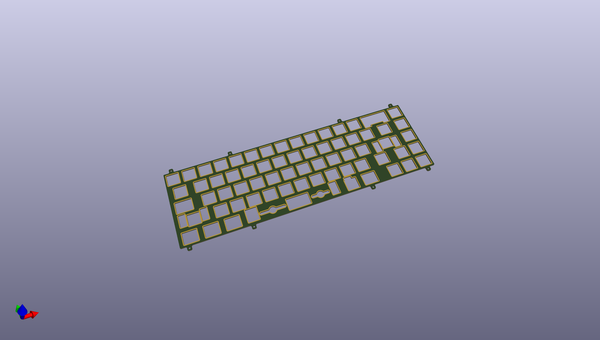
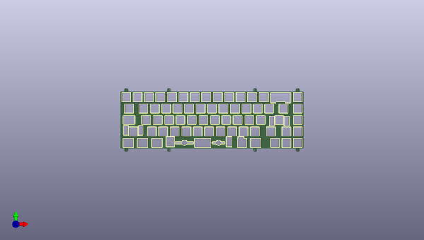
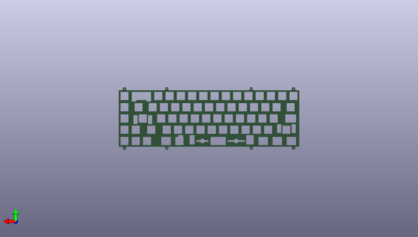

# jiu
 
## summary 
* id: acheronproject_jiu_jiu_plate
* user: acheronproject
* name: jiu
* board: jiu_plate
* repo: https://github.com/AcheronProject/Jiu
* src_file_repo_kicad_pcb: plate_kicad_files/jiu_plate.kicad_pcb
* src_file_repo_kicad_pcb_link: https://github.com/AcheronProject/Jiu/tree/master/plate_kicad_files/jiu_plate.kicad_pcb
* src_file_repo_kicad_sch: plate_kicad_files/jiu_plate.kicad_sch
* src_file_repo_kicad_sch_link: https://github.com/AcheronProject/Jiu/tree/master/plate_kicad_files/jiu_plate.kicad_sch

* src_file_repo_sch: 
* src_file_repo_sch_link: https://github.com/AcheronProject/Jiu/tree/master/

## schematic  
  
[schematic (pdf)](working_schematic.pdf)  

## pcb  
 
  
  
  
[board (pdf)](working.pdf)  

## bom_schematic
no data

