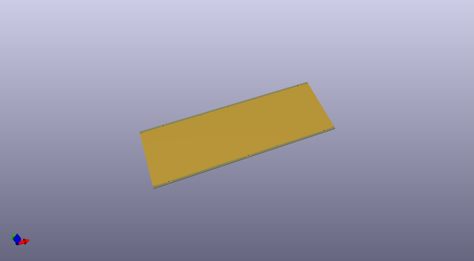
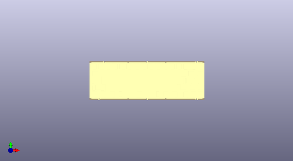
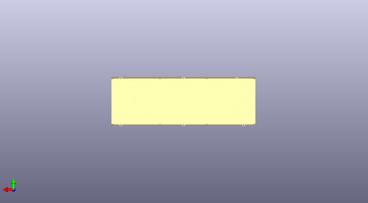

# kbd67mkii_plates
 
## summary 
* id: acheronproject_kbd67mkii_plates_kbd67mkii_ansi_plate
* user: acheronproject
* name: kbd67mkii_plates
* board: kbd67mkii_ansi_plate
* repo: https://github.com/AcheronProject/kbd67mkii_plates
* src_file_repo_kicad_pcb: kicad_files/kbd67mkii_ansi_half_plate.kicad_pcb
* src_file_repo_kicad_pcb_link: https://github.com/AcheronProject/kbd67mkii_plates/tree/master/kicad_files/kbd67mkii_ansi_half_plate.kicad_pcb

* src_file_repo_sch: 
* src_file_repo_sch_link: https://github.com/AcheronProject/kbd67mkii_plates/tree/master/

## pcb  
 
  
  
  
[board (pdf)](working.pdf)  

## working_bom
| Id | Designator | Footprint | Quantity | Designation | Supplier and ref |  | None | 
| --- | --- | --- | --- | --- | --- | --- | --- | 
| 1 | REF**,REF**,REF**,REF**,REF**,REF**,REF**,REF**,REF**,REF**,REF**,REF**,REF**,REF**,REF**,REF**,REF**,REF**,REF**,REF**,REF** | MX100 | 21 | MX100 |  |  | [''] | 
| 2 | REF**,REF**,REF**,REF**,REF** | MX125 | 5 | MX125 |  |  | [''] | 
| 3 | REF** | MX175 | 1 | MX175 |  |  | [''] | 
| 4 | REF**,REF** | MX150 | 2 | MX150 |  |  | [''] | 
| 5 | REF** | MX625 | 1 | MX625 |  |  | [''] | 
| 6 | REF**,REF** | MX225 | 2 | MX225 |  |  | [''] | 

