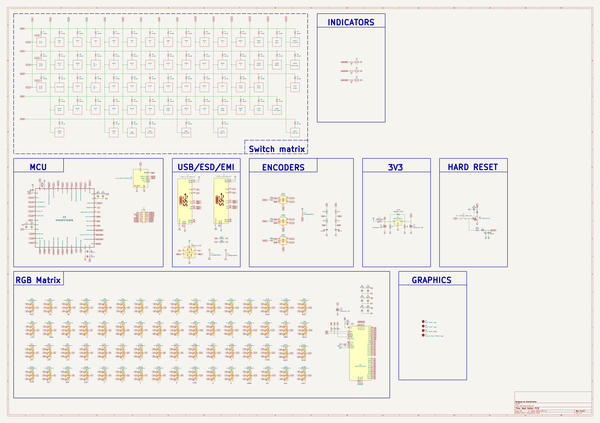
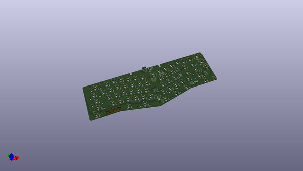
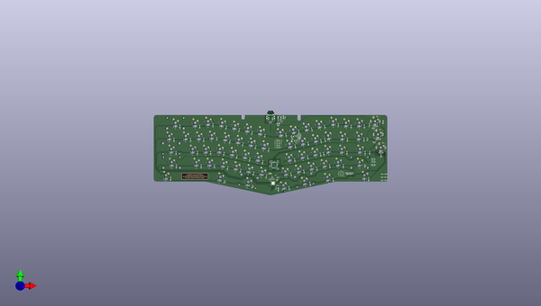
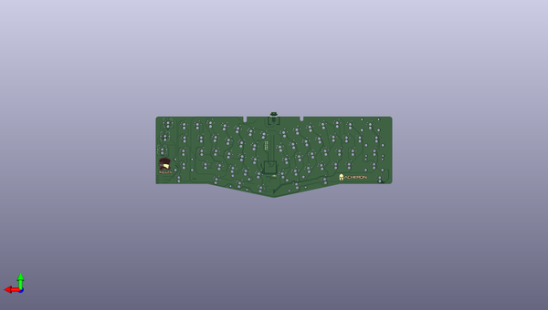

# madhatter
 
## summary 
* id: acheronproject_madhatter_mad_hatter
* user: acheronproject
* name: madhatter
* board: mad_hatter
* repo: https://github.com/AcheronProject/MadHatter
* src_file_repo_kicad_pcb: kicadFiles/mad-hatter.kicad_pcb
* src_file_repo_kicad_pcb_link: https://github.com/AcheronProject/MadHatter/tree/master/kicadFiles/mad-hatter.kicad_pcb
* src_file_repo_kicad_sch: kicadFiles/mad-hatter.kicad_sch
* src_file_repo_kicad_sch_link: https://github.com/AcheronProject/MadHatter/tree/master/kicadFiles/mad-hatter.kicad_sch

* src_file_repo_sch: 
* src_file_repo_sch_link: https://github.com/AcheronProject/MadHatter/tree/master/

## schematic  
  
[schematic (pdf)](working_schematic.pdf)  

## pcb  
 
  
  
  
[board (pdf)](working.pdf)  

## working_bom
| Id | Designator | Footprint | Quantity | Designation | Supplier and ref |  | None | 
| --- | --- | --- | --- | --- | --- | --- | --- | 
| 1 | SW2 | MX100 | 1 | GRV |  |  | [''] | 
| 2 | SW7 | MX100 | 1 | 5 |  |  | [''] | 
| 3 | SW8 | MX100 | 1 | 6 |  |  | [''] | 
| 4 | SW3 | MX100 | 1 | 1 |  |  | [''] | 
| 5 | SW4 | MX100 | 1 | 2 |  |  | [''] | 
| 6 | SW5 | MX100 | 1 | 3 |  |  | [''] | 
| 7 | SW1 | MX100 | 1 | ESC |  |  | [''] | 
| 8 | SW6 | MX100 | 1 | 4 |  |  | [''] | 
| 9 | SW9 | MX100 | 1 | 7 |  |  | [''] | 
| 10 | SW10 | MX100 | 1 | 8 |  |  | [''] | 
| 11 | SW11 | MX100 | 1 | 9 |  |  | [''] | 
| 12 | SW12 | MX100 | 1 | 0 |  |  | [''] | 
| 13 | SW13 | MX100 | 1 | MINUS |  |  | [''] | 
| 14 | SW14 | MX100 | 1 | EQUAL |  |  | [''] | 
| 15 | SW15 | MX200 | 1 | 2U BKSP |  |  | [''] | 
| 16 | SW16 | MX100 | 1 | PGUP |  |  | [''] | 
| 17 | SW17 | MX150 | 1 | TAB |  |  | [''] | 
| 18 | SW18 | MX100 | 1 | Q |  |  | [''] | 
| 19 | SW19 | MX100 | 1 | W |  |  | [''] | 
| 20 | SW20 | MX100 | 1 | E |  |  | [''] | 
| 21 | SW21 | MX100 | 1 | R |  |  | [''] | 
| 22 | SW22 | MX100 | 1 | T |  |  | [''] | 
| 23 | SW23 | MX100 | 1 | Y |  |  | [''] | 
| 24 | SW24 | MX100 | 1 | U |  |  | [''] | 
| 25 | SW25 | MX100 | 1 | I |  |  | [''] | 
| 26 | SW26 | MX100 | 1 | O |  |  | [''] | 
| 27 | SW27 | MX100 | 1 | P |  |  | [''] | 
| 28 | SW28 | MX100 | 1 | LBRACE |  |  | [''] | 
| 29 | SW29 | MX100 | 1 | RBRACE |  |  | [''] | 
| 30 | SW31 | MX100 | 1 | PGDN |  |  | [''] | 
| 31 | SW32 | MX175 | 1 | FULL CAPS |  |  | [''] | 
| 32 | SW33 | MX100 | 1 | A |  |  | [''] | 
| 33 | SW34 | MX100 | 1 | S |  |  | [''] | 
| 34 | SW35 | MX100 | 1 | D |  |  | [''] | 
| 35 | SW36 | MX100 | 1 | F |  |  | [''] | 
| 36 | SW37 | MX100 | 1 | G |  |  | [''] | 
| 37 | SW38 | MX100 | 1 | H |  |  | [''] | 
| 38 | SW40 | MX100 | 1 | K |  |  | [''] | 
| 39 | SW41 | MX100 | 1 | L |  |  | [''] | 
| 40 | SW42 | MX100 | 1 | COLON |  |  | [''] | 
| 41 | SW43 | MX100 | 1 | QUOTE |  |  | [''] | 
| 42 | SW44 | MX225R | 1 | ENTER |  |  | [''] | 
| 43 | SW45 | MX225 | 1 | LSHIFT |  |  | [''] | 
| 44 | SW46 | MX100 | 1 | Z |  |  | [''] | 
| 45 | SW47 | MX100 | 1 | X |  |  | [''] | 
| 46 | SW48 | MX100 | 1 | C |  |  | [''] | 
| 47 | SW49 | MX100 | 1 | V |  |  | [''] | 
| 48 | SW50 | MX100 | 1 | B |  |  | [''] | 
| 49 | SW51 | MX100 | 1 | EXTRA |  |  | [''] | 
| 50 | SW52 | MX100 | 1 | N |  |  | [''] | 
| 51 | SW53 | MX100 | 1 | M |  |  | [''] | 
| 52 | SW54 | MX100 | 1 | COMMA |  |  | [''] | 
| 53 | SW55 | MX100 | 1 | DOT |  |  | [''] | 
| 54 | SW56 | MX100 | 1 | SLASH |  |  | [''] | 
| 55 | SW57 | MX275 | 1 | 2.75U RSHIFT |  |  | [''] | 
| 56 | SW58 | MX150 | 1 | LCTRL |  |  | [''] | 
| 57 | SW59 | MX150 | 1 | LALT |  |  | [''] | 
| 58 | SW62 | MX275R | 1 | RIGHT SPACE |  |  | [''] | 
| 59 | SW63 | MX150 | 1 | RIGHT ALT |  |  | [''] | 
| 60 | SW64 | MX150 | 1 | RIGHT CTRL |  |  | [''] | 
| 61 | LED1,LED2,LED3 | LED_THT_2.54mm | 3 | LED |  |  | [''] | 
| 62 | SW61 | MX125 | 1 | LEFT SPACE |  |  | [''] | 
| 63 | SW60 | MX200R | 1 | LEFT SPACE |  |  | [''] | 
| 64 | SW30 | MX150 | 1 | BACK SLASH |  |  | [''] | 
| 65 | SW39 | MX100 | 1 | J |  |  | [''] | 
| 66 | L1,L2,L3 | L_1206_3216Metric_Pad1.42x1.75mm_HandSolder | 3 | 120R@100MHz |  |  | [''] | 
| 67 | C9,C3,C16,C4,C13,C5,C11 | C_0402_1005Metric | 7 | 100n |  |  | [''] | 
| 68 | D105,D124,D95,D94,D76,D77,D70,D80,D117,D100,D87,D83,D74,D114,D101,D107,D66,D104,D69,D73,D88,D78,D110,D81,D97,D128,D116,D121,D67,D106,D89,D120,D98,D102,D84,D103,D111,D90,D119,D93,D86,D79,D85,D96,D113,D71,D115,D109,D72,D91,D92,D127,D122,D108,D125,D99,D118,D68,D126,D82,D75,D112,D123 | LED_RGB_SMD_6028_2.8x3.5mm_Round | 63 | CP-6028SMDRGBC-CA |  |  | [''] | 
| 69 | D24,D61,D54,D34,D40,D2,D30,D48,D47,D26,D58,D64,D39,D15,D7,D32,D20,D49,D62,D42,D22,D27,D35,D60,D4,D9,D55,D16,D1,D50,D14,D3,D19,D43,D33,D17,D53,D10,D21,D8,D41,D13,D29,D6,D56,D46,D38,D44,D63,D23,D28,D12,D11,D5,D45,D57,D59,D31,D25,D18,D37,D52,D36,D51 | D_SOD-123 | 64 | 1N4148W |  |  | [''] | 
| 70 | C14,C12,C17,C18 | C_0402_1005Metric | 4 | 470n |  |  | [''] | 
| 71 | C2,C1 | CP_EIA-3216-10_Kemet-I_Pad1.58x1.35mm_HandSolder | 2 | 1u |  |  | [''] | 
| 72 | R7,R8 | R_0805_2012Metric | 2 | 100k |  |  | [''] | 
| 73 | F1 | Fuse_1812_4532Metric | 1 | mSMD110-16V |  |  | [''] | 
| 74 | R2,R3,R1 | R_0805_2012Metric | 3 | 420R |  |  | [''] | 
| 75 | U2 | QFN-48-1EP_6x6mm_P0.4mm_EP4.2x4.2mm | 1 | IS31FL3733-QF |  |  | [''] | 
| 76 | C19,C20,C21 | C_0805_2012Metric | 3 | 100n |  |  | [''] | 
| 77 | D130,D132,D133,D131 | D_SOD-123 | 4 | 1N4148W |  |  | [''] | 
| 78 | R12,R6,R13,R11,R10 | R_0805_2012Metric | 5 | 10k |  |  | [''] | 
| 79 | SW65,SW67,SW66 | ALPS_EC11E | 3 | EC11Ex |  |  | [''] | 
| 80 | C15 | CP_EIA-3216-10_Kemet-I_Pad1.58x1.35mm_HandSolder | 1 | 22u |  |  | [''] | 
| 81 | R5,R4 | R_0805_2012Metric | 2 | 1k |  |  | [''] | 
| 82 | C7 | C_0402_1005Metric | 1 | 1u |  |  | [''] | 
| 83 | J3 | PinHeader_2x06_P1.00mm_Vertical | 1 | EXTRA  |  |  | [''] | 
| 84 | R18,R17 | R_0805_2012Metric | 2 | 5.1k |  |  | [''] | 
| 85 | C22 | C_0805_2012Metric | 1 | 10u |  |  | [''] | 
| 86 | Q1 | SOT-23 | 1 | DTC123JKAT146 |  |  | [''] | 
| 87 | U4 | SOT-23 | 1 | MCP1700T-3302E/TT |  |  | [''] | 
| 88 | D129 | D_SOD-123 | 1 | RB060M-60TR |  |  | [''] | 
| 89 | C8 | C_0402_1005Metric | 1 | 10n |  |  | [''] | 
| 90 | J2 | Conn_ARM_JTAG_SWD_10 | 1 | Conn_ARM_JTAG_SWD_10 |  |  | [''] | 
| 91 | R14 | R_0805_2012Metric | 1 | 100R |  |  | [''] | 
| 92 | J1,J4 | TYPE-C-31-M-12 | 2 | TYPE-C-31-M12_13 |  |  | [''] | 
| 93 | D65 | LED_RGB_SMD_6028_2.8x3.5mm_Round | 1 | CP-6028SMDRGBC-CA |  |  | [''] | 
| 94 | S1 | K2-1187SQ-A4SW-06 | 1 | K2-1187SQ-A4SW-06 |  |  | [''] | 
| 95 | U1 | SOT-23-6 | 1 | USBLC6-2SC6 |  |  | [''] | 
| 96 | U3 | LQFP-48_7x7mm_P0.5mm | 1 | STM32F072CBT6 |  |  | [''] | 
| 97 | G2 | osh-logo | 1 | Mad Hatter Logo |  |  | [''] | 
| 98 | R9 | R_0805_2012Metric | 1 | 20k |  |  | [''] | 
| 99 | C6,C10 | C_0402_1005Metric | 2 | 4.7u |  |  | [''] | 
| 100 | R15 | R_0805_2012Metric | 1 | 330K |  |  | [''] | 
| 101 | G3 | mad_hatter_label | 1 | Mad Hatter label |  |  | [''] | 
| 102 | R16 | R_0805_2012Metric | 1 | 1M |  |  | [''] | 
| 103 | G1 | mad_hatter_logo-20x22 | 1 | Mad Hatter Logo |  |  | [''] | 
| 104 | G4 | acheronLong_40x12mm_Plated | 1 | Acheron Back Plated Logo |  |  | [''] | 

## bom_schematic
| Ref | Qnty | Value | Cmp name | Footprint | Description | Vendor | DNP | 
| --- | --- | --- | --- | --- | --- | --- | --- | 
| C1, C2 | 2 | 1u | CP1 | acheron_Components:CP_EIA-3216-10_Kemet-I_Pad1.58x1.35mm_HandSolder | Polarized capacitor, US symbol |  |  | 
| C3, C4, C5, C9, C11, C13, C16 | 7 | 100n | C_Small | Capacitor_SMD:C_0402_1005Metric | Unpolarized capacitor, small symbol |  |  | 
| C6, C10 | 2 | 4.7u | C_Small | Capacitor_SMD:C_0402_1005Metric | Unpolarized capacitor, small symbol |  |  | 
| C7 | 1 | 1u | C_Small | Capacitor_SMD:C_0402_1005Metric | Unpolarized capacitor, small symbol |  |  | 
| C8 | 1 | 10n | C_Small | Capacitor_SMD:C_0402_1005Metric | Unpolarized capacitor, small symbol |  |  | 
| C12, C14, C17, C18 | 4 | 470n | C_Small | Capacitor_SMD:C_0402_1005Metric | Unpolarized capacitor, small symbol |  |  | 
| C15 | 1 | 22u | CP1 | acheron_Components:CP_EIA-3216-10_Kemet-I_Pad1.58x1.35mm_HandSolder | Polarized capacitor, US symbol |  |  | 
| C19, C20, C21 | 3 | 100n | C_Small | Capacitor_SMD:C_0805_2012Metric | Unpolarized capacitor, small symbol |  |  | 
| C22 | 1 | 10u | C_Small | Capacitor_SMD:C_0805_2012Metric | Unpolarized capacitor, small symbol |  |  | 
| D1, D2, D3, D4, D5, D6, D7, D8, D9, D10, D11, D12, D13, D14, D15, D16, D17, D18, D19, D20, D21, D22, D23, D24, D25, D26, D27, D28, D29, D30, D31, D32, D33, D34, D35, D36, D37, D38, D39, D40, D41, D42, D43, D44, D45, D46, D47, D48, D49, D50, D51, D52, D53, D54, D55, D56, D57, D58, D59, D60, D61, D62, D63, D64 | 64 | 1N4148W | D | Acheron Components:D_SOD-123 | Diode |  |  | 
| D65 | 1 | CP-6028SMDRGBC-CA | LED_ARGB | Acheron Components:LED_RGB_SMD_6028_2.8x3.5mm_Round | RGB LED, anode/red/green/blue |  |  | 
| D66, D67, D68, D69, D70, D71, D72, D73, D74, D75, D76, D77, D78, D79, D80, D81, D82, D83, D84, D85, D86, D87, D88, D89, D90, D91, D92, D93, D94, D95, D96, D97, D98, D99, D100, D101, D102, D103, D104, D105, D106, D107, D108, D109, D110, D111, D112, D113, D114, D115, D116, D117, D118, D119, D120, D121, D122, D123, D124, D125, D126, D127, D128 | 63 | CP-6028SMDRGBC-CA | LED_ARGB | acheron_Components:LED_RGB_SMD_6028_2.8x3.5mm_Round | RGB LED, anode/red/green/blue |  |  | 
| D129 | 1 | RB060M-60TR | D_Schottky | acheron_Components:D_SOD-123 | Schottky diode |  |  | 
| D130, D131, D132, D133 | 4 | 1N4148W | D | acheron_Components:D_SOD-123 | Diode |  |  | 
| F1 | 1 | mSMD110-16V | Polyfuse | Fuse:Fuse_1812_4532Metric | Resettable fuse, polymeric positive temperature coefficient |  |  | 
| G1 | 1 | Mad Hatter Logo | MountingHole | Mad Hatter Graphics:mad_hatter_logo-20x22 | Mounting Hole without connection |  |  | 
| J1, J4 | 2 | TYPE-C-31-M12_13 | TYPE-C-31-M12_13 | acheron_Connectors:TYPE-C-31-M-12 |  |  |  | 
| J3 | 1 | EXTRA  | Conn_02x06_Counter_Clockwise | Connector_PinHeader_1.00mm:PinHeader_2x06_P1.00mm_Vertical | Generic connector, double row, 02x06, counter clockwise pin numbering scheme (similar to DIP packge numbering), script generated (kicad-library-utils/schlib/autogen/connector/) |  |  | 
| L1, L2, L3 | 3 | 120R@100MHz | L_Core_Ferrite | Inductor_SMD:L_1206_3216Metric_Pad1.42x1.75mm_HandSolder | Inductor with ferrite core |  |  | 
| LED1, LED2, LED3 | 3 | LED | LED | Acheron Components:LED_THT_2.54mm |  |  |  | 
| Q1 | 1 | DTC123JKAT146 | DTC123J | Package_TO_SOT_SMD:SOT-23 |  |  |  | 
| R1, R2, R3 | 3 | 420R | R_Small | Resistor_SMD:R_0805_2012Metric | Resistor, small symbol |  |  | 
| R4, R5 | 2 | 1k | R_Small | Resistor_SMD:R_0805_2012Metric | Resistor, small symbol |  |  | 
| R6, R10, R11, R12, R13 | 5 | 10k | R | Resistor_SMD:R_0805_2012Metric | Resistor |  |  | 
| R7, R8 | 2 | 100k | R | Resistor_SMD:R_0805_2012Metric | Resistor |  |  | 
| R9 | 1 | 20k | R_Small | Resistor_SMD:R_0805_2012Metric | Resistor, small symbol |  |  | 
| R14 | 1 | 100R | R_Small | Resistor_SMD:R_0805_2012Metric | Resistor, small symbol |  |  | 
| R15 | 1 | 330K | R_Small | Resistor_SMD:R_0805_2012Metric | Resistor, small symbol |  |  | 
| R16 | 1 | 1M | R_Small | Resistor_SMD:R_0805_2012Metric | Resistor, small symbol |  |  | 
| R17, R18 | 2 | 5.1k | R | Resistor_SMD:R_0805_2012Metric | Resistor |  |  | 
| S1 | 1 | K2-1187SQ-A4SW-06 | SW_SPST | acheron_Hardware:K2-1187SQ-A4SW-06 | Single Pole Single Throw (SPST) switch |  |  | 
| SW65, SW66, SW67 | 3 | EC11Ex | Rotary_Encoder_Switch_Chassis | Acheron Hardware:ALPS_EC11E | Rotary encoder, dual channel, incremental quadrate outputs, with switch |  |  | 
| U1 | 1 | USBLC6-2SC6 | USBLC6-2SC6 | acheron_Components:SOT-23-6 | Very low capacitance ESD protection diode, 2 data-line, SOT-23-6 |  |  | 
| U2 | 1 | IS31FL3733-QF | IS31FL3733-QF | acheron_Components:QFN-48-1EP_6x6mm_P0.4mm_EP4.2x4.2mm | 12x16 LED matrix driver with 8-bit PWM and breathing, QFN-48 |  |  | 
| U3 | 1 | STM32F072CBT6 | STM32F072-LQFP48 | acheron_Components:LQFP-48_7x7mm_P0.5mm |  |  |  | 
| U4 | 1 | MCP1700T-3302E/TT | MCP1700-3302E_SOT23 | Package_TO_SOT_SMD:SOT-23 | 250mA Low Quiscent Current LDO, 3.3V output, SOT-23 |  |  | 

