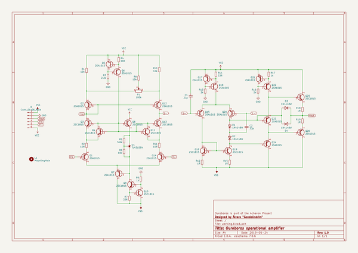

# ouroboros
 
## summary 
* id: acheronproject_ouroboros_ouroboros
* user: acheronproject
* name: ouroboros
* board: ouroboros
* repo: https://github.com/AcheronProject/Ouroboros
* src_file_repo_kicad_pcb: kicadFiles/ouroboros.kicad_pcb
* src_file_repo_kicad_pcb_link: https://github.com/AcheronProject/Ouroboros/tree/master/kicadFiles/ouroboros.kicad_pcb

* src_file_repo_sch: kicadFiles/ouroboros.sch
* src_file_repo_sch_link: https://github.com/AcheronProject/Ouroboros/tree/master/kicadFiles/ouroboros.sch

## schematic  
  
[schematic (pdf)](working_schematic.pdf)  

## pcb  
 
  
  
  
[board (pdf)](working.pdf)  

## bom_schematic
| Ref | Qnty | Value | Cmp name | Footprint | Description | Vendor | DNP | 
| --- | --- | --- | --- | --- | --- | --- | --- | 
| C1, C2 | 2 | 33p | C_Small | Capacitor_SMD:C_0805_2012Metric_Pad1.15x1.40mm_HandSolder | Unpolarized capacitor, small symbol |  |  | 
| D1, D2, D3, D4 | 4 | 1N4148W | 1N4148W | Diode_SMD:D_SOD-123 | 75V 0.15A Fast Switching Diode, SOD-123 |  |  | 
| J1 | 1 | Conn_01x06_Male | Conn_01x06_Male-Connector | acheronConnectors:male6pinHeader |  |  |  | 
| L1 | 1 | MountingHole | MountingHole | ouroborosLogo:ouroboros | Mounting Hole without connection |  |  | 
| P1 | 1 | 100k | R_POT-Device | acheronHardware:3313J |  |  |  | 
| Q1, Q2, Q5, Q6, Q7, Q12, Q14, Q15, Q17, Q18, Q20, Q21, Q22, Q23, Q24, Q26 | 16 | 2SA1015 | 2SA1015 | Package_TO_SOT_SMD:SOT-23 | -0.15A Ic, -50V Vce, Low Noise Audio PNP Transistor, TO-92 |  |  | 
| Q3, Q4, Q8, Q9, Q10, Q11, Q13, Q16, Q19, Q25 | 10 | 2SC1815 | 2SC1815 | Package_TO_SOT_SMD:SOT-23 | 0.15A Ic, 50V Vce, Low Noise Audio NPN Transistor, TO-92 |  |  | 
| R1, R6, R8, R10 | 4 | 10k | R_Small | Resistor_SMD:R_0805_2012Metric_Pad1.15x1.40mm_HandSolder | Resistor, small symbol |  |  | 
| R2, R11 | 2 | 10R | R_Small | Resistor_SMD:R_0805_2012Metric_Pad1.15x1.40mm_HandSolder | Resistor, small symbol |  |  | 
| R3 | 1 | 2.2k | R_Small | Resistor_SMD:R_0805_2012Metric_Pad1.15x1.40mm_HandSolder | Resistor, small symbol |  |  | 
| R4 | 1 | 100 | R_Small | Resistor_SMD:R_0805_2012Metric_Pad1.15x1.40mm_HandSolder | Resistor, small symbol |  |  | 
| R5 | 1 | 5.6k | R_Small | Resistor_SMD:R_0805_2012Metric_Pad1.15x1.40mm_HandSolder | Resistor, small symbol |  |  | 
| R7, R14 | 2 | 33R | R_Small | Resistor_SMD:R_0805_2012Metric_Pad1.15x1.40mm_HandSolder | Resistor, small symbol |  |  | 
| R9, R17 | 2 | 1k | R_Small | Resistor_SMD:R_0805_2012Metric_Pad1.15x1.40mm_HandSolder | Resistor, small symbol |  |  | 
| R12, R15, R18, R19 | 4 | 1R | R_Small | Resistor_SMD:R_0805_2012Metric_Pad1.15x1.40mm_HandSolder | Resistor, small symbol |  |  | 
| R13, R16 | 2 | 2k | R_Small | Resistor_SMD:R_0805_2012Metric_Pad1.15x1.40mm_HandSolder | Resistor, small symbol |  |  | 
| U1 | 1 | TL431DBV | TL431DBV | Package_TO_SOT_SMD:SOT-23-5 | Shunt Regulator, SOT-23-5 |  |  | 

