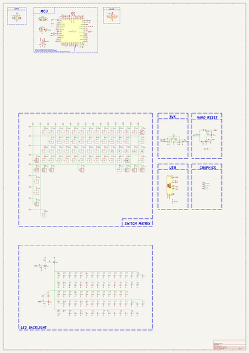

# raphael
 
## summary 
* id: acheronproject_raphael_raphael
* user: acheronproject
* name: raphael
* board: raphael
* repo: https://github.com/AcheronProject/Raphael
* src_file_repo_kicad_pcb: kicad_files/raphael.kicad_pcb
* src_file_repo_kicad_pcb_link: https://github.com/AcheronProject/Raphael/tree/main/kicad_files/raphael.kicad_pcb
* src_file_repo_kicad_sch: kicad_files/raphael.kicad_sch
* src_file_repo_kicad_sch_link: https://github.com/AcheronProject/Raphael/tree/main/kicad_files/raphael.kicad_sch

* src_file_repo_sch: 
* src_file_repo_sch_link: https://github.com/AcheronProject/Raphael/tree/main/

## schematic  
  
[schematic (pdf)](working_schematic.pdf)  

## working_bom
| Id | Designator | Footprint | Quantity | Designation | Supplier and ref |  | None | 
| --- | --- | --- | --- | --- | --- | --- | --- | 
| 1 | D11,D48,D53,D8,D1,D6,D27,D17,D42,D26,D22,D38,D43,D20,D56,D40,D50,D36,D29,D65,D35,D18,D16,D51,D55,D24,D45,D32,D47,D54,D28,D61,D14,D4,D46,D37,D62,D12,D9,D59,D19,D49,D10,D31,D13,D23,D25,D41,D58,D64,D7,D60,D33,D57,D3,D30,D66,D63,D15,D21,D5,D68,D52,D44,D34,D39,D67 | D_SOD-123 | 67 | 1N4148W |  |  | [''] | 
| 2 | Q2,Q3 | SOT-23 | 2 | 2N7002 |  |  | [''] | 
| 3 | C9,C6,C8,C7,C2,C15 | C_0402_1005Metric | 6 | 100n |  |  | [''] | 
| 4 | R63,R49,R37,R78,R83,R67,R52,R72,R33,R44,R40,R73,R81,R20,R26,R60,R31,R61,R25,R80,R85,R77,R53,R70,R66,R36,R46,R82,R55,R86,R71,R23,R35,R42,R21,R58,R47,R39,R27,R64,R74,R59,R54,R29,R30,R45,R28,R62,R24,R22,R56,R32,R51,R38,R48,R50,R41,R87,R34,R68,R57,R79,R65,R84,R69,R43 | R_0805_2012Metric | 66 | 1k |  |  | [''] | 
| 5 | J1 | SM04B-SRSS-TB(LF)(SN)_mounting-reliefs | 1 | A1001WR-S-04P |  |  | [''] | 
| 6 | C14,C13 | C_0402_1005Metric | 2 | 16p |  |  | [''] | 
| 7 | C12 | C_0402_1005Metric | 1 | 10n |  |  | [''] | 
| 8 | C10 | CP_EIA-3216-10_Kemet-I_Pad1.58x1.35mm_HandSolder | 1 | 10u |  |  | [''] | 
| 9 | R4,R5,R6 | R_0402_1005Metric | 3 | 100R |  |  | [''] | 
| 10 | R10,R9,R16,R3,R19 | R_0402_1005Metric | 5 | 10k |  |  | [''] | 
| 11 | U5 | STM_UFQFPN-48_LQFP-48-1EP_7x7mm_P0.5mm_HandSoldering_ThermalReliefs | 1 | STM32F411CEU6 |  |  | [''] | 
| 12 | C11,C16 | C_0402_1005Metric | 2 | 4.7u |  |  | [''] | 
| 13 | C3,C4 | C_0805_2012Metric | 2 | 1u |  |  | [''] | 
| 14 | R76 | R_0805_2012Metric | 1 | 10k |  |  | [''] | 
| 15 | FB1 | L_0805_2012Metric | 1 | GZ2012D601TF |  |  | [''] | 
| 16 | R12,R11 | R_0402_1005Metric | 2 | 4.7k |  |  | [''] | 
| 17 | J2 | TYPE-C-31-M-12 | 1 | TYPE-C-31-M-12 |  |  | [''] | 
| 18 | R15,R14 | R_0402_1005Metric | 2 | 5.1k |  |  | [''] | 
| 19 | R17,R18 | R_0402_1005Metric | 2 | 100 |  |  | [''] | 
| 20 | C5 | C_0805_2012Metric | 1 | 10n |  |  | [''] | 
| 21 | SW1 | K2-1187SQ-A4SW-06 | 1 | K2-1187SQ-A4SW-06 |  |  | [''] | 
| 22 | U2 | SOT-363_SC-70-6 | 1 | 2N7002DW |  |  | [''] | 
| 23 | D2 | D_SOD-123 | 1 | B5819W-SL |  |  | [''] | 
| 24 | R2 | R_0402_1005Metric | 1 | 1M |  |  | [''] | 
| 25 | C1 | C_0402_1005Metric | 1 | 10u |  |  | [''] | 
| 26 | U3 | SOT-23-5 | 1 | SGM2007-3.3XN5/TR |  |  | [''] | 
| 27 | R7,R8 | R_0805_2012Metric | 2 | 100k |  |  | [''] | 
| 28 | F1 | Fuse_1206_3216Metric | 1 | nSMD100-16V |  |  | [''] | 
| 29 | R13 | R_0402_1005Metric | 1 | 1.5k |  |  | [''] | 
| 30 | Q1 | SOT-23 | 1 | AO3401A |  |  | [''] | 
| 31 | U4 | TSSOP-8_4.4x3mm_P0.65mm | 1 | BL24C256A-SFRC |  |  | [''] | 
| 32 | Y1 | Crystal_SMD_3225-4Pin_3.2x2.5mm | 1 | 7325-0800A2010-00 |  |  | [''] | 
| 33 | R75 | R_0805_2012Metric | 1 | 100R |  |  | [''] | 
| 34 | U1 | SOT-23-6 | 1 | USBLC6-2SC6 |  |  | [''] | 
| 35 | R1 | R_0402_1005Metric | 1 | 330k |  |  | [''] | 

## bom_schematic
| Ref | Qnty | Value | Cmp name | Footprint | Description | Vendor | DNP | 
| --- | --- | --- | --- | --- | --- | --- | --- | 
| C1 | 1 | 10u | C_Small | Capacitor_SMD:C_0402_1005Metric | Unpolarized capacitor, small symbol |  |  | 
| C2, C6, C7, C8, C9, C15 | 6 | 100n | C_Small | Capacitor_SMD:C_0402_1005Metric | Unpolarized capacitor, small symbol |  |  | 
| C3, C4 | 2 | 1u | C | Capacitor_SMD:C_0805_2012Metric | Unpolarized capacitor |  |  | 
| C5 | 1 | 10n | C_Small | Capacitor_SMD:C_0805_2012Metric | Unpolarized capacitor, small symbol |  |  | 
| C10 | 1 | 10u | CP1 | acheron_Components:CP_EIA-3216-10_Kemet-I_Pad1.58x1.35mm_HandSolder | Polarized capacitor, US symbol |  |  | 
| C11, C16 | 2 | 4.7u | C_Small | Capacitor_SMD:C_0402_1005Metric | Unpolarized capacitor, small symbol |  |  | 
| C12 | 1 | 10n | C_Small | Capacitor_SMD:C_0402_1005Metric | Unpolarized capacitor, small symbol |  |  | 
| C13, C14 | 2 | 16p | C_Small | Capacitor_SMD:C_0402_1005Metric | Unpolarized capacitor, small symbol |  |  | 
| D1, D3, D4, D5, D6, D7, D8, D9, D10, D11, D12, D13, D14, D15, D16, D17, D18, D19, D20, D21, D22, D23, D24, D25, D26, D27, D28, D29, D30, D31, D32, D33, D34, D35, D36, D37, D38, D39, D40, D41, D42, D43, D44, D45, D46, D47, D48, D49, D50, D51, D52, D53, D54, D55, D56, D57, D58, D59, D60, D61, D62, D63, D64, D65, D66, D67, D68 | 67 | 1N4148W | D_Small | acheron_Components:D_SOD-123 | Diode, small symbol |  |  | 
| D2 | 1 | B5819W-SL | D_Schottky | acheron_Components:D_SOD-123 | Schottky diode |  |  | 
| F1 | 1 | nSMD100-16V | Fuse | Fuse:Fuse_1206_3216Metric | Fuse |  |  | 
| FB1 | 1 | GZ2012D601TF | Ferrite_Bead_Small | Inductor_SMD:L_0805_2012Metric | Ferrite bead, small symbol |  |  | 
| J1 | 1 | A1001WR-S-04P | Conn_01x04_MountingPin | acheron_Connectors:SM04B-SRSS-TB(LF)(SN)_mounting-reliefs | Generic connectable mounting pin connector, single row, 01x04, script generated (kicad-library-utils/schlib/autogen/connector/) |  |  | 
| J2 | 1 | TYPE-C-31-M-12 | TYPE-C-31-M12_13 | acheron_Connectors:TYPE-C-31-M-12 |  |  |  | 
| Q1 | 1 | AO3401A | AO3401A | Package_TO_SOT_SMD:SOT-23 | -4.0A Id, -30V Vds, P-Channel MOSFET, SOT-23 |  |  | 
| Q2, Q3 | 2 | 2N7002 | 2N7002 | Package_TO_SOT_SMD:SOT-23 | 0.115A Id, 60V Vds, N-Channel MOSFET, SOT-23 |  |  | 
| R1 | 1 | 330k | R_Small | Resistor_SMD:R_0402_1005Metric | Resistor, small symbol |  |  | 
| R2 | 1 | 1M | R_Small | Resistor_SMD:R_0402_1005Metric | Resistor, small symbol |  |  | 
| R3, R9, R10, R16, R19 | 5 | 10k | R_Small | Resistor_SMD:R_0402_1005Metric | Resistor, small symbol |  |  | 
| R4, R5, R6 | 3 | 100R | R_Small | Resistor_SMD:R_0402_1005Metric | Resistor, small symbol |  |  | 
| R7, R8 | 2 | 100k | R | Resistor_SMD:R_0805_2012Metric | Resistor |  |  | 
| R11, R12 | 2 | 4.7k | R_Small | Resistor_SMD:R_0402_1005Metric | Resistor, small symbol |  |  | 
| R13 | 1 | 1.5k | R_Small | Resistor_SMD:R_0402_1005Metric | Resistor, small symbol |  |  | 
| R14, R15 | 2 | 5.1k | R_Small | Resistor_SMD:R_0402_1005Metric | Resistor, small symbol |  |  | 
| R17, R18 | 2 | 100 | R_Small | Resistor_SMD:R_0402_1005Metric | Resistor, small symbol |  |  | 
| R20, R21, R22, R23, R24, R25, R26, R27, R28, R29, R30, R31, R32, R33, R34, R35, R36, R37, R38, R39, R40, R41, R42, R43, R44, R45, R46, R47, R48, R49, R50, R51, R52, R53, R54, R55, R56, R57, R58, R59, R60, R61, R62, R63, R64, R65, R66, R67, R68, R69, R70, R71, R72, R73, R74, R77, R78, R79, R80, R81, R82, R83, R84, R85, R86, R87 | 66 | 1k | R_Small | Resistor_SMD:R_0805_2012Metric | Resistor, small symbol |  |  | 
| R75 | 1 | 100R | R_Small | Resistor_SMD:R_0805_2012Metric | Resistor, small symbol |  |  | 
| R76 | 1 | 10k | R_Small | Resistor_SMD:R_0805_2012Metric | Resistor, small symbol |  |  | 
| SW1 | 1 | K2-1187SQ-A4SW-06 | SW_SPST | acheron_Hardware:K2-1187SQ-A4SW-06 | Single Pole Single Throw (SPST) switch |  |  | 
| U1 | 1 | USBLC6-2SC6 | USBLC6-2SC6 | acheron_Components:SOT-23-6 | Very low capacitance ESD protection diode, 2 data-line, SOT-23-6 |  |  | 
| U2 | 1 | 2N7002DW | 2N7002DW | acheron_Components:SOT-363_SC-70-6 | Dual N-channel enhancement mode MOSFET |  |  | 
| U3 | 1 | SGM2007-3.3XN5/TR | SGM2036 | acheron_Components:SOT-23-5 | 300mA, Low Power, Low Dropout Linear Regulators |  |  | 
| U4 | 1 | BL24C256A-SFRC | 24LC256 | acheron_Components:TSSOP-8_4.4x3mm_P0.65mm | I2C Serial EEPROM, 256Kb, DIP-8/SOIC-8/TSSOP-8/DFN-8 |  |  | 
| U5 | 1 | STM32F411CEU6 | STM32F411-48 | acheron_Components:STM_UFQFPN-48_LQFP-48-1EP_7x7mm_P0.5mm_HandSoldering_ThermalReliefs | UFQFPN-48 Arm® Cortex®-M4 32bits MCU+FPU, 125 DMIPS, 512KB Flash,   128KB RAM, USB OTG FS, 11 TIMs, 1 ADC, 13 comm. interfaces |  |  | 
| Y1 | 1 | 7325-0800A2010-00 | Crystal_GND24 | acheron_Components:Crystal_SMD_3225-4Pin_3.2x2.5mm | Four pin crystal, GND on pins 2 and 4 |  |  | 

