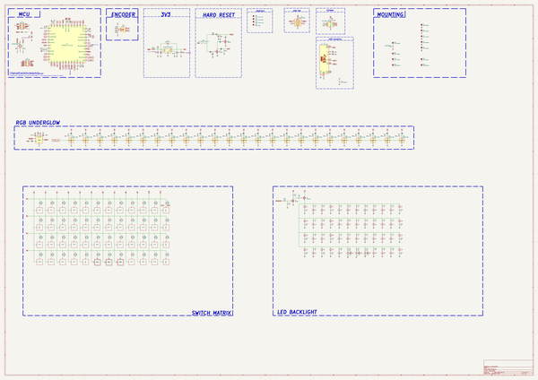
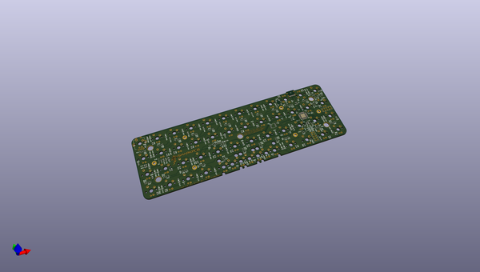

# sharkpcb
 
## summary 
* id: acheronproject_sharkpcb_shark
* user: acheronproject
* name: sharkpcb
* board: shark
* repo: https://github.com/AcheronProject/SharkPCB
* src_file_repo_kicad_pcb: kicad_files/shark.kicad_pcb
* src_file_repo_kicad_pcb_link: https://github.com/AcheronProject/SharkPCB/tree/main/kicad_files/shark.kicad_pcb
* src_file_repo_kicad_sch: kicad_files/shark.kicad_sch
* src_file_repo_kicad_sch_link: https://github.com/AcheronProject/SharkPCB/tree/main/kicad_files/shark.kicad_sch

* src_file_repo_sch: 
* src_file_repo_sch_link: https://github.com/AcheronProject/SharkPCB/tree/main/

## schematic  
  
[schematic (pdf)](working_schematic.pdf)  

## pcb  
 
  
  
  
[board (pdf)](working.pdf)  

## working_bom
| Id | Designator | Footprint | Quantity | Designation | Supplier and ref |  | None | 
| --- | --- | --- | --- | --- | --- | --- | --- | 
| 1 | R41,R14,R40,R7,R44 | R_0402_1005Metric | 5 | 10k |  |  | [''] | 
| 2 | D52,D35,D47,D48,D32,D60,D40,D39,D55,D50,D43,D49,D31,D44,D69,D63,D45,D61,D30,D67,D53,D62,D73,D56,D37,D42,D1,D70,D64,D58,D41,D68,D28,D72,D29,D36,D34,D74,D27,D66,D46,D38,D51,D57,D59,D54,D71,D33,D65 | D_SOD-123 | 49 | 1N4148W |  |  | [''] | 
| 3 | MH1,MH6,MH4,MH2,MH3,MH5 | MountingHole_2.5mm_Pad | 6 | MountingHole |  |  | [''] | 
| 4 | R34,R38,R26,R16,R39,R22,R20,R19,R29,R23,R28,R24,R18,R33,R35,R32,R36,R31,R21,R37,R25,R17,R30,R27 | R_0402_1005Metric | 24 | 5.1R |  |  | [''] | 
| 5 | R43,R42 | R_0402_1005Metric | 2 | 100 |  |  | [''] | 
| 6 | Y1 | Crystal_SMD_3225-4Pin_3.2x2.5mm | 1 | TAXM8M4RFDCET2T |  |  | [''] | 
| 7 | C33,C39,C28,C3,C44,C34,C19,C25,C15,C36,C22,C43,C20,C2,C13,C11,C24,C37,C38,C30,C23,C29,C5,C31,C41,C26,C27,C4,C1,C35,C21,C42,C40,C32 | C_0402_1005Metric | 34 | 100n |  |  | [''] | 
| 8 | R5 | R_0402_1005Metric | 1 | 330k |  |  | [''] | 
| 9 | R47,R89,R66,R62,R60,R54,R50,R51,R74,R48,R76,R65,R53,R88,R73,R72,R46,R91,R75,R52,R61,R77,R55,R80,R63,R45,R64,R59,R68,R81,R49,R92,R56,R71,R78,R90 | R_0805_2012Metric | 36 | 1k |  |  | [''] | 
| 10 | FB1,FB2 | L_0805_2012Metric | 2 | GZ2012D601TF |  |  | [''] | 
| 11 | D25,D18,D12,D13,D6,D23,D8,D14,D26,D20,D4,D22,D7,D9,D19,D17,D16,D10,D5,D11,D15,D21,D3,D24 | LED_WS2812_2020 | 24 | WS2812C-2020 |  |  | [''] | 
| 12 | C8,C7 | C_0402_1005Metric | 2 | 15p |  |  | [''] | 
| 13 | C12,C9 | C_0402_1005Metric | 2 | 4.7u |  |  | [''] | 
| 14 | R12,R13 | R_0805_2012Metric | 2 | 100k |  |  | [''] | 
| 15 | C16,C17 | C_0805_2012Metric | 2 | 1u |  |  | [''] | 
| 16 | R87,R70,R82,R85,R86,R67,R69,R79,R57,R84,R83,R58 | R_0402_1005Metric | 12 | 1k |  |  | [''] | 
| 17 | U1 | STM_UFQFPN-48_LQFP-48-1EP_7x7mm_P0.5mm_HandSoldering_ThermalReliefs | 1 | STM32F411CEU6 |  |  | [''] | 
| 18 | R2,R1 | R_0402_1005Metric | 2 | 4.7k |  |  | [''] | 
| 19 | R10,R9,R8 | R_0402_1005Metric | 3 | 100R |  |  | [''] | 
| 20 | D2 | D_SOD-123 | 1 | B5819W-SL |  |  | [''] | 
| 21 | H3,H4,H5,H1,H2 | shark_3mm_tht_mountinghole | 5 | MountingHole |  |  | [''] | 
| 22 | C18,C10 | C_0402_1005Metric | 2 | 10n |  |  | [''] | 
| 23 | Q3 | SOT-23 | 1 | AO3401A |  |  | [''] | 
| 24 | R15,R11 | R_0402_1005Metric | 2 | 5.1k |  |  | [''] | 
| 25 | C14 | C_0402_1005Metric | 1 | 10u |  |  | [''] | 
| 26 | Q2,Q1,Q4 | SOT-23 | 3 | 2N7002 |  |  | [''] | 
| 27 | U5 | SOT-563 | 1 | TXS0101DRLR |  |  | [''] | 
| 28 | U3 | SOIC-8 | 1 | AT24C256C-SSHL-T |  |  | [''] | 
| 29 | C6 | CP_EIA-3216-10_Kemet-I_Pad1.58x1.35mm_HandSolder | 1 | 10u |  |  | [''] | 
| 30 | R4 | R_0402_1005Metric | 1 | 1.5k |  |  | [''] | 
| 31 | U4 | SOT-23-5 | 1 | SGM2007-3.3XN5/TR |  |  | [''] | 
| 32 | SW2 | K2-1187SQ-A4SW-06 | 1 | K2-1187SQ-A4SW-06 |  |  | [''] | 
| 33 | U2 | SOT-23-6 | 1 | USBLC6-2SC6 |  |  | [''] | 
| 34 | R6 | R_0402_1005Metric | 1 | 1M |  |  | [''] | 
| 35 | R3 | R_0805_2012Metric | 1 | 10k |  |  | [''] | 
| 36 | J1 | TYPE-C-31-M-12 | 1 | TYPE-C-31-M12 |  |  | [''] | 
| 37 | F1 | Fuse_1206_3216Metric | 1 | nSMD100-16V |  |  | [''] | 

## bom_schematic
| Ref | Qnty | Value | Cmp name | Footprint | Description | Vendor | DNP | 
| --- | --- | --- | --- | --- | --- | --- | --- | 
| C1, C2, C3, C4, C5, C11, C13, C15, C19, C20, C21, C22, C23, C24, C25, C26, C27, C28, C29, C30, C31, C32, C33, C34, C35, C36, C37, C38, C39, C40, C41, C42, C43, C44 | 34 | 100n | C_Small | Capacitor_SMD:C_0402_1005Metric | Unpolarized capacitor, small symbol |  |  | 
| C6 | 1 | 10u | CP1 | acheron_Components:CP_EIA-3216-10_Kemet-I_Pad1.58x1.35mm_HandSolder | Polarized capacitor, US symbol |  |  | 
| C7, C8 | 2 | 15p | C_Small | Capacitor_SMD:C_0402_1005Metric | Unpolarized capacitor, small symbol |  |  | 
| C9, C12 | 2 | 4.7u | C_Small | Capacitor_SMD:C_0402_1005Metric | Unpolarized capacitor, small symbol |  |  | 
| C10, C18 | 2 | 10n | C_Small | Capacitor_SMD:C_0402_1005Metric | Unpolarized capacitor, small symbol |  |  | 
| C14 | 1 | 10u | C_Small | Capacitor_SMD:C_0402_1005Metric | Unpolarized capacitor, small symbol |  |  | 
| C16, C17 | 2 | 1u | C | Capacitor_SMD:C_0805_2012Metric | Unpolarized capacitor |  |  | 
| D1, D27, D28, D29, D30, D31, D32, D33, D34, D35, D36, D37, D38, D39, D40, D41, D42, D43, D44, D45, D46, D47, D48, D49, D50, D51, D52, D53, D54, D55, D56, D57, D58, D59, D60, D61, D62, D63, D64, D65, D66, D67, D68, D69, D70, D71, D72, D73, D74 | 49 | 1N4148W | D | acheron_Components:D_SOD-123 | Diode |  |  | 
| D2 | 1 | B5819W-SL | D_Schottky | acheron_Components:D_SOD-123 | Schottky diode |  |  | 
| D3, D4, D5, D6, D7, D8, D9, D10, D11, D12, D13, D14, D15, D16, D17, D18, D19, D20, D21, D22, D23, D24, D25, D26 | 24 | WS2812C-2020 | WS2812B-2020 | acheron_Components:LED_WS2812_2020 | Intelligent control RGB LED integrated light source, 3.5x3.5mm package |  |  | 
| F1 | 1 | nSMD100-16V | Fuse | Fuse:Fuse_1206_3216Metric | Fuse |  |  | 
| FB1, FB2 | 2 | GZ2012D601TF | Ferrite_Bead_Small | Inductor_SMD:L_0805_2012Metric | Ferrite bead, small symbol |  |  | 
| H1, H2, H3, H4, H5 | 5 | MountingHole | MountingHole_Pad | shark_library:shark_3mm_tht_mountinghole | Mounting Hole with connection |  |  | 
| J1 | 1 | TYPE-C-31-M12 | USB_C_16_pin | acheron_Connectors:TYPE-C-31-M-12 | 16-pin USB type C (USB 2.0) connector |  |  | 
| MH1, MH2, MH3, MH4, MH5, MH6 | 6 | MountingHole | MountingHole_Pad | shark_library:MountingHole_2.5mm_Pad | Mounting Hole with connection |  |  | 
| Q1, Q2, Q4 | 3 | 2N7002 | 2N7002 | Package_TO_SOT_SMD:SOT-23 | 0.115A Id, 60V Vds, N-Channel MOSFET, SOT-23 |  |  | 
| Q3 | 1 | AO3401A | AO3401A | Package_TO_SOT_SMD:SOT-23 | -4.0A Id, -30V Vds, P-Channel MOSFET, SOT-23 |  |  | 
| R1, R2 | 2 | 4.7k | R_Small | Resistor_SMD:R_0402_1005Metric | Resistor, small symbol |  |  | 
| R3 | 1 | 10k | R_Small | Resistor_SMD:R_0805_2012Metric | Resistor, small symbol |  |  | 
| R4 | 1 | 1.5k | R_Small | Resistor_SMD:R_0402_1005Metric | Resistor, small symbol |  |  | 
| R5 | 1 | 330k | R_Small | Resistor_SMD:R_0402_1005Metric | Resistor, small symbol |  |  | 
| R6 | 1 | 1M | R_Small | Resistor_SMD:R_0402_1005Metric | Resistor, small symbol |  |  | 
| R7, R14, R40, R41, R44 | 5 | 10k | R_Small | Resistor_SMD:R_0402_1005Metric | Resistor, small symbol |  |  | 
| R8, R9, R10 | 3 | 100R | R_Small | Resistor_SMD:R_0402_1005Metric | Resistor, small symbol |  |  | 
| R11, R15 | 2 | 5.1k | R_Small | Resistor_SMD:R_0402_1005Metric | Resistor, small symbol |  |  | 
| R12, R13 | 2 | 100k | R | Resistor_SMD:R_0805_2012Metric | Resistor |  |  | 
| R16, R17, R18, R19, R20, R21, R22, R23, R24, R25, R26, R27, R28, R29, R30, R31, R32, R33, R34, R35, R36, R37, R38, R39 | 24 | 5.1R | R_Small | Resistor_SMD:R_0402_1005Metric | Resistor, small symbol |  |  | 
| R42, R43 | 2 | 100 | R_Small | Resistor_SMD:R_0402_1005Metric | Resistor, small symbol |  |  | 
| R45, R46, R47, R48, R49, R50, R51, R52, R53, R54, R55, R56, R59, R60, R61, R62, R63, R64, R65, R66, R68, R71, R72, R73, R74, R75, R76, R77, R78, R80, R81, R88, R89, R90, R91, R92 | 36 | 1k | R_Small | Resistor_SMD:R_0805_2012Metric | Resistor, small symbol |  |  | 
| R57, R58, R67, R69, R70, R79, R82, R83, R84, R85, R86, R87 | 12 | 1k | R_Small | Resistor_SMD:R_0402_1005Metric | Resistor, small symbol |  |  | 
| SW2 | 1 | K2-1187SQ-A4SW-06 | SW_SPST | acheron_Hardware:K2-1187SQ-A4SW-06 | Single Pole Single Throw (SPST) switch |  |  | 
| U1 | 1 | STM32F411CEU6 | STM32F411-48 | acheron_Components:STM_UFQFPN-48_LQFP-48-1EP_7x7mm_P0.5mm_HandSoldering_ThermalReliefs | UFQFPN-48 Arm® Cortex®-M4 32bits MCU+FPU, 125 DMIPS, 512KB Flash,   128KB RAM, USB OTG FS, 11 TIMs, 1 ADC, 13 comm. interfaces |  |  | 
| U2 | 1 | USBLC6-2SC6 | USBLC6-2SC6 | acheron_Components:SOT-23-6 | Very low capacitance ESD protection diode, 2 data-line, SOT-23-6 |  |  | 
| U3 | 1 | AT24C256C-SSHL-T | 24LC256 | acheron_Components:SOIC-8 | I2C Serial EEPROM, 256Kb, DIP-8/SOIC-8/TSSOP-8/DFN-8 |  |  | 
| U4 | 1 | SGM2007-3.3XN5/TR | SGM2036 | acheron_Components:SOT-23-5 | 300mA, Low Power, Low Dropout Linear Regulators |  |  | 
| U5 | 1 | TXS0101DRLR | TXS0101 | acheron_Components:SOT-563 | 1-bit bidirectional level shifting voltage level translator |  |  | 
| Y1 | 1 | TAXM8M4RFDCET2T | Crystal_GND24 | acheron_Components:Crystal_SMD_3225-4Pin_3.2x2.5mm | Four pin crystal, GND on pins 2 and 4 |  |  | 

## mounting_holes
| x | y | package | value | ref | size | 
| --- | --- | --- | --- | --- | --- | 
| 190.0 | 38.0 | shark_3mm_tht_mountinghole | MountingHole | H1 | m3 | 
| 0.0 | 38.0 | shark_3mm_tht_mountinghole | MountingHole | H2 | m3 | 
| 94.975 | 18.975 | shark_3mm_tht_mountinghole | MountingHole | H3 | m3 | 
| 0.0 | 0.0 | shark_3mm_tht_mountinghole | MountingHole | H4 | m3 | 
| 190.0 | 0.0 | shark_3mm_tht_mountinghole | MountingHole | H5 | m3 | 

