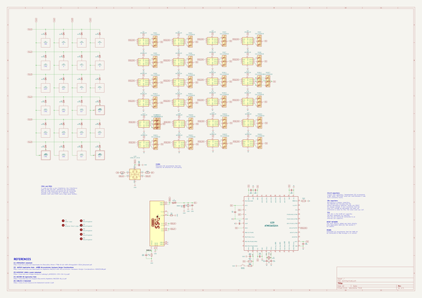
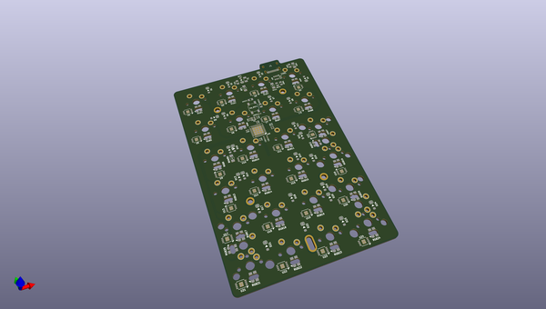
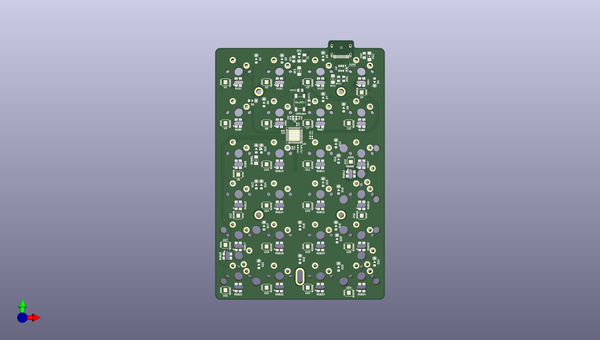
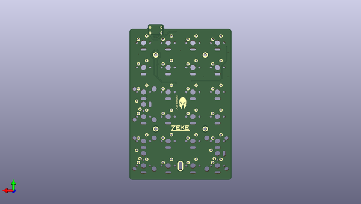

# zeke
 
## summary 
* id: acheronproject_zeke_zeke
* user: acheronproject
* name: zeke
* board: zeke
* repo: https://github.com/AcheronProject/Zeke
* src_file_repo_kicad_pcb: PCB Files/zeke.kicad_pcb
* src_file_repo_kicad_pcb_link: https://github.com/AcheronProject/Zeke/tree/master/PCB Files/zeke.kicad_pcb

* src_file_repo_sch: PCB Files/zeke.sch
* src_file_repo_sch_link: https://github.com/AcheronProject/Zeke/tree/master/PCB Files/zeke.sch

## schematic  
  
[schematic (pdf)](working_schematic.pdf)  

## pcb  
 
  
  
  
[board (pdf)](working.pdf)  

## working_bom
| Id | Designator | Footprint | Quantity | Designation | Supplier and ref |  | None | 
| --- | --- | --- | --- | --- | --- | --- | --- | 
| 1 | CB2,CB3,CB4,CB5,CB6,CRST1,CUSB1 | C_0402_1005Metric | 7 | 100nF |  |  | [''] | 
| 2 | CSH1 | C_0805_2012Metric_Pad1.15x1.40mm_HandSolder | 1 | 100nF |  |  | [''] | 
| 3 | CU1,CB1 | C_0402_1005Metric | 2 | 1uF |  |  | [''] | 
| 4 | D1,D2,D3,D4,D5,D6,D7,D8,D9,D10,D11,D12,D13,D14,D15,D16,D17,D18,D19,D21,D22,D23,D24,D20 | D_SOD-123 | 24 | 1N4148 |  |  | [''] | 
| 5 | J1 | TYPE-C-31-M-12 | 1 | USB_C |  |  | [''] | 
| 6 | RDM1,RDP1 | R_0805_2012Metric | 2 | 22 |  |  | [''] | 
| 7 | RF1 | R_SMD_1026 | 1 | 10k |  |  | [''] | 
| 8 | RHWB1 | R_SMD_1026 | 1 | 1k |  |  | [''] | 
| 9 | RRST2 | R_0805_2012Metric | 1 | 330R |  |  | [''] | 
| 10 | SW1,SW2,SW3,SW4,SW5,SW6,SW7,SW8,SW9,SW10,SW11,SW12,SW13,SW14,SW15,SW16,SW17,SW18,SW19,SW20,SW21,SW22,SW23,SW24 | MX100 | 24 | MXSwitch |  |  | [''] | 
| 11 | SW_RST1 | smdPushBtn | 1 | SW_Push |  |  | [''] | 
| 12 | U28 | SOT-23-6 | 1 | USBLC6-2SC6 |  |  | [''] | 
| 13 | RCC1 | R_SMD_1026 | 1 | 5.1k |  |  | [''] | 
| 14 | U29 | QFN-44-1EP_7x7mm_P0.5mm_EP5.2x5.2mm | 1 | ATMEGA32U4 |  |  | [''] | 
| 15 | H1,H2,H3,H4 | Mounting_Hole_2.5x04mm | 4 | MountingHole |  |  | [''] | 
| 16 | H5 | Mounting_Hole_Oval_2.5x8mm | 1 | MountingHole |  |  | [''] | 
| 17 | U1,U5,U12,U2,U3,U4,U6,U8,U9,U10,U11,U13,U14,U15,U16,U18,U19,U20,U21,U22,U23,U24,U7,U17 | MSOP-8-1EP_3x3mm_P0.65mm_EP1.68x1.88mm | 24 | WS2811M |  |  | [''] | 
| 18 | CX2,CX1 | C_0402_1005Metric | 2 | 8.2pF |  |  | [''] | 
| 19 | X1 | Crystal_SMD_2016-4Pin_2.0x1.6mm | 1 | 16MHz |  |  | [''] | 
| 20 | SW25 | MX200R | 1 | MXSwitch |  |  | [''] | 
| 21 | SW26,SW27 | MX200 | 2 | MXSwitch |  |  | [''] | 
| 22 | RRST1 | R_0805_2012Metric | 1 | 4.7k |  |  | [''] | 
| 23 | RGB12,RGB27,RGB2,RGB3,RGB4,RGB5,RGB6,RGB7,RGB8,RGB9,RGB10,RGB11,RGB13,RGB14,RGB15,RGB16,RGB18,RGB19,RGB20,RGB21,RGB22,RGB23,RGB24,RGB25,RGB17,RGB1 | E6C1209RGB | 26 | E6C1209RGB |  |  | [''] | 
| 24 | F1 | Fuse_1206_3216Metric | 1 | Polyfuse |  |  | [''] | 
| 25 | CF1 | C_0805_2012Metric_Pad1.15x1.40mm_HandSolder | 1 | 1u |  |  | [''] | 
| 26 | DF1 | D_SOD-123 | 1 | RB060M-60TR |  |  | [''] | 
| 27 | RSH1 | R_SMD_1026 | 1 | 1M |  |  | [''] | 
| 28 | L1 | zekeLogo | 1 | Zeke Logo |  |  | [''] | 
| 29 | L2 | acheronShort_0.3x0.5in_Plated | 1 | Acheron Short Logo Plated |  |  | [''] | 

## bom_schematic
| Ref | Qnty | Value | Cmp name | Footprint | Description | Vendor | DNP | 
| --- | --- | --- | --- | --- | --- | --- | --- | 
| CB1 | 1 | 1uF | C_Small | Capacitor_SMD:C_0402_1005Metric | Unpolarized capacitor, small symbol |  |  | 
| CB2, CB3, CB4, CB5, CB6 | 5 | 100nF | C_Small | Capacitor_SMD:C_0402_1005Metric | Unpolarized capacitor, small symbol |  |  | 
| CF1 | 1 | 1u | C_Small | Capacitor_SMD:C_0805_2012Metric_Pad1.15x1.40mm_HandSolder | Unpolarized capacitor, small symbol |  |  | 
| CRST1 | 1 | 100nF | C_Small | Capacitor_SMD:C_0402_1005Metric | Unpolarized capacitor, small symbol |  |  | 
| CSH1 | 1 | 100nF | C_Small | Capacitor_SMD:C_0805_2012Metric_Pad1.15x1.40mm_HandSolder | Unpolarized capacitor, small symbol |  |  | 
| CU1 | 1 | 1uF | C_Small | Capacitor_SMD:C_0402_1005Metric | Unpolarized capacitor, small symbol |  |  | 
| CUSB1 | 1 | 100nF | C_Small | Capacitor_SMD:C_0402_1005Metric | Unpolarized capacitor, small symbol |  |  | 
| CX1, CX2 | 2 | 8.2pF | C_Small | Capacitor_SMD:C_0402_1005Metric | Unpolarized capacitor, small symbol |  |  | 
| D1, D2, D3, D4, D5, D6, D7, D8, D9, D10, D11, D12, D13, D14, D15, D16, D17, D18, D19, D20, D21, D22, D23, D24 | 24 | 1N4148 | D | acheron_Components:D_SOD-123 | Diode |  |  | 
| DF1 | 1 | RB060M-60TR | D_Schottky | acheron_Components:D_SOD-123 | Schottky diode |  |  | 
| F1 | 1 | Polyfuse | Polyfuse | Fuse:Fuse_1206_3216Metric | Resettable fuse, polymeric positive temperature coefficient |  |  | 
| H1, H2, H3, H4 | 4 | MountingHole | MountingHole | acheron_MountingHoles:Mounting_Hole_2.5x04mm | Mounting Hole without connection |  |  | 
| H5 | 1 | MountingHole | MountingHole | acheron_MountingHoles:Mounting_Hole_Oval_2.5x8mm | Mounting Hole without connection |  |  | 
| J1 | 1 | USB_C | TYPE-C-31-M12_13-acheronSymbols | acheron_Connectors:TYPE-C-31-M-12 |  |  |  | 
| L1 | 1 | Zeke Logo | MountingHole | zekeGraphics:zekeLogo | Mounting Hole without connection |  |  | 
| L2 | 1 | Acheron Short Logo Plated | MountingHole | acheron_Logos:acheronShort_0.3x0.5in_Plated | Mounting Hole without connection |  |  | 
| RCC1 | 1 | 5.1k | R_Small | acheron_Components:R_SMD_1026 | Resistor, small symbol |  |  | 
| RDM1 | 1 | 22 | R | Resistor_SMD:R_0805_2012Metric | Resistor |  |  | 
| RDP1 | 1 | 22 | R | Resistor_SMD:R_0805_2012Metric | Resistor |  |  | 
| RF1 | 1 | 10k | R_Small | acheron_Components:R_SMD_1026 | Resistor, small symbol |  |  | 
| RGB1, RGB2, RGB3, RGB4, RGB5, RGB6, RGB7, RGB8, RGB9, RGB10, RGB11, RGB12, RGB13, RGB14, RGB15, RGB16, RGB17, RGB18, RGB19, RGB20, RGB21, RGB22, RGB23, RGB24, RGB25, RGB27 | 26 | E6C1209RGB | LED_GBRA-acheronSymbols | acheron_Components:E6C1209RGB |  |  |  | 
| RHWB1 | 1 | 1k | R | acheron_Components:R_SMD_1026 | Resistor |  |  | 
| RRST1 | 1 | 4.7k | R | Resistor_SMD:R_0805_2012Metric | Resistor |  |  | 
| RRST2 | 1 | 330R | R | Resistor_SMD:R_0805_2012Metric | Resistor |  |  | 
| RSH1 | 1 | 1M | R_Small | acheron_Components:R_SMD_1026 | Resistor, small symbol |  |  | 
| SW1, SW2, SW3, SW4, SW5, SW6, SW7, SW8, SW9, SW10, SW11, SW12, SW13, SW14, SW15, SW16, SW17, SW18, SW19, SW20, SW21, SW22, SW23, SW24 | 24 | MXSwitch | MXSwitch-acheronSymbols | acheron_MX:MX100 |  |  |  | 
| SW25 | 1 | MXSwitch | MXSwitch-acheronSymbols | acheron_MX:MX200R |  |  |  | 
| SW26, SW27 | 2 | MXSwitch | MXSwitch-acheronSymbols | acheron_MX:MX200 |  |  |  | 
| SW_RST1 | 1 | SW_Push | SW_Push | acheron_Hardware:smdPushBtn | Push button switch, generic, two pins |  |  | 
| U1, U2, U3, U4, U5, U6, U7, U8, U9, U10, U11, U12, U13, U14, U15, U16, U17, U18, U19, U20, U21, U22, U23, U24 | 24 | WS2811M | WS2811 | acheron_Components:MSOP-8-1EP_3x3mm_P0.65mm_EP1.68x1.88mm | 3-Channel 8-Bit PWM LED Driver, DIP-8/SOIC-8 |  |  | 
| U28 | 1 | USBLC6-2SC6 | USBLC6-2SC6-Power_Protection | acheron_Components:SOT-23-6 |  |  |  | 
| U29 | 1 | ATMEGA32U4 | ATMEGA32U4-acheronSymbols | acheron_Components:QFN-44-1EP_7x7mm_P0.5mm_EP5.2x5.2mm |  |  |  | 
| X1 | 1 | 16MHz | Crystal_GND24_Small | Crystal:Crystal_SMD_2016-4Pin_2.0x1.6mm | Four pin crystal, GND on pins 2 and 4, small symbol |  |  | 

## mounting_holes
| x | y | package | value | ref | size | 
| --- | --- | --- | --- | --- | --- | 
| 0.0 | 85.72540000000001 | Mounting_Hole_2.5x04mm | MountingHole | H1 | m3 | 
| 38.100199999999994 | 85.72540000000001 | Mounting_Hole_2.5x04mm | MountingHole | H2 | m3 | 
| 0.0 | 28.575199999999995 | Mounting_Hole_2.5x04mm | MountingHole | H3 | m3 | 
| 38.100199999999994 | 28.575199999999995 | Mounting_Hole_2.5x04mm | MountingHole | H4 | m3 | 
| 19.050099999999993 | 0.0 | Mounting_Hole_Oval_2.5x8mm | MountingHole | H5 | m3 | 

