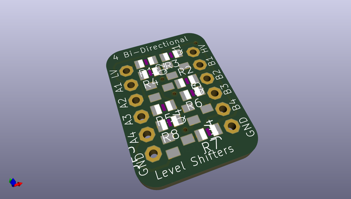
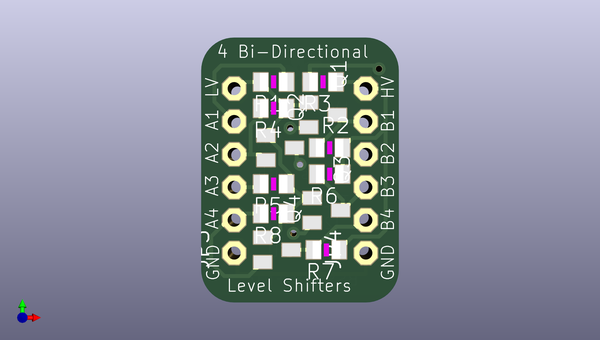
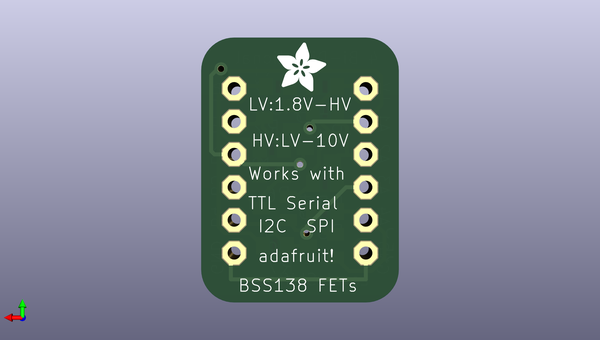

# 4_channel_level_shifter_pcb
 
## summary 
* id: adafruit_4_channel_level_shifter_pcb_adafruit_fet_4_channel_shifter
* user: adafruit
* name: 4_channel_level_shifter_pcb
* board: adafruit_fet_4_channel_shifter
* repo: https://github.com/adafruit/4-Channel-Level-Shifter-PCB

* src_file_repo_sch: 
* src_file_repo_sch_link: https://github.com/adafruit/4-Channel-Level-Shifter-PCB/tree/master/

## schematic  
  
[schematic (pdf)](working_schematic.pdf)  

## pcb  
 
  
  
  
[board (pdf)](working.pdf)  

## working_bom
| Id | Designator | Footprint | Quantity | Designation | Supplier and ref |  | None | 
| --- | --- | --- | --- | --- | --- | --- | --- | 
| 1 | R4,R8,R5,R2,R3,R1,R6,R7 | R0805 | 8 | 10K |  |  | [''] | 
| 2 | Q3,Q1,Q2,Q4 | SOT23 | 4 | BSS138 |  |  | [''] | 
| 3 | JP3,JP4 | 1X06-CLEANBIG | 2 |  |  |  | [''] | 
| 4 | U$1 | ADAFRUIT_3.5MM | 1 |  |  |  | [''] | 

## bom_schematic
no data

