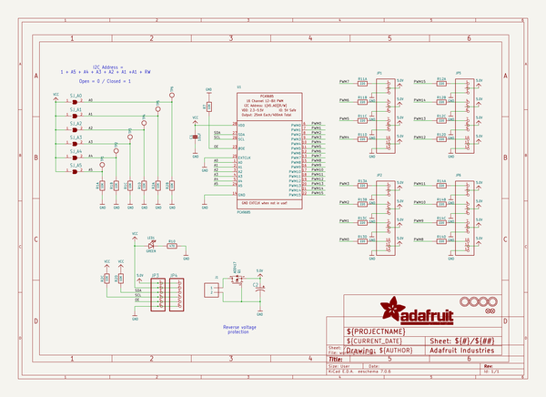
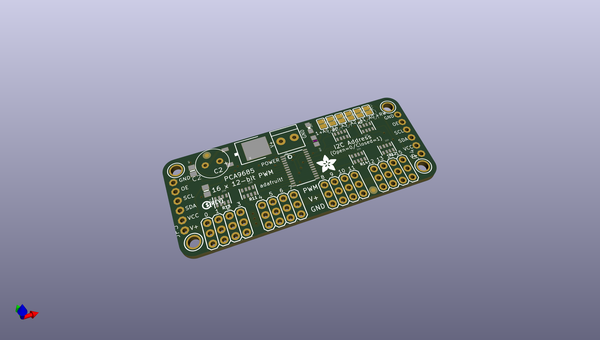
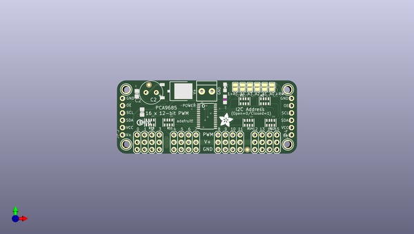
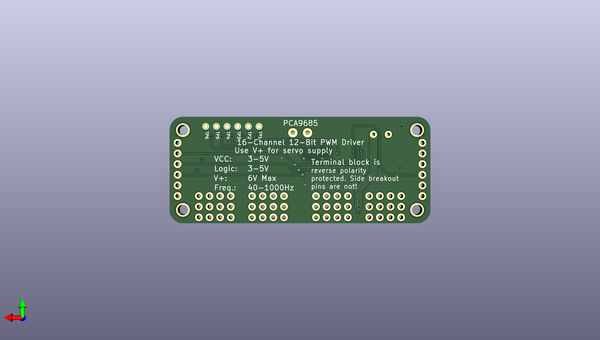

# adafruit_16_channel_pwm_servo_driver_pcb
 
## summary 
* id: adafruit_adafruit_16_channel_pwm_servo_driver_pcb_adafruit_pca9685
* user: adafruit
* name: adafruit_16_channel_pwm_servo_driver_pcb
* board: adafruit_pca9685
* repo: https://github.com/adafruit/Adafruit-16-Channel-PWM-Servo-Driver-PCB

* src_file_repo_sch: 
* src_file_repo_sch_link: https://github.com/adafruit/Adafruit-16-Channel-PWM-Servo-Driver-PCB/tree/master/

## schematic  
  
[schematic (pdf)](working_schematic.pdf)  

## pcb  
 
  
  
  
[board (pdf)](working.pdf)  

## working_bom
| Id | Designator | Footprint | Quantity | Designation | Supplier and ref |  | None | 
| --- | --- | --- | --- | --- | --- | --- | --- | 
| 1 | SJ_A3,SJ_A0,SJ_A5,SJ_A2,SJ_A4,SJ_A1 | SOLDERJUMPER_REFLOW_NOPASTE | 6 |  |  |  | [''] | 
| 2 | R7 | 0805-NO | 1 | 10K |  |  | [''] | 
| 3 | Q1 | TO252 | 1 | AOD417 |  |  | [''] | 
| 4 | J1 | TERMBLOCK_1X2-3.5MM | 1 |  |  |  | [''] | 
| 5 | U1 | TSSOP28 | 1 | PCA9685 |  |  | [''] | 
| 6 | U$50,U$49,U$47,U$48 | MOUNTINGHOLE_2.5_PLATED | 4 | MOUNTINGHOLE2.5 |  |  | [''] | 
| 7 | R14,R12,R13,R11 | RESPACK_4X0603 | 4 | 220 |  |  | [''] | 
| 8 | JP2,JP1,JP5,JP6 | 3X04 | 4 |  |  |  | [''] | 
| 9 | U$51 | ADAFRUIT_5MM | 1 |  |  |  | [''] | 
| 10 | U$54 | PCBFEAT-REV-040 | 1 |  |  |  | [''] | 
| 11 | JP4,JP3 | 1X06-CLEANBIG | 2 |  |  |  | [''] | 
| 12 | C1 | 0805-NO | 1 | 10uF |  |  | [''] | 
| 13 | FID1,FID2 | FIDUCIAL_1MM | 2 | FIDUCIAL" |  |  | [''] | 
| 14 | LED1 | CHIPLED_0805_NOOUTLINE | 1 | GREEN |  |  | [''] | 
| 15 | R2,R1 | RESPACK_4X0603 | 2 | 10K |  |  | [''] | 
| 16 | C2 | E3,5-8 | 1 |  |  |  | [''] | 
| 17 | R10 | _0805MP | 1 | 470 |  |  | [''] | 
| 18 | TP5,TP3,TP2,TP1,TP6,TP4 | TESTPOINT_ROUND_1MM | 6 |  |  |  | [''] | 

## bom_schematic
| Ref | Qnty | Value | Cmp name | Footprint | Description | Vendor | DNP | 
| --- | --- | --- | --- | --- | --- | --- | --- | 
| C1 | 1 | 10uF | CAP_CERAMIC0805-NOOUTLINE | working:0805-NO |  |  |  | 
| C2 | 1 | CPOL-USE3.5-8 | CPOL-USE3.5-8 | working:E3,5-8 |  |  |  | 
| FID1, FID2 | 2 | FIDUCIAL"" | FIDUCIAL{dblquote}{dblquote} | working:FIDUCIAL_1MM |  |  |  | 
| J1 | 1 | TERMBLOCK_1X2 | TERMBLOCK_1X2 | working:TERMBLOCK_1X2-3.5MM |  |  |  | 
| JP1, JP2, JP5, JP6 | 4 | HEADER-3X04 | HEADER-3X04 | working:3X04 |  |  |  | 
| JP3, JP4 | 2 | PINHD-1X6CB | PINHD-1X6CB | working:1X06-CLEANBIG |  |  |  | 
| LED1 | 1 | GREEN | LED0805_NOOUTLINE | working:CHIPLED_0805_NOOUTLINE |  |  |  | 
| Q1 | 1 | AOD417 | MOSFET-PTO252 | working:TO252 |  |  |  | 
| R1, R2 | 2 | 10K | RESISTOR_4PACK | working:RESPACK_4X0603 |  |  |  | 
| R7 | 1 | 10K | RESISTOR0805_NOOUTLINE | working:0805-NO |  |  |  | 
| R10 | 1 | 470 | RESISTOR_0805MP | working:_0805MP |  |  |  | 
| R11, R12, R13, R14 | 4 | 220 | RESISTOR_4PACK | working:RESPACK_4X0603 |  |  |  | 
| SJ_A0, SJ_A1, SJ_A2, SJ_A3, SJ_A4, SJ_A5 | 6 | SOLDERJUMPERREFLOW_NOPASTE | SOLDERJUMPERREFLOW_NOPASTE | working:SOLDERJUMPER_REFLOW_NOPASTE |  |  |  | 
| TP1, TP2, TP3, TP4, TP5, TP6 | 6 | TESTPOINTROUND1MM | TESTPOINTROUND1MM | working:TESTPOINT_ROUND_1MM |  |  |  | 
| U1 | 1 | PCA9685 | PCA9685 | working:TSSOP28 |  |  |  | 
| U$47, U$48, U$49, U$50 | 4 | MOUNTINGHOLE2.5 | MOUNTINGHOLE2.5 | working:MOUNTINGHOLE_2.5_PLATED |  |  |  | 

## mounting_holes
| x | y | package | value | ref | size | 
| --- | --- | --- | --- | --- | --- | 
| 0.0 | 19.049999999999997 | MOUNTINGHOLE_2.5_PLATED | MOUNTINGHOLE2.5 | U$47 | m3 | 
| 0.0 | 0.0 | MOUNTINGHOLE_2.5_PLATED | MOUNTINGHOLE2.5 | U$48 | m3 | 
| 55.88000000000001 | 19.049999999999997 | MOUNTINGHOLE_2.5_PLATED | MOUNTINGHOLE2.5 | U$49 | m3 | 
| 55.88000000000001 | 0.0 | MOUNTINGHOLE_2.5_PLATED | MOUNTINGHOLE2.5 | U$50 | m3 | 

