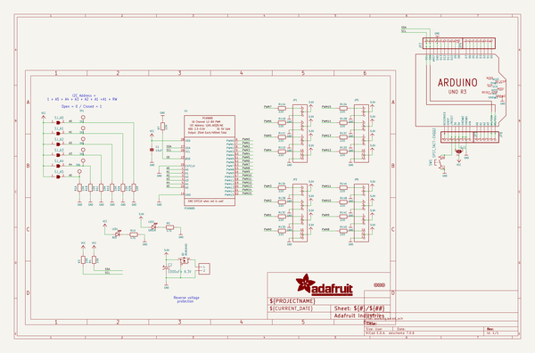
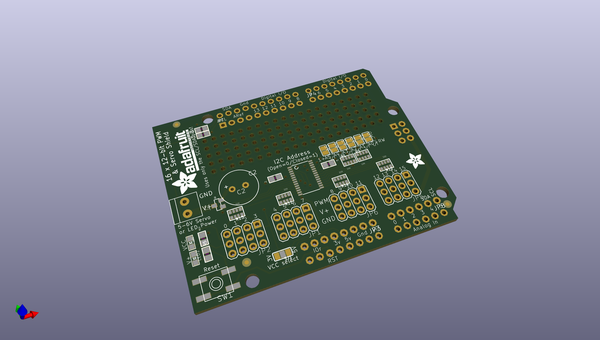
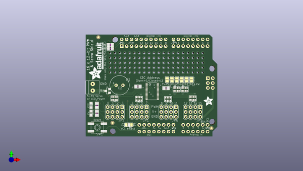
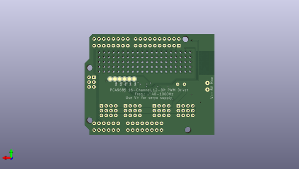

# adafruit_16_channel_pwm_servo_shield
 
## summary 
* id: adafruit_adafruit_16_channel_pwm_servo_shield_adafruit_pwm_servo_shield
* user: adafruit
* name: adafruit_16_channel_pwm_servo_shield
* board: adafruit_pwm_servo_shield
* repo: https://github.com/adafruit/Adafruit-16-channel-PWM-Servo-Shield

* src_file_repo_sch: 
* src_file_repo_sch_link: https://github.com/adafruit/Adafruit-16-channel-PWM-Servo-Shield/tree/master/

## schematic  
  
[schematic (pdf)](working_schematic.pdf)  

## pcb  
 
  
  
  
[board (pdf)](working.pdf)  

## working_bom
| Id | Designator | Footprint | Quantity | Designation | Supplier and ref |  | None | 
| --- | --- | --- | --- | --- | --- | --- | --- | 
| 1 | J1 | 1X2-3.5MM | 1 | TERMBLOCK_1X2-3.5MM |  |  | [''] | 
| 2 | SJ_A4,SJ_A3,SJ_A5,SJ_A0,SJ_A1,SJ_A2 | SOLDERJUMPER_REFLOW_NOPASTE | 6 |  |  |  | [''] | 
| 3 | LED1 | CHIPLED_0805 | 1 | RED |  |  | [''] | 
| 4 | JP8 | 1X06-CLEANBIG | 1 |  |  |  | [''] | 
| 5 | U1 | TSSOP28 | 1 | PCA9685 |  |  | [''] | 
| 6 | R7,R3,R4 | 0805 | 3 | 10K |  |  | [''] | 
| 7 | R12,R14,R13,R11 | RESPACK_4X0603 | 4 | 220 |  |  | [''] | 
| 8 | JP3,JP4 | 1X08-CLEANBIG | 2 |  |  |  | [''] | 
| 9 | C1 | 0805 | 1 | 10uF |  |  | [''] | 
| 10 | JP5,JP6,JP2,JP1 | 3X04 | 4 |  |  |  | [''] | 
| 11 | SJ1 | SOLDERJUMPER_2WAY_OPEN_NOPASTE | 1 |  |  |  | [''] | 
| 12 | FID1,FID2,FID3 | FIDUCIAL_1MM | 3 | FIDUCIAL" |  |  | [''] | 
| 13 | @HOLE3,@HOLE0,@HOLE1,@HOLE2 |  | 4 |  |  |  | [''] | 
| 14 | Q1 | SOT23-WIDE | 1 | IRLML6401 |  |  | [''] | 
| 15 | R5,R10 | 0805 | 2 | 470 |  |  | [''] | 
| 16 | JP7 | 1X10_ROUND70 | 1 |  |  |  | [''] | 
| 17 | U$54 | ADAFRUIT_TEXT_20MM | 1 |  |  |  | [''] | 
| 18 | R2,R1 | RESPACK_4X0603 | 2 | 10K |  |  | [''] | 
| 19 | SW1 | EVQ-Q2 | 1 | SPST_TACT-EVQQ2 |  |  | [''] | 
| 20 | U$51 | ADAFRUIT_5MM | 1 |  |  |  | [''] | 
| 21 | C2 | E3,5-10 | 1 | 1000uF+ 6.3V |  |  | [''] | 
| 22 | U$44 | ARDUINOR3_ICSP | 1 | ARDUINO_R3_ICSP |  |  | [''] | 
| 23 | LED2 | CHIPLED_0805 | 1 | GREEN |  |  | [''] | 
| 24 | TP5,TP3,TP4,TP2,TP6,TP1 | TESTPOINT_ROUND_2MM | 6 |  |  |  | [''] | 

## bom_schematic
| Ref | Qnty | Value | Cmp name | Footprint | Description | Vendor | DNP | 
| --- | --- | --- | --- | --- | --- | --- | --- | 
| C1 | 1 | 10uF | CAP_CERAMIC0805 | working:0805 |  |  |  | 
| C2 | 1 | 1000uF+ 6.3V | CPOL-USE3.5-10 | working:E3,5-10 |  |  |  | 
| FID1, FID2, FID3 | 3 | FIDUCIAL"" | FIDUCIAL{dblquote}{dblquote} | working:FIDUCIAL_1MM |  |  |  | 
| J1 | 1 | TERMBLOCK_1X2-3.5MM | TERMBLOCK_1X2-3.5MM | working:1X2-3.5MM |  |  |  | 
| JP1, JP2, JP5, JP6 | 4 | HEADER-3X04 | HEADER-3X04 | working:3X04 |  |  |  | 
| JP3, JP4 | 2 | PINHD-1X8CLEANBIG | PINHD-1X8CLEANBIG | working:1X08-CLEANBIG |  |  |  | 
| JP7 | 1 | HEADER-1X1070MIL | HEADER-1X1070MIL | working:1X10_ROUND70 |  |  |  | 
| JP8 | 1 | PINHD-1X6CB | PINHD-1X6CB | working:1X06-CLEANBIG |  |  |  | 
| LED1 | 1 | RED | LED0805 | working:CHIPLED_0805 |  |  |  | 
| LED2 | 1 | GREEN | LED0805 | working:CHIPLED_0805 |  |  |  | 
| Q1 | 1 | IRLML6401 | MOSFET-PWIDE | working:SOT23-WIDE |  |  |  | 
| R1, R2 | 2 | 10K | RESISTOR_4PACK | working:RESPACK_4X0603 |  |  |  | 
| R3, R4, R7 | 3 | 10K | RESISTOR0805 | working:0805 |  |  |  | 
| R5, R10 | 2 | 470 | RESISTOR0805 | working:0805 |  |  |  | 
| R11, R12, R13, R14 | 4 | 220 | RESISTOR_4PACK | working:RESPACK_4X0603 |  |  |  | 
| SJ1 | 1 | SOLDERJUMPER_2WAY | SOLDERJUMPER_2WAY | working:SOLDERJUMPER_2WAY_OPEN_NOPASTE |  |  |  | 
| SJ_A0, SJ_A1, SJ_A2, SJ_A3, SJ_A4, SJ_A5 | 6 | SOLDERJUMPERREFLOW_NOPASTE | SOLDERJUMPERREFLOW_NOPASTE | working:SOLDERJUMPER_REFLOW_NOPASTE |  |  |  | 
| SW1 | 1 | SPST_TACT-EVQQ2 | SPST_TACT-EVQQ2 | working:EVQ-Q2 |  |  |  | 
| TP1, TP2, TP3, TP4, TP5, TP6 | 6 | TESTPOINTROUND2MM | TESTPOINTROUND2MM | working:TESTPOINT_ROUND_2MM |  |  |  | 
| U1 | 1 | PCA9685 | PCA9685 | working:TSSOP28 |  |  |  | 
| U$44 | 1 | ARDUINO_R3_ICSP | ARDUINO_R3_ICSP | working:ARDUINOR3_ICSP |  |  |  | 

