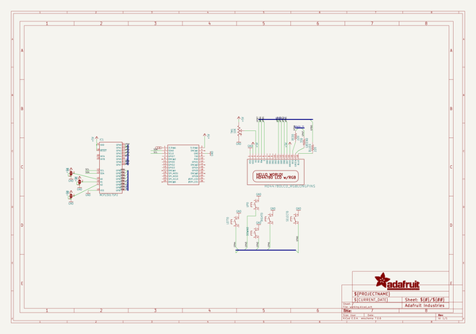
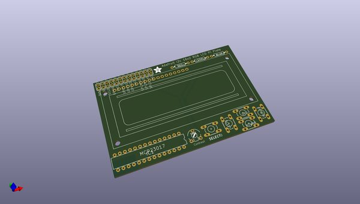
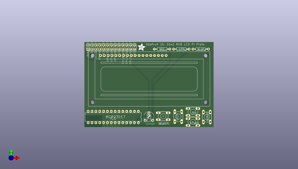
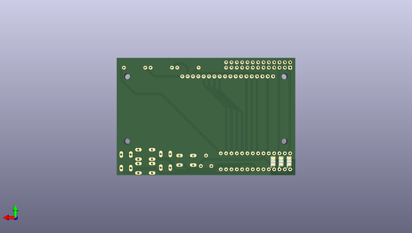

# adafruit_16x2_lcd_pi_plate
 
## summary 
* id: adafruit_adafruit_16x2_lcd_pi_plate_adafruit_rgblcdplate
* user: adafruit
* name: adafruit_16x2_lcd_pi_plate
* board: adafruit_rgblcdplate
* repo: https://github.com/adafruit/Adafruit-16x2-LCD-Pi-Plate

* src_file_repo_sch: 
* src_file_repo_sch_link: https://github.com/adafruit/Adafruit-16x2-LCD-Pi-Plate/tree/master/

## schematic  
  
[schematic (pdf)](working_schematic.pdf)  

## pcb  
 
  
  
  
[board (pdf)](working.pdf)  

## working_bom
| Id | Designator | Footprint | Quantity | Designation | Supplier and ref |  | None | 
| --- | --- | --- | --- | --- | --- | --- | --- | 
| 1 | U$1 | LCD1602-RGB | 1 | HD44780LCD_RGBLONGPINS |  |  | [''] | 
| 2 | SELECT0,LEFT0,UP0,DOWN0,RIGHT0 | B3F-10XX | 5 |  |  |  | [''] | 
| 3 | BLUE0,RED0 | 0207_10 | 2 | 220 |  |  | [''] | 
| 4 | TM1 | 6MM | 1 | 10K |  |  | [''] | 
| 5 | U$4 | RASBERRYPI_SHIELD | 1 | RASPBERRYPI_BB |  |  | [''] | 
| 6 | GREEN0 | 0207_10 | 1 | 330 |  |  | [''] | 
| 7 | IC1 | DIL28-3-ROUND | 1 | MCP23017SP2 |  |  | [''] | 
| 8 | U$2 | ADAFRUIT_5MM | 1 |  |  |  | [''] | 
| 9 | A1,A0,A2 | SOLDERJUMPER_2WAY_OPEN_NOPASTE | 3 |  |  |  | [''] | 

## bom_schematic
| Ref | Qnty | Value | Cmp name | Footprint | Description | Vendor | DNP | 
| --- | --- | --- | --- | --- | --- | --- | --- | 
| A0, A1, A2 | 3 | SOLDERJUMPER_2WAY | SOLDERJUMPER_2WAY | working:SOLDERJUMPER_2WAY_OPEN_NOPASTE |  |  |  | 
| BLUE0 | 1 | 220 | R-US_0207/10 | working:0207_10 |  |  |  | 
| DOWN0 | 1 | 10-XX | 10-XX | working:B3F-10XX |  |  |  | 
| GREEN0 | 1 | 330 | R-US_0207/10 | working:0207_10 |  |  |  | 
| IC1 | 1 | MCP23017SP2 | MCP23017SP2 | working:DIL28-3-ROUND |  |  |  | 
| LEFT0 | 1 | 10-XX | 10-XX | working:B3F-10XX |  |  |  | 
| RED0 | 1 | 220 | R-US_0207/10 | working:0207_10 |  |  |  | 
| RIGHT0 | 1 | 10-XX | 10-XX | working:B3F-10XX |  |  |  | 
| SELECT0 | 1 | 10-XX | 10-XX | working:B3F-10XX |  |  |  | 
| TM1 | 1 | 10K | TRIM | working:6MM |  |  |  | 
| U$1 | 1 | HD44780LCD_RGBLONGPINS | HD44780LCD_RGBLONGPINS | working:LCD1602-RGB |  |  |  | 
| U$4 | 1 | RASPBERRYPI_BB | RASPBERRYPI_BB | working:RASBERRYPI_SHIELD |  |  |  | 
| UP0 | 1 | 10-XX | 10-XX | working:B3F-10XX |  |  |  | 

