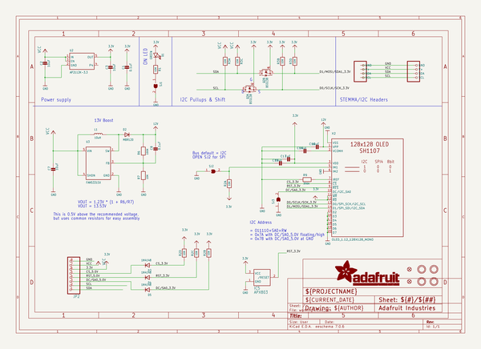
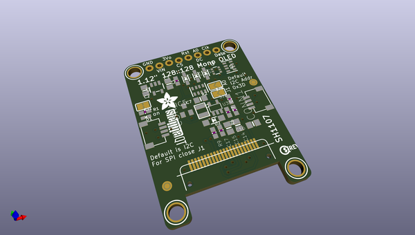
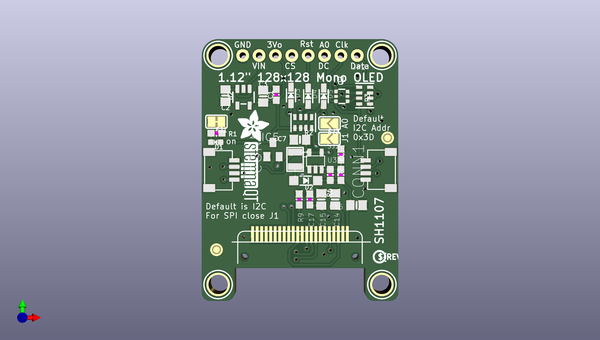
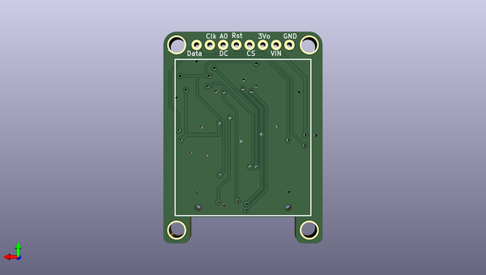

# adafruit_1_12in_128x128_oled_pcb
 
## summary 
* id: adafruit_adafruit_1_12in_128x128_oled_pcb_adafruit_monochrome_1_12in_128x128_oled
* user: adafruit
* name: adafruit_1_12in_128x128_oled_pcb
* board: adafruit_monochrome_1_12in_128x128_oled
* repo: https://github.com/adafruit/Adafruit-1.12in-128x128-OLED-PCB

* src_file_repo_sch: 
* src_file_repo_sch_link: https://github.com/adafruit/Adafruit-1.12in-128x128-OLED-PCB/tree/main/

## schematic  
  
[schematic (pdf)](working_schematic.pdf)  

## pcb  
 
  
  
  
[board (pdf)](working.pdf)  

## working_bom
| Id | Designator | Footprint | Quantity | Designation | Supplier and ref |  | None | 
| --- | --- | --- | --- | --- | --- | --- | --- | 
| 1 | R2,R3 | RESPACK_4X0603 | 2 | 10K |  |  | [''] | 
| 2 | D5,D4,D3 | SOD-323 | 3 | 1N4148 |  |  | [''] | 
| 3 | C14,C3,C15,C16,C2,C7 | 0805-NO | 6 | 10uF |  |  | [''] | 
| 4 | U$25 | PCBFEAT-REV-040 | 1 |  |  |  | [''] | 
| 5 | Q2 | SOT363 | 1 | BSS138 |  |  | [''] | 
| 6 | U$31 | STEMMAQT | 1 |  |  |  | [''] | 
| 7 | D1 | CHIPLED_0603_NOOUTLINE | 1 | GREEN |  |  | [''] | 
| 8 | U$21,U$19,U$1,U$17 | MOUNTINGHOLE_3.0_PLATEDTHIN | 4 | MOUNTINGHOLE3.0THIN |  |  | [''] | 
| 9 | D2 | SOD-123 | 1 | MBR120 |  |  | [''] | 
| 10 | FID4,FID3 | FIDUCIAL_1MM | 2 | FIDUCIAL_1MM |  |  | [''] | 
| 11 | R6 | 0603-NO | 1 | 100K |  |  | [''] | 
| 12 | C17 | 0603-NO | 1 | 1uF |  |  | [''] | 
| 13 | R1,R7 | 0603-NO | 2 | 10K |  |  | [''] | 
| 14 | CONN4,CONN1 | JST_SH4 | 2 | STEMMA_I2C_QT |  |  | [''] | 
| 15 | SJ3,SJ2 | SOLDERJUMPER_ARROW_NOPASTE | 2 |  |  |  | [''] | 
| 16 | JP2 | 1X08_ROUND_76 | 1 |  |  |  | [''] | 
| 17 | R9 | 0603-NO | 1 | 390K |  |  | [''] | 
| 18 | U3 | SOT23-5@1 | 1 | FAN5331SX |  |  | [''] | 
| 19 | L1 | INDUCTOR_1007 | 1 | 10uH |  |  | [''] | 
| 20 | C8,C1 | 0603-NO | 2 | 0.1uF |  |  | [''] | 
| 21 | U$8 | ADAFRUIT_5MM | 1 |  |  |  | [''] | 
| 22 | U2 | SOT23-5 | 1 | AP2112K-3.3 |  |  | [''] | 
| 23 | SJ1 | SOLDERJUMPER_CLOSEDWIRE | 1 |  |  |  | [''] | 
| 24 | IC5 | SOT23 | 1 | APX803 |  |  | [''] | 
| 25 | X2 | OLED_1.12IN_128X128MONO | 1 | OLED_1.12_128X128_MONO |  |  | [''] | 

## bom_schematic
| Ref | Qnty | Value | Cmp name | Footprint | Description | Vendor | DNP | 
| --- | --- | --- | --- | --- | --- | --- | --- | 
| C1, C8 | 2 | 0.1uF | CAP_CERAMIC0603_NO | working:0603-NO |  |  |  | 
| C2, C3, C7, C14, C15, C16 | 6 | 10uF | CAP_CERAMIC0805-NOOUTLINE | working:0805-NO |  |  |  | 
| C17 | 1 | 1uF | CAP_CERAMIC0603_NO | working:0603-NO |  |  |  | 
| CONN1, CONN4 | 2 | STEMMA_I2C_QT | STEMMA_I2C_QT | working:JST_SH4 |  |  |  | 
| D1 | 1 | GREEN | LED0603_NOOUTLINE | working:CHIPLED_0603_NOOUTLINE |  |  |  | 
| D2 | 1 | MBR120 | DIODESOD-123 | working:SOD-123 |  |  |  | 
| D3, D4, D5 | 3 | 1N4148 | DIODESOD-323 | working:SOD-323 |  |  |  | 
| FID3, FID4 | 2 | FIDUCIAL_1MM | FIDUCIAL_1MM | working:FIDUCIAL_1MM |  |  |  | 
| IC5 | 1 | APX803 | AXP083-SAG | working:SOT23 |  |  |  | 
| JP2 | 1 | HEADER-1X876MIL | HEADER-1X876MIL | working:1X08_ROUND_76 |  |  |  | 
| L1 | 1 | 10uH | INDUCTOR | working:INDUCTOR_1007 |  |  |  | 
| Q2 | 1 | BSS138 | MOSFET-N_DUAL | working:SOT363 |  |  |  | 
| R1, R7 | 2 | 10K | RESISTOR_0603_NOOUT | working:0603-NO |  |  |  | 
| R2, R3 | 2 | 10K | RESISTOR_4PACK | working:RESPACK_4X0603 |  |  |  | 
| R6 | 1 | 100K | RESISTOR_0603_NOOUT | working:0603-NO |  |  |  | 
| R9 | 1 | 390K | RESISTOR_0603_NOOUT | working:0603-NO |  |  |  | 
| SJ1 | 1 | SOLDERJUMPERCLOSED | SOLDERJUMPERCLOSED | working:SOLDERJUMPER_CLOSEDWIRE |  |  |  | 
| SJ2, SJ3 | 2 | SOLDERJUMPER | SOLDERJUMPER | working:SOLDERJUMPER_ARROW_NOPASTE |  |  |  | 
| U2 | 1 | AP2112K-3.3 | VREG_SOT23-5 | working:SOT23-5 |  |  |  | 
| U3 | 1 | FAN5331SX | FAN5331 | working:SOT23-5@1 |  |  |  | 
| U$1, U$17, U$19, U$21 | 4 | MOUNTINGHOLE3.0THIN | MOUNTINGHOLE3.0THIN | working:MOUNTINGHOLE_3.0_PLATEDTHIN |  |  |  | 
| X2 | 1 | OLED_1.12_128X128_MONO | OLED_1.12_128X128_MONO | working:OLED_1.12IN_128X128MONO |  |  |  | 

## mounting_holes
| x | y | package | value | ref | size | 
| --- | --- | --- | --- | --- | --- | 
| 0.0 | 35.56 | MOUNTINGHOLE_3.0_PLATEDTHIN | MOUNTINGHOLE3.0THIN | U$1 | m3 | 
| 25.400000000000006 | 35.56 | MOUNTINGHOLE_3.0_PLATEDTHIN | MOUNTINGHOLE3.0THIN | U$17 | m3 | 
| 0.0 | 0.0 | MOUNTINGHOLE_3.0_PLATEDTHIN | MOUNTINGHOLE3.0THIN | U$19 | m3 | 
| 25.400000000000006 | 0.0 | MOUNTINGHOLE_3.0_PLATEDTHIN | MOUNTINGHOLE3.0THIN | U$21 | m3 | 

