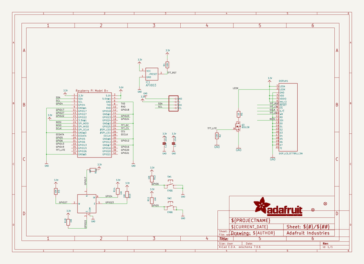
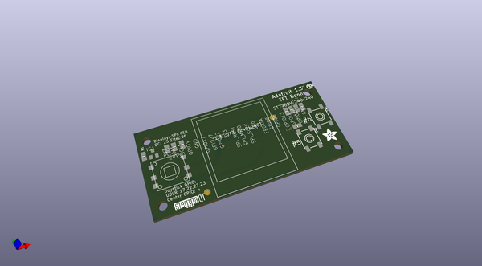
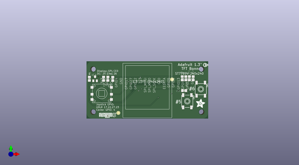
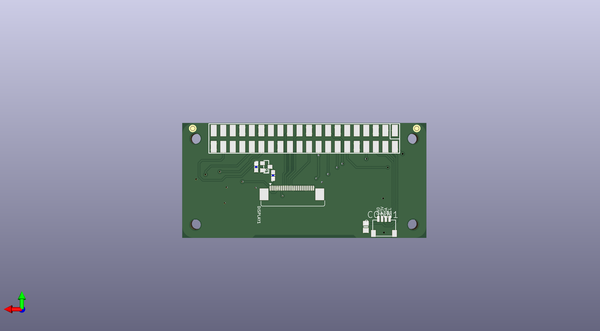

# adafruit_1_3in_color_tft_bonnet_pcb
 
## summary 
* id: adafruit_adafruit_1_3in_color_tft_bonnet_pcb_adafruit_1_3in_color_tft_bonnet
* user: adafruit
* name: adafruit_1_3in_color_tft_bonnet_pcb
* board: adafruit_1_3in_color_tft_bonnet
* repo: https://github.com/adafruit/Adafruit-1.3in-Color-TFT-Bonnet-PCB

* src_file_repo_sch: 
* src_file_repo_sch_link: https://github.com/adafruit/Adafruit-1.3in-Color-TFT-Bonnet-PCB/tree/master/

## schematic  
  
[schematic (pdf)](working_schematic.pdf)  

## pcb  
 
  
  
  
[board (pdf)](working.pdf)  

## working_bom
| Id | Designator | Footprint | Quantity | Designation | Supplier and ref |  | None | 
| --- | --- | --- | --- | --- | --- | --- | --- | 
| 1 | IC1 | SOT23 | 1 | APX803 |  |  | [''] | 
| 2 | U$29 | STEMMAQT | 1 |  |  |  | [''] | 
| 3 | FID1,FID2 | FIDUCIAL_1MM | 2 | FIDUCIAL_1MM |  |  | [''] | 
| 4 | R1,R3,R13,R14,R16,R11,R12,R18 | 0805-NO | 8 | 10K |  |  | [''] | 
| 5 | RPI1 | PI_BONNET_SMT | 1 | RASPBERRYPI_BPLUS_BONNETSMT |  |  | [''] | 
| 6 | SW2 | 6MM_SMT | 1 | EVQQ |  |  | [''] | 
| 7 | C10,C1 | 0805-NO | 2 | 10uF |  |  | [''] | 
| 8 | SW3 | SKQUBAE010 | 1 | NAVSWITCHSKQUABAUE010 |  |  | [''] | 
| 9 | U$28 | ADAFRUIT_5MM | 1 |  |  |  | [''] | 
| 10 | U$2 | PCBFEAT-REV-040 | 1 |  |  |  | [''] | 
| 11 | SW1 | 6MMX6MM_TACTILE_SMT | 1 | EVQQ |  |  | [''] | 
| 12 | R2 | 0603-NO | 1 | 10K |  |  | [''] | 
| 13 | DISPLAY1 | TFT_1.3IN_240X240_24P | 1 | DISP_LCD_ST7789_1.3IN |  |  | [''] | 
| 14 | R5 | 0603-NO | 1 | 10 |  |  | [''] | 
| 15 | CONN1 | JST_SH4 | 1 | STEMMA_I2C_QT |  |  | [''] | 
| 16 | Q3 | SOT23-WIDE | 1 | BSS138 |  |  | [''] | 

## bom_schematic
| Ref | Qnty | Value | Cmp name | Footprint | Description | Vendor | DNP | 
| --- | --- | --- | --- | --- | --- | --- | --- | 
| C1, C10 | 2 | 10uF | CAP_CERAMIC0805-NOOUTLINE | working:0805-NO |  |  |  | 
| CONN1 | 1 | STEMMA_I2C_QT | STEMMA_I2C_QT | working:JST_SH4 |  |  |  | 
| DISPLAY1 | 1 | DISP_LCD_ST7789_1.3IN | DISP_LCD_ST7789_1.3IN | working:TFT_1.3IN_240X240_24P |  |  |  | 
| FID1, FID2 | 2 | FIDUCIAL_1MM | FIDUCIAL_1MM | working:FIDUCIAL_1MM |  |  |  | 
| IC1 | 1 | APX803 | AXP083-SAG | working:SOT23 |  |  |  | 
| Q3 | 1 | BSS138 | MOSFET-NWIDE | working:SOT23-WIDE |  |  |  | 
| R1, R3, R11, R12, R13, R14, R16, R18 | 8 | 10K | RESISTOR0805_NOOUTLINE | working:0805-NO |  |  |  | 
| R2 | 1 | 10K | RESISTOR_0603_NOOUT | working:0603-NO |  |  |  | 
| R5 | 1 | 10 | RESISTOR_0603_NOOUT | working:0603-NO |  |  |  | 
| RPI1 | 1 | RASPBERRYPI_BPLUS_BONNETSMT | RASPBERRYPI_BPLUS_BONNETSMT | working:PI_BONNET_SMT |  |  |  | 
| SW1 | 1 | EVQQ | SWITCH_TACT_SMT_6MM | working:6MMX6MM_TACTILE_SMT |  |  |  | 
| SW2 | 1 | EVQQ | SWITCH_TACT_SMT_6MMSMALL | working:6MM_SMT |  |  |  | 
| SW3 | 1 | NAVSWITCHSKQUABAUE010 | NAVSWITCHSKQUABAUE010 | working:SKQUBAE010 |  |  |  | 

