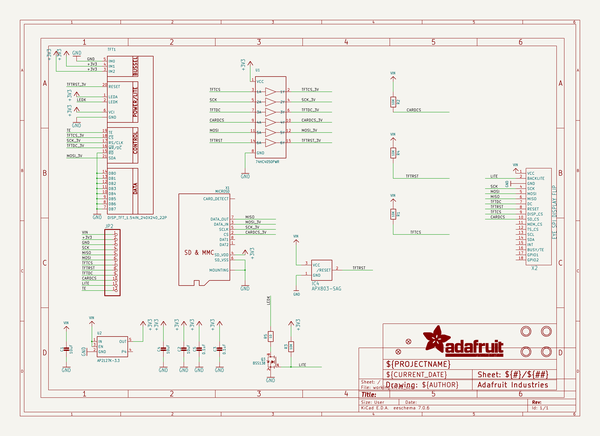
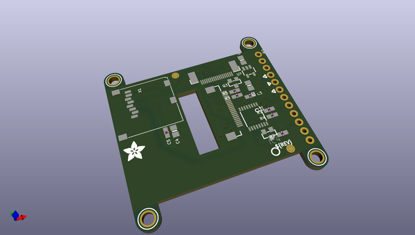

# adafruit_1_54_inch_240x240_tft_pcb
 
## summary 
* id: adafruit_adafruit_1_54_inch_240x240_tft_pcb_adafruit_1_54inch_240x240
* user: adafruit
* name: adafruit_1_54_inch_240x240_tft_pcb
* board: adafruit_1_54inch_240x240
* repo: https://github.com/adafruit/Adafruit-1.54-inch-240x240-TFT-PCB

* src_file_repo_sch: 
* src_file_repo_sch_link: https://github.com/adafruit/Adafruit-1.54-inch-240x240-TFT-PCB/tree/master/

## schematic  
  
[schematic (pdf)](working_schematic.pdf)  

## pcb  
 
  
  
  
[board (pdf)](working.pdf)  

## working_bom
| Id | Designator | Footprint | Quantity | Designation | Supplier and ref |  | None | 
| --- | --- | --- | --- | --- | --- | --- | --- | 
| 1 | R5 | 0603-NO | 1 | 10 |  |  | [''] | 
| 2 | C3,C5 | 0603-NO | 2 | 0.1uF |  |  | [''] | 
| 3 | R1,R3,R4,R2 | 0603-NO | 4 | 10K |  |  | [''] | 
| 4 | PLABEL1 | PLABEL1 | 1 |  |  |  | [''] | 
| 5 | PLABEL14 | PLABEL14 | 1 |  |  |  | [''] | 
| 6 | C4,C2,C1 | 0805-NO | 3 | 10uF |  |  | [''] | 
| 7 | Q3 | SOT23-WIDE | 1 | BSS138 |  |  | [''] | 
| 8 | PLABEL12 | PLABEL12 | 1 |  |  |  | [''] | 
| 9 | X1 | MICROSD | 1 | MICROSD |  |  | [''] | 
| 10 | PLABEL13 | PLABEL13 | 1 |  |  |  | [''] | 
| 11 | X2 | EYE_SPI_DISPLAY_BOTCONTACT | 1 | EYE_SPI_DISPLAY_FLIP |  |  | [''] | 
| 12 | PLABEL4 | PLABEL4 | 1 |  |  |  | [''] | 
| 13 | U$4,U$5 | FIDUCIAL_1MM | 2 | FIDUCIAL_1MM |  |  | [''] | 
| 14 | JP2 | 1X12_ROUND_76MIL | 1 |  |  |  | [''] | 
| 15 | PLABEL7 | PLABEL7 | 1 |  |  |  | [''] | 
| 16 | PLABEL8 | PLABEL8 | 1 |  |  |  | [''] | 
| 17 | PLABEL16 | PLABEL16 | 1 |  |  |  | [''] | 
| 18 | U$7,U$9,U$10,U$8 | MOUNTINGHOLE_2.5_PLATED | 4 | MOUNTINGHOLE2.5 |  |  | [''] | 
| 19 | U1 | TSSOP16 | 1 | 74HC4050PWR |  |  | [''] | 
| 20 | PLABEL0 | PLABEL0 | 1 |  |  |  | [''] | 
| 21 | IC4 | SOT23-WIDE | 1 | APX803-SAG |  |  | [''] | 
| 22 | PLABEL15 | PLABEL15 | 1 |  |  |  | [''] | 
| 23 | PLABEL9 | PLABEL9 | 1 |  |  |  | [''] | 
| 24 | U2 | SOT23-5 | 1 | AP2127K-3.3 |  |  | [''] | 
| 25 | PLABEL3 | PLABEL3 | 1 |  |  |  | [''] | 
| 26 | PLABEL2 | PLABEL2 | 1 |  |  |  | [''] | 
| 27 | PLABEL5 | PLABEL5 | 1 |  |  |  | [''] | 
| 28 | U$1 | ADAFRUIT_5MM | 1 |  |  |  | [''] | 
| 29 | PLABEL6 | PLABEL6 | 1 |  |  |  | [''] | 
| 30 | U$2 | PCBFEAT-REV-040 | 1 |  |  |  | [''] | 
| 31 | PLABEL10 | PLABEL10 | 1 |  |  |  | [''] | 
| 32 | PLABEL11 | PLABEL11 | 1 |  |  |  | [''] | 
| 33 | PLABEL23 | PLABEL23 | 1 |  |  |  | [''] | 
| 34 | PLABEL20 | PLABEL20 | 1 |  |  |  | [''] | 
| 35 | TFT1 | TFT_1.54IN_240X240_22PIN | 1 | DISP_TFT_1.54IN_240X240_22P |  |  | [''] | 
| 36 | PLABEL28 | PLABEL28 | 1 |  |  |  | [''] | 
| 37 | PLABEL19 | PLABEL19 | 1 |  |  |  | [''] | 
| 38 | PLABEL26 | PLABEL26 | 1 |  |  |  | [''] | 
| 39 | PLABEL29 | PLABEL29 | 1 |  |  |  | [''] | 
| 40 | PLABEL27 | PLABEL27 | 1 |  |  |  | [''] | 
| 41 | PLABEL21 | PLABEL21 | 1 |  |  |  | [''] | 
| 42 | PLABEL18 | PLABEL18 | 1 |  |  |  | [''] | 
| 43 | PLABEL17 | PLABEL17 | 1 |  |  |  | [''] | 
| 44 | PLABEL25 | PLABEL25 | 1 |  |  |  | [''] | 
| 45 | PLABEL22 | PLABEL22 | 1 |  |  |  | [''] | 
| 46 | PLABEL24 | PLABEL24 | 1 |  |  |  | [''] | 

## bom_schematic
| Ref | Qnty | Value | Cmp name | Footprint | Description | Vendor | DNP | 
| --- | --- | --- | --- | --- | --- | --- | --- | 
| C1, C2, C4 | 3 | 10uF | CAP_CERAMIC0805-NOOUTLINE | working:0805-NO |  |  |  | 
| C3, C5 | 2 | 0.1uF | CAP_CERAMIC0603_NO | working:0603-NO |  |  |  | 
| IC4 | 1 | APX803-SAG | APX083-SAG | working:SOT23-WIDE |  |  |  | 
| JP2 | 1 | HEADER-1X1276MIL | HEADER-1X1276MIL | working:1X12_ROUND_76MIL |  |  |  | 
| Q3 | 1 | BSS138 | MOSFET-NWIDE | working:SOT23-WIDE |  |  |  | 
| R1, R2, R3, R4 | 4 | 10K | RESISTOR_0603_NOOUT | working:0603-NO |  |  |  | 
| R5 | 1 | 10 | RESISTOR_0603_NOOUT | working:0603-NO |  |  |  | 
| TFT1 | 1 | DISP_TFT_1.54IN_240X240_22P | DISP_TFT_1.54IN_240X240_22P | working:TFT_1.54IN_240X240_22PIN |  |  |  | 
| U1 | 1 | 74HC4050PWR | 74HC4050DTSSOP | working:TSSOP16 |  |  |  | 
| U2 | 1 | AP2127K-3.3 | VREG_SOT23-5 | working:SOT23-5 |  |  |  | 
| U$4, U$5 | 2 | FIDUCIAL_1MM | FIDUCIAL_1MM | working:FIDUCIAL_1MM |  |  |  | 
| U$7, U$8, U$9, U$10 | 4 | MOUNTINGHOLE2.5 | MOUNTINGHOLE2.5 | working:MOUNTINGHOLE_2.5_PLATED |  |  |  | 
| X1 | 1 | MICROSD | MICROSD | working:MICROSD |  |  |  | 
| X2 | 1 | EYE_SPI_DISPLAY_FLIP | EYE_SPI_DISPLAY_FLIP | working:EYE_SPI_DISPLAY_BOTCONTACT |  |  |  | 

## mounting_holes
| x | y | package | value | ref | size | 
| --- | --- | --- | --- | --- | --- | 
| 0.0 | 36.83 | MOUNTINGHOLE_2.5_PLATED | MOUNTINGHOLE2.5 | U$7 | m3 | 
| 0.0 | 0.0 | MOUNTINGHOLE_2.5_PLATED | MOUNTINGHOLE2.5 | U$8 | m3 | 
| 38.734999999999985 | 36.83 | MOUNTINGHOLE_2.5_PLATED | MOUNTINGHOLE2.5 | U$9 | m3 | 
| 38.734999999999985 | 0.0 | MOUNTINGHOLE_2.5_PLATED | MOUNTINGHOLE2.5 | U$10 | m3 | 

