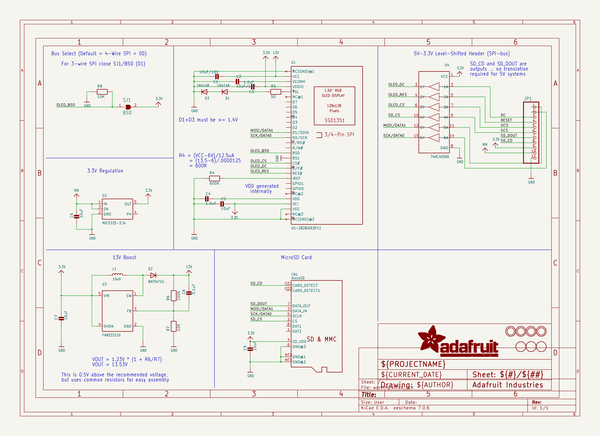
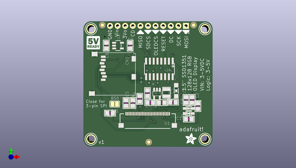
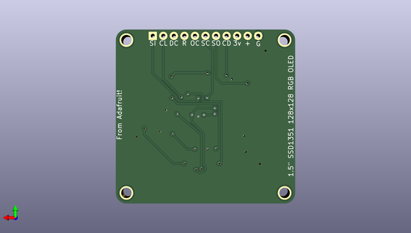

# adafruit_1_5inch_color_oled_pcb
 
## summary 
* id: adafruit_adafruit_1_5inch_color_oled_pcb_adafruit_1_5_128x128_rgb_oled
* user: adafruit
* name: adafruit_1_5inch_color_oled_pcb
* board: adafruit_1_5_128x128_rgb_oled
* repo: https://github.com/adafruit/Adafruit-1.5inch-Color-OLED-PCB

* src_file_repo_sch: 
* src_file_repo_sch_link: https://github.com/adafruit/Adafruit-1.5inch-Color-OLED-PCB/tree/master/

## schematic  
  
[schematic (pdf)](working_schematic.pdf)  

## pcb  
 
  
  
  
[board (pdf)](working.pdf)  

## working_bom
| Id | Designator | Footprint | Quantity | Designation | Supplier and ref |  | None | 
| --- | --- | --- | --- | --- | --- | --- | --- | 
| 1 | U2 | SOT23-5 | 1 | MIC5225-3.3v |  |  | [''] | 
| 2 | U3 | SOT23-5@1 | 1 | FAN5331SX |  |  | [''] | 
| 3 | D2 | SOD-123 | 1 | BAT54T1G |  |  | [''] | 
| 4 | U$29,U$26,U$27 | FIDUCIAL_1MM | 3 | FIDUCIAL |  |  | [''] | 
| 5 | CN1 | MICROSD | 1 | microSD |  |  | [''] | 
| 6 | R4 | 0805 | 1 | 600K |  |  | [''] | 
| 7 | U$30 | LOGIC_5VREADY_5MM | 1 |  |  |  | [''] | 
| 8 | C1,C2 | 0805 | 2 | 10uF/16V |  |  | [''] | 
| 9 | U1 | FPC_XF2M-3015-1A | 1 | UG-2828GDEDF11 |  |  | [''] | 
| 10 | U4 | SOIC16 | 1 | 74HC4050D |  |  | [''] | 
| 11 | U$24,U$23,U$25,U$22 | MOUNTINGHOLE_2.5_PLATED | 4 | MOUNTINGHOLE2.5 |  |  | [''] | 
| 12 | SJ1 | SOLDERJUMPER_REFLOW_NOPASTE | 1 | BS0 |  |  | [''] | 
| 13 | R5 | 0805 | 1 | 50 |  |  | [''] | 
| 14 | C7,C9,C5,C6 | 0805 | 4 | 10uF |  |  | [''] | 
| 15 | C4,C3 | 0805 | 2 | 1.0uF |  |  | [''] | 
| 16 | R8,R7 | 0805 | 2 | 10K |  |  | [''] | 
| 17 | JP1 | 1X11_ROUND_76 | 1 |  |  |  | [''] | 
| 18 | L1 | INDUCTOR_1007 | 1 | 10uH |  |  | [''] | 
| 19 | R6 | 0805 | 1 | 100K |  |  | [''] | 
| 20 | D1,D3 | SOD-323 | 2 | 1N4148 |  |  | [''] | 
| 21 | C8 | 0805 | 1 | 0.1uF |  |  | [''] | 
| 22 | U$28 | ADAFRUIT_3.5MM | 1 |  |  |  | [''] | 

## bom_schematic
| Ref | Qnty | Value | Cmp name | Footprint | Description | Vendor | DNP | 
| --- | --- | --- | --- | --- | --- | --- | --- | 
| C1, C2 | 2 | 10uF/16V | CAP_CERAMIC0805 | working:0805 |  |  |  | 
| C3, C4 | 2 | 1.0uF | CAP_CERAMIC0805 | working:0805 |  |  |  | 
| C5, C6, C7, C9 | 4 | 10uF | CAP_CERAMIC0805 | working:0805 |  |  |  | 
| C8 | 1 | 0.1uF | CAP_CERAMIC0805 | working:0805 |  |  |  | 
| CN1 | 1 | microSD | MICROSD | working:MICROSD |  |  |  | 
| D1, D3 | 2 | 1N4148 | DIODESOD-323 | working:SOD-323 |  |  |  | 
| D2 | 1 | BAT54T1G | DIODESOD-123 | working:SOD-123 |  |  |  | 
| JP1 | 1 | HEADER-1X1176MIL | HEADER-1X1176MIL | working:1X11_ROUND_76 |  |  |  | 
| L1 | 1 | 10uH | INDUCTOR | working:INDUCTOR_1007 |  |  |  | 
| R4 | 1 | 600K | RESISTOR0805 | working:0805 |  |  |  | 
| R5 | 1 | 50 | RESISTOR0805 | working:0805 |  |  |  | 
| R6 | 1 | 100K | RESISTOR0805 | working:0805 |  |  |  | 
| R7, R8 | 2 | 10K | RESISTOR0805 | working:0805 |  |  |  | 
| SJ1 | 1 | BS0 | SOLDERJUMPERREFLOW_NOPASTE | working:SOLDERJUMPER_REFLOW_NOPASTE |  |  |  | 
| U1 | 1 | UG-2828GDEDF11 | DISP_OLED_UG-2828GDEDF11TOP | working:FPC_XF2M-3015-1A |  |  |  | 
| U2 | 1 | MIC5225-3.3v | VREG_SOT23-5 | working:SOT23-5 |  |  |  | 
| U3 | 1 | FAN5331SX | FAN5331 | working:SOT23-5@1 |  |  |  | 
| U4 | 1 | 74HC4050D | 74HC4050D | working:SOIC16 |  |  |  | 
| U$22, U$23, U$24, U$25 | 4 | MOUNTINGHOLE2.5 | MOUNTINGHOLE2.5 | working:MOUNTINGHOLE_2.5_PLATED |  |  |  | 
| U$26, U$27, U$29 | 3 | FIDUCIAL | FIDUCIAL | working:FIDUCIAL_1MM |  |  |  | 

## mounting_holes
| x | y | package | value | ref | size | 
| --- | --- | --- | --- | --- | --- | 
| 0.0 | 0.0 | MOUNTINGHOLE_2.5_PLATED | MOUNTINGHOLE2.5 | U$22 | m3 | 
| 38.099999999999994 | 0.0 | MOUNTINGHOLE_2.5_PLATED | MOUNTINGHOLE2.5 | U$23 | m3 | 
| 38.099999999999994 | 36.83 | MOUNTINGHOLE_2.5_PLATED | MOUNTINGHOLE2.5 | U$24 | m3 | 
| 0.0 | 36.83 | MOUNTINGHOLE_2.5_PLATED | MOUNTINGHOLE2.5 | U$25 | m3 | 

