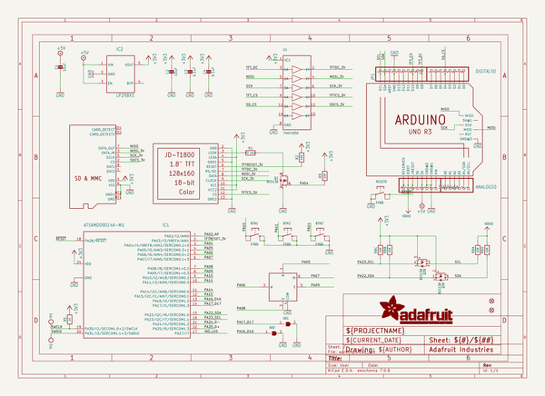
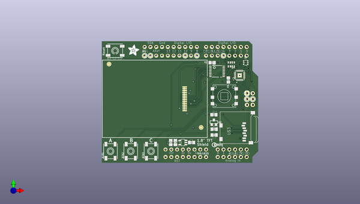

# adafruit_1_8_tft_shield_pcb
 
## summary 
* id: adafruit_adafruit_1_8_tft_shield_pcb_adafruit_1_8_tftshield
* user: adafruit
* name: adafruit_1_8_tft_shield_pcb
* board: adafruit_1_8_tftshield
* repo: https://github.com/adafruit/Adafruit-1.8-TFT-Shield-PCB

* src_file_repo_sch: 
* src_file_repo_sch_link: https://github.com/adafruit/Adafruit-1.8-TFT-Shield-PCB/tree/master/

## schematic  
  
[schematic (pdf)](working_schematic.pdf)  

## pcb  
 
  
  
  
[board (pdf)](working.pdf)  

## working_bom
| Id | Designator | Footprint | Quantity | Designation | Supplier and ref |  | None | 
| --- | --- | --- | --- | --- | --- | --- | --- | 
| 1 | C1,C2 | 0805-NO | 2 | 10uF |  |  | [''] | 
| 2 | DIGITALS1,DIGITALS0 | 1X08_ROUND | 2 |  |  |  | [''] | 
| 3 | Q2 | SOT23-WIDE | 1 | BSS138 |  |  | [''] | 
| 4 | BTN3,RESET0,BTN1,BTN2 | EVQ-Q2_SMALLER | 4 | EVQQ |  |  | [''] | 
| 5 | R9,R2 | 0805-NO | 2 | 10K |  |  | [''] | 
| 6 | U$1 | JD-T1800 | 1 | DISP_LCD_JDT1800 |  |  | [''] | 
| 7 | U$3 | MICROSD | 1 | MICROSD |  |  | [''] | 
| 8 | M1 | ARDUINOR3_ICSP | 1 | ARDUINO_R3_ICSP |  |  | [''] | 
| 9 | U$9 | PCBFEAT-REV-040 | 1 |  |  |  | [''] | 
| 10 | IC1 | QFN24_4MM | 1 | ATSAMD09D14A-MU |  |  | [''] | 
| 11 | JP1 | 1X10_ROUND | 1 |  |  |  | [''] | 
| 12 | IC2 | SOT23-5L | 1 | AP2112K-3.3 |  |  | [''] | 
| 13 | ANALOGS0 | 1X06_ROUND | 1 |  |  |  | [''] | 
| 14 | C3,C4 | 0805-NO | 2 | 0.1uF |  |  | [''] | 
| 15 | R8 | RESPACK_4X0603_NO | 1 | 10K |  |  | [''] | 
| 16 | FID1,FID3 | FIDUCIAL_1MM | 2 | FIDUCIAL_1MM |  |  | [''] | 
| 17 | Q3 | SOT363 | 1 | BSS138 |  |  | [''] | 
| 18 | U1 | TSSOP16 | 1 | 74HC4050 |  |  | [''] | 
| 19 | U$7 | ADAFRUIT_5MM | 1 |  |  |  | [''] | 
| 20 | SW1 | SKQUBAE010 | 1 | NAVSWITCHSKQUABAUE010 |  |  | [''] | 
| 21 | R5 | 0805-NO | 1 | 1K |  |  | [''] | 
| 22 | R1 | 0805-NO | 1 | 22 ohm |  |  | [''] | 
| 23 | AD0,AD1 | SOLDERJUMPER_ARROW_NOPASTE | 2 |  |  |  | [''] | 
| 24 | TP2,TP1 | TESTPOINT_ROUND_2MM | 2 |  |  |  | [''] | 
| 25 | U$5 | ADAFRUIT_TEXT_30MM | 1 |  |  |  | [''] | 
| 26 | U$8 | SEESAW_LOGO | 1 |  |  |  | [''] | 

## bom_schematic
| Ref | Qnty | Value | Cmp name | Footprint | Description | Vendor | DNP | 
| --- | --- | --- | --- | --- | --- | --- | --- | 
| AD0, AD1 | 2 | SOLDERJUMPER | SOLDERJUMPER | working:SOLDERJUMPER_ARROW_NOPASTE |  |  |  | 
| ANALOGS0 | 1 | HEADER-1X6ROUND | HEADER-1X6ROUND | working:1X06_ROUND |  |  |  | 
| BTN1, BTN2, BTN3 | 3 | EVQQ | SWITCH_TACT_SMT_EVQQ2_SMALL | working:EVQ-Q2_SMALLER |  |  |  | 
| C1, C2 | 2 | 10uF | CAP_CERAMIC0805-NOOUTLINE | working:0805-NO |  |  |  | 
| C3, C4 | 2 | 0.1uF | CAP_CERAMIC0805-NOOUTLINE | working:0805-NO |  |  |  | 
| DIGITALS0, DIGITALS1 | 2 | HEADER-1X8ROUND | HEADER-1X8ROUND | working:1X08_ROUND |  |  |  | 
| FID1, FID3 | 2 | FIDUCIAL_1MM | FIDUCIAL_1MM | working:FIDUCIAL_1MM |  |  |  | 
| IC1 | 1 | ATSAMD09D14A-MU | ATSAMD09D14A-MU | working:QFN24_4MM |  |  |  | 
| IC2 | 1 | LP298XS | LP298XS | working:SOT23-5L |  |  |  | 
| JP1 | 1 | HEADER-1X10ROUND | HEADER-1X10ROUND | working:1X10_ROUND |  |  |  | 
| M1 | 1 | ARDUINO_R3_ICSP | ARDUINO_R3_ICSP | working:ARDUINOR3_ICSP |  |  |  | 
| Q2 | 1 | BSS138 | MOSFET-NWIDE | working:SOT23-WIDE |  |  |  | 
| Q3 | 1 | BSS138 | MOSFET-N_DUAL | working:SOT363 |  |  |  | 
| R1 | 1 | 22 ohm | RESISTOR0805_NOOUTLINE | working:0805-NO |  |  |  | 
| R2, R9 | 2 | 10K | RESISTOR0805_NOOUTLINE | working:0805-NO |  |  |  | 
| R5 | 1 | 1K | RESISTOR0805_NOOUTLINE | working:0805-NO |  |  |  | 
| R8 | 1 | 10K | RESISTOR_4PACK_NO | working:RESPACK_4X0603_NO |  |  |  | 
| RESET0 | 1 | EVQQ | SWITCH_TACT_SMT_EVQQ2_SMALL | working:EVQ-Q2_SMALLER |  |  |  | 
| SW1 | 1 | NAVSWITCHSKQUABAUE010 | NAVSWITCHSKQUABAUE010 | working:SKQUBAE010 |  |  |  | 
| TP1, TP2 | 2 | TESTPOINTROUND2MM | TESTPOINTROUND2MM | working:TESTPOINT_ROUND_2MM |  |  |  | 
| U1 | 1 | 74HC4050 | 74HC4050DTSSOP | working:TSSOP16 |  |  |  | 
| U$1 | 1 | DISP_LCD_JDT1800 | DISP_LCD_JDT1800 | working:JD-T1800 |  |  |  | 
| U$3 | 1 | MICROSD | MICROSD | working:MICROSD |  |  |  | 

