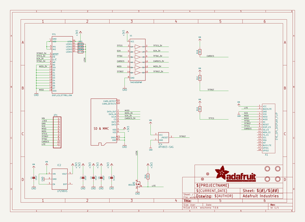
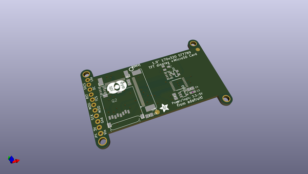
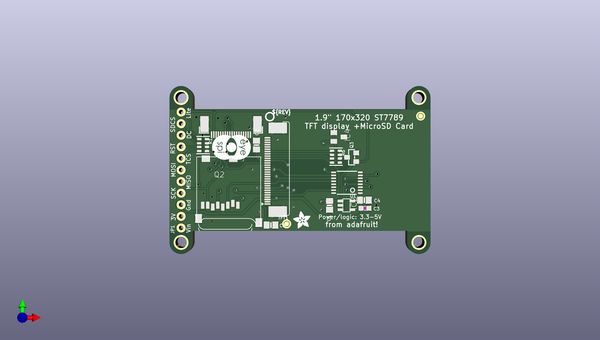
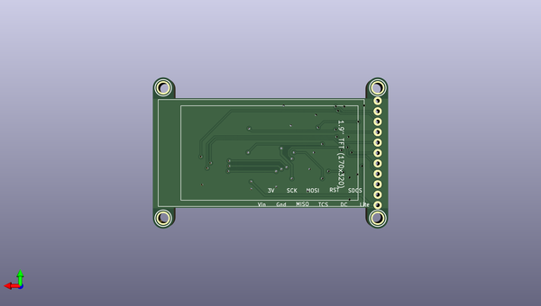

# adafruit_1_9in_320x170_color_ips_tft_pcb
 
## summary 
* id: adafruit_adafruit_1_9in_320x170_color_ips_tft_pcb_adafruit_1_9in_320x170_color_ips_tft
* user: adafruit
* name: adafruit_1_9in_320x170_color_ips_tft_pcb
* board: adafruit_1_9in_320x170_color_ips_tft
* repo: https://github.com/adafruit/Adafruit-1.9in-320x170-Color-IPS-TFT-PCB

* src_file_repo_sch: 
* src_file_repo_sch_link: https://github.com/adafruit/Adafruit-1.9in-320x170-Color-IPS-TFT-PCB/tree/main/

## schematic  
  
[schematic (pdf)](working_schematic.pdf)  

## pcb  
 
  
  
  
[board (pdf)](working.pdf)  

## working_bom
| Id | Designator | Footprint | Quantity | Designation | Supplier and ref |  | None | 
| --- | --- | --- | --- | --- | --- | --- | --- | 
| 1 | U$2 | PCBFEAT-REV-040 | 1 |  |  |  | [''] | 
| 2 | C5,C4,C1,C2 | 0805-NO | 4 | 10uF |  |  | [''] | 
| 3 | TFT1 | TFT_1.9IN_170X320_30P | 1 | DISP_LCD_ST7789_1.9IN |  |  | [''] | 
| 4 | IC4 | SOT23 | 1 | APX803-SAG |  |  | [''] | 
| 5 | IC2 | SOT23-5L | 1 | AP2112 |  |  | [''] | 
| 6 | R1 | RESPACK_4X0603 | 1 | 10k |  |  | [''] | 
| 7 | Q3 | SOT23-WIDE | 1 | BSS138 |  |  | [''] | 
| 8 | U1 | TSSOP16 | 1 | 74HC4050PWR |  |  | [''] | 
| 9 | JP1 | 1X11_ROUND_76 | 1 |  |  |  | [''] | 
| 10 | R6 | RESPACK_4X0603 | 1 | ~22 OHM |  |  | [''] | 
| 11 | U$4,U$5 | FIDUCIAL_1MM | 2 | FIDUCIAL_1MM |  |  | [''] | 
| 12 | X1 | EYE_SPI_DISPLAY_BOTCONTACT | 1 | EYE_SPI_DISPLAY_FLIP |  |  | [''] | 
| 13 | C3 | 0603-NO | 1 | 0.1uF |  |  | [''] | 
| 14 | U$22 | EYESPI_MINI_LOGO | 1 |  |  |  | [''] | 
| 15 | Q2 | MICROSD | 1 | MICROSD |  |  | [''] | 
| 16 | U$21 | ADAFRUIT_3.5MM | 1 |  |  |  | [''] | 
| 17 | U$10,U$9,U$8,U$7 | MOUNTINGHOLE_2.5_PLATED | 4 | MOUNTINGHOLE2.5 |  |  | [''] | 

## bom_schematic
| Ref | Qnty | Value | Cmp name | Footprint | Description | Vendor | DNP | 
| --- | --- | --- | --- | --- | --- | --- | --- | 
| C1, C2, C4, C5 | 4 | 10uF | CAP_CERAMIC0805-NOOUTLINE | working:0805-NO |  |  |  | 
| C3 | 1 | 0.1uF | CAP_CERAMIC0603_NO | working:0603-NO |  |  |  | 
| IC2 | 1 | LP298XS | LP298XS | working:SOT23-5L |  |  |  | 
| IC4 | 1 | APX803-SAG | AXP083-SAG | working:SOT23 |  |  |  | 
| JP1 | 1 | HEADER-1X1176MIL | HEADER-1X1176MIL | working:1X11_ROUND_76 |  |  |  | 
| Q2 | 1 | MICROSD | MICROSD | working:MICROSD |  |  |  | 
| Q3 | 1 | BSS138 | MOSFET-NWIDE | working:SOT23-WIDE |  |  |  | 
| R1 | 1 | 10k | RESISTOR_4PACK | working:RESPACK_4X0603 |  |  |  | 
| R6 | 1 | ~22 OHM | RESISTOR_4PACK | working:RESPACK_4X0603 |  |  |  | 
| TFT1 | 1 | DISP_LCD_ST7789_1.9IN | DISP_LCD_ST7789_1.9IN | working:TFT_1.9IN_170X320_30P |  |  |  | 
| U1 | 1 | 74HC4050PWR | 74HC4050DTSSOP | working:TSSOP16 |  |  |  | 
| U$4, U$5 | 2 | FIDUCIAL_1MM | FIDUCIAL_1MM | working:FIDUCIAL_1MM |  |  |  | 
| U$7, U$8, U$9, U$10 | 4 | MOUNTINGHOLE2.5 | MOUNTINGHOLE2.5 | working:MOUNTINGHOLE_2.5_PLATED |  |  |  | 
| X1 | 1 | EYE_SPI_DISPLAY_FLIP | EYE_SPI_DISPLAY_FLIP | working:EYE_SPI_DISPLAY_BOTCONTACT |  |  |  | 

