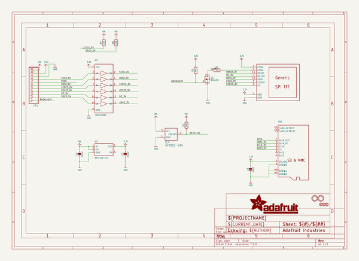
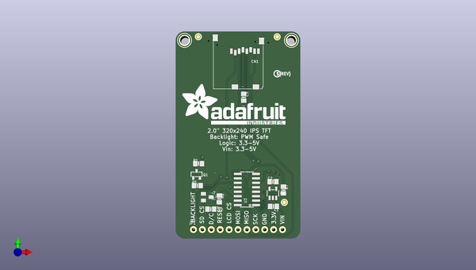
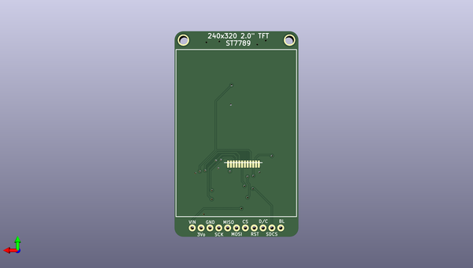

# adafruit_2_0_inch_240x320_tft_pcb
 
## summary 
* id: adafruit_adafruit_2_0_inch_240x320_tft_pcb_adafruit_2_0_inch_240x320_ips_tft
* user: adafruit
* name: adafruit_2_0_inch_240x320_tft_pcb
* board: adafruit_2_0_inch_240x320_ips_tft
* repo: https://github.com/adafruit/Adafruit-2.0-inch-240x320-TFT-PCB

* src_file_repo_sch: 
* src_file_repo_sch_link: https://github.com/adafruit/Adafruit-2.0-inch-240x320-TFT-PCB/tree/master/

## schematic  
  
[schematic (pdf)](working_schematic.pdf)  

## pcb  
 
  
  
  
[board (pdf)](working.pdf)  

## working_bom
| Id | Designator | Footprint | Quantity | Designation | Supplier and ref |  | None | 
| --- | --- | --- | --- | --- | --- | --- | --- | 
| 1 | U2 | SOT23-5 | 1 | AP2112K-3.3 |  |  | [''] | 
| 2 | R1 | 0805-NO | 1 | 10 |  |  | [''] | 
| 3 | Q1 | SOT23-R | 1 | BSS138 |  |  | [''] | 
| 4 | U$24 | PCBFEAT-REV-040 | 1 |  |  |  | [''] | 
| 5 | U3 | SOIC16 | 1 | 74HC4050D |  |  | [''] | 
| 6 | FID1,FID3,FID2 | FIDUCIAL_1MM | 3 | FIDUCIAL_1MM |  |  | [''] | 
| 7 | R8,R5,R2,R7 | 0805-NO | 4 | 10K |  |  | [''] | 
| 8 | U$4,U$3 | MOUNTINGHOLE_2.5_PLATED | 2 | MOUNTINGHOLE2.5 |  |  | [''] | 
| 9 | IC4 | SOT23 | 1 | APX803-SAG |  |  | [''] | 
| 10 | JP1 | 1X11_ROUND_76 | 1 |  |  |  | [''] | 
| 11 | C1,C3,C2 | 0805-NO | 3 | 10uF |  |  | [''] | 
| 12 | CN1 | MICROSD | 1 |  |  |  | [''] | 
| 13 | U$20 | ADAFRUIT_TEXT_30MM | 1 |  |  |  | [''] | 
| 14 | DISP1 | TFT_2.0IN_240X320_12P | 1 | DISP_LCD_GENERIC_SPI_2.0IN_240X320 |  |  | [''] | 

## bom_schematic
| Ref | Qnty | Value | Cmp name | Footprint | Description | Vendor | DNP | 
| --- | --- | --- | --- | --- | --- | --- | --- | 
| C1, C2, C3 | 3 | 10uF | CAP_CERAMIC0805-NOOUTLINE | working:0805-NO |  |  |  | 
| CN1 | 1 | MICROSD | MICROSD | working:MICROSD |  |  |  | 
| DISP1 | 1 | DISP_LCD_GENERIC_SPI_2.0IN_240X320 | DISP_LCD_GENERIC_SPI_2.0IN_240X320 | working:TFT_2.0IN_240X320_12P |  |  |  | 
| FID1, FID2, FID3 | 3 | FIDUCIAL_1MM | FIDUCIAL_1MM | working:FIDUCIAL_1MM |  |  |  | 
| IC4 | 1 | APX803-SAG | AXP083-SAG | working:SOT23 |  |  |  | 
| JP1 | 1 | HEADER-1X1176MIL | HEADER-1X1176MIL | working:1X11_ROUND_76 |  |  |  | 
| Q1 | 1 | BSS138 | MOSFET-NREFLOW | working:SOT23-R |  |  |  | 
| R1 | 1 | 10 | RESISTOR0805_NOOUTLINE | working:0805-NO |  |  |  | 
| R2, R5, R7, R8 | 4 | 10K | RESISTOR0805_NOOUTLINE | working:0805-NO |  |  |  | 
| U2 | 1 | AP2112K-3.3 | VREG_SOT23-5 | working:SOT23-5 |  |  |  | 
| U3 | 1 | 74HC4050D | 74HC4050D | working:SOIC16 |  |  |  | 
| U$3, U$4 | 2 | MOUNTINGHOLE2.5 | MOUNTINGHOLE2.5 | working:MOUNTINGHOLE_2.5_PLATED |  |  |  | 

## mounting_holes
| x | y | package | value | ref | size | 
| --- | --- | --- | --- | --- | --- | 
| 30.47999999999999 | 0.0 | MOUNTINGHOLE_2.5_PLATED | MOUNTINGHOLE2.5 | U$3 | m3 | 
| 0.0 | 0.0 | MOUNTINGHOLE_2.5_PLATED | MOUNTINGHOLE2.5 | U$4 | m3 | 

