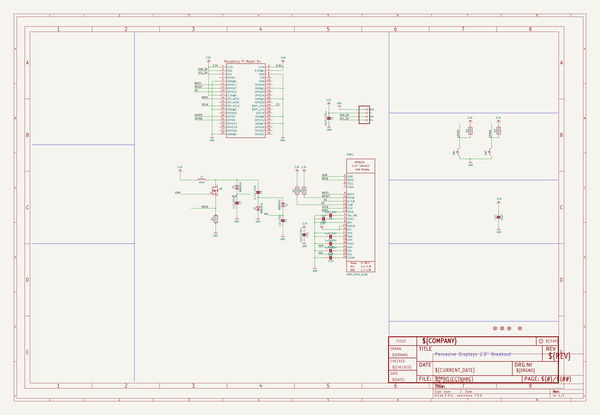
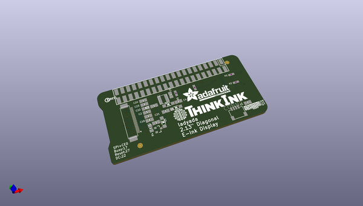
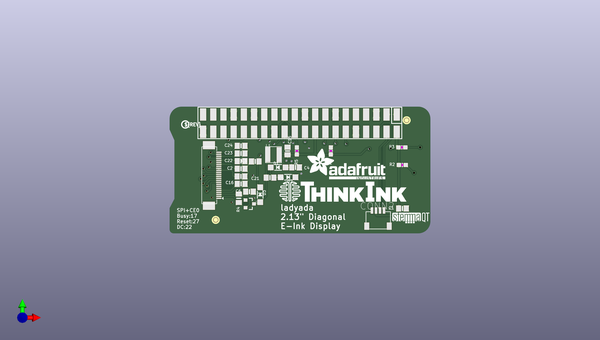
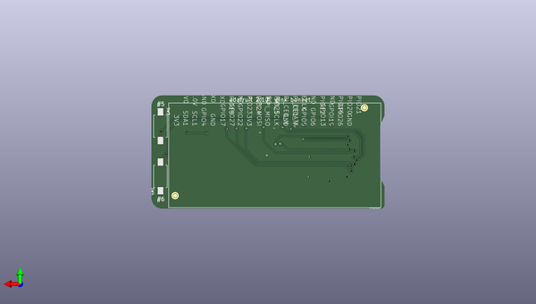

# adafruit_2_13in_eink_bonnet_pcb
 
## summary 
* id: adafruit_adafruit_2_13in_eink_bonnet_pcb_adafruit_2_13in_eink_bonnet
* user: adafruit
* name: adafruit_2_13in_eink_bonnet_pcb
* board: adafruit_2_13in_eink_bonnet
* repo: https://github.com/adafruit/Adafruit-2-13in-eInk-Bonnet-PCB

* src_file_repo_sch: 
* src_file_repo_sch_link: https://github.com/adafruit/Adafruit-2-13in-eInk-Bonnet-PCB/tree/master/

## schematic  
  
[schematic (pdf)](working_schematic.pdf)  

## pcb  
 
  
  
  
[board (pdf)](working.pdf)  

## working_bom
| Id | Designator | Footprint | Quantity | Designation | Supplier and ref |  | None | 
| --- | --- | --- | --- | --- | --- | --- | --- | 
| 1 | C3,C4,C23,C22 | 0805-NO | 4 | 1uF/25V |  |  | [''] | 
| 2 | R3,R5,R2,R6 | 0603-NO | 4 | 100K |  |  | [''] | 
| 3 | D2,D3,D1 | SOD-123 | 3 | MBR0540 |  |  | [''] | 
| 4 | C5 | 0805-NO | 1 | 4.7uF/25V |  |  | [''] | 
| 5 | U$28 | ADAFRUIT_TEXT_20MM | 1 |  |  |  | [''] | 
| 6 | C16,C24 | 0805-NO | 2 | 1uF |  |  | [''] | 
| 7 | C1,C15 | 0805-NO | 2 | 10uF/10V+ |  |  | [''] | 
| 8 | CONN2 | JST_SH4 | 1 | STEMMA_I2C_QT |  |  | [''] | 
| 9 | Q5 | SOT23-3 | 1 | IRLML0100 |  |  | [''] | 
| 10 | C2,C6 | 0805-NO | 2 | 1uF/10V |  |  | [''] | 
| 11 | R4 | 0805_10MGAP | 1 | 0.47ohm |  |  | [''] | 
| 12 | U$30 | STEMMAQT | 1 |  |  |  | [''] | 
| 13 | U$9 | PCBFEAT-REV-040 | 1 |  |  |  | [''] | 
| 14 | U$29 | THINKINK_1.25IN | 1 |  |  |  | [''] | 
| 15 | FID4,FID1,FID3,FID2 | FIDUCIAL_1MM | 4 | FIDUCIAL_1MM |  |  | [''] | 
| 16 | C21 | 0805-NO | 1 | 10µF |  |  | [''] | 
| 17 | L1 | INDUCTOR_4X4MM_NR401 | 1 | 10uH |  |  | [''] | 
| 18 | SW3,SW4 | TACTILE_3X6MM | 2 |  |  |  | [''] | 
| 19 | RPI2 | PI_BONNET_SMT_NODIM | 1 | RASPBERRYPI_BPLUS_SMT_NODIM |  |  | [''] | 
| 20 | EINK1 | EINK_213IN_104X212 | 1 | EINK_24PIN_213IN |  |  | [''] | 

## bom_schematic
| Ref | Qnty | Value | Cmp name | Footprint | Description | Vendor | DNP | 
| --- | --- | --- | --- | --- | --- | --- | --- | 
| C1, C15 | 2 | 10uF/10V+ | CAP_CERAMIC0805-NOOUTLINE | working:0805-NO |  |  |  | 
| C2, C6 | 2 | 1uF/10V | CAP_CERAMIC0805-NOOUTLINE | working:0805-NO |  |  |  | 
| C3, C4, C22, C23 | 4 | 1uF/25V | CAP_CERAMIC0805-NOOUTLINE | working:0805-NO |  |  |  | 
| C5 | 1 | 4.7uF/25V | CAP_CERAMIC0805-NOOUTLINE | working:0805-NO |  |  |  | 
| C16, C24 | 2 | 1uF | CAP_CERAMIC0805-NOOUTLINE | working:0805-NO |  |  |  | 
| C21 | 1 | 10µF | CAP_CERAMIC0805-NOOUTLINE | working:0805-NO |  |  |  | 
| CONN2 | 1 | STEMMA_I2C_QT | STEMMA_I2C_QT | working:JST_SH4 |  |  |  | 
| D1, D2, D3 | 3 | MBR0540 | DIODE-SCHOTTKYSOD-123 | working:SOD-123 |  |  |  | 
| EINK1 | 1 | EINK_24PIN_213IN | EINK_24PIN_213IN | working:EINK_213IN_104X212 |  |  |  | 
| FID1, FID2, FID3, FID4 | 4 | FIDUCIAL_1MM | FIDUCIAL_1MM | working:FIDUCIAL_1MM |  |  |  | 
| L1 | 1 | 10uH | INDUCTORNR401 | working:INDUCTOR_4X4MM_NR401 |  |  |  | 
| Q5 | 1 | IRLML2060TRPBF | IRLML2060TRPBF | working:SOT23-3 |  |  |  | 
| R2, R3, R5, R6 | 4 | 100K | RESISTOR_0603_NOOUT | working:0603-NO |  |  |  | 
| R4 | 1 | 0.47ohm | RESISTOR0805_10MGAP | working:0805_10MGAP |  |  |  | 
| RPI2 | 1 | RASPBERRYPI_BPLUS_SMT_NODIM | RASPBERRYPI_BPLUS_SMT_NODIM | working:PI_BONNET_SMT_NODIM |  |  |  | 
| SW3, SW4 | 2 | SWITCH_PUSHBUTTON_3.5X6MM | SWITCH_PUSHBUTTON_3.5X6MM | working:TACTILE_3X6MM |  |  |  | 

